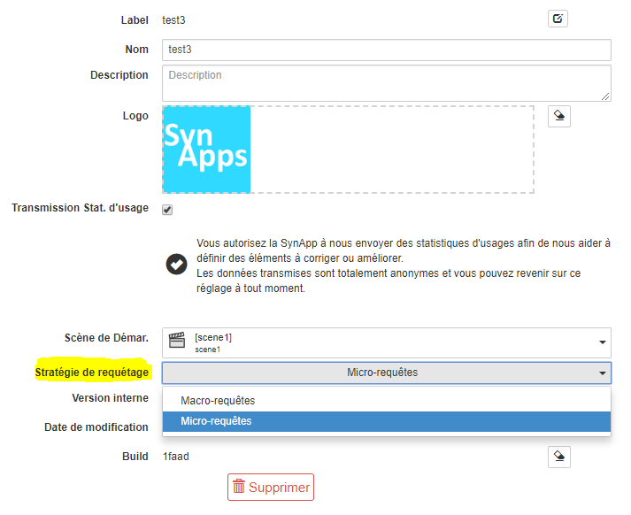
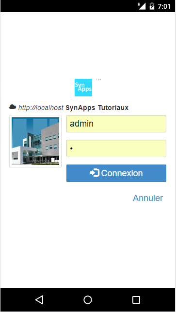
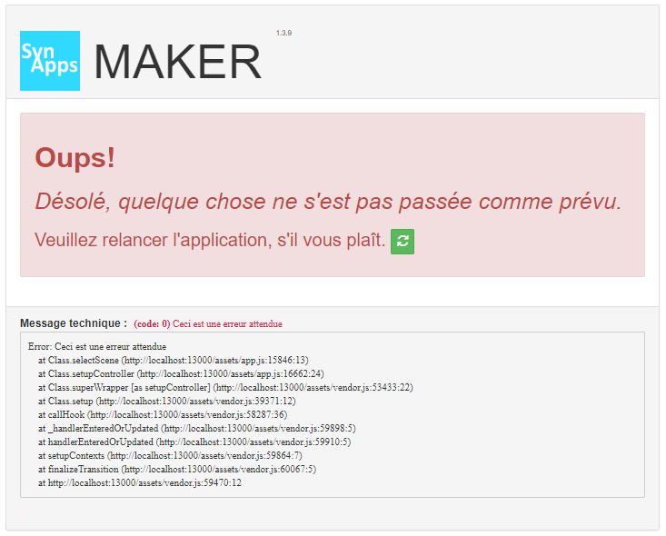
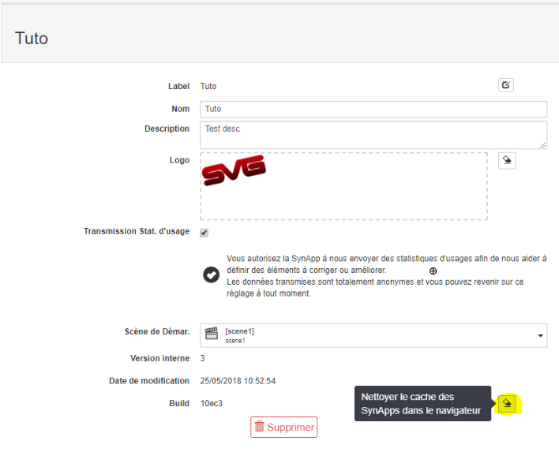
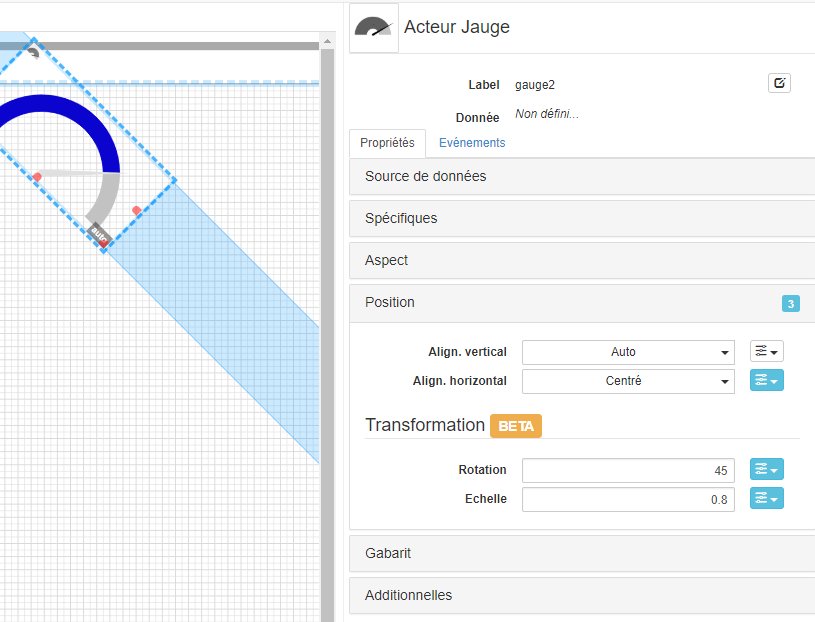
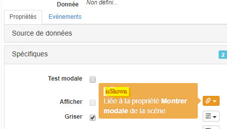
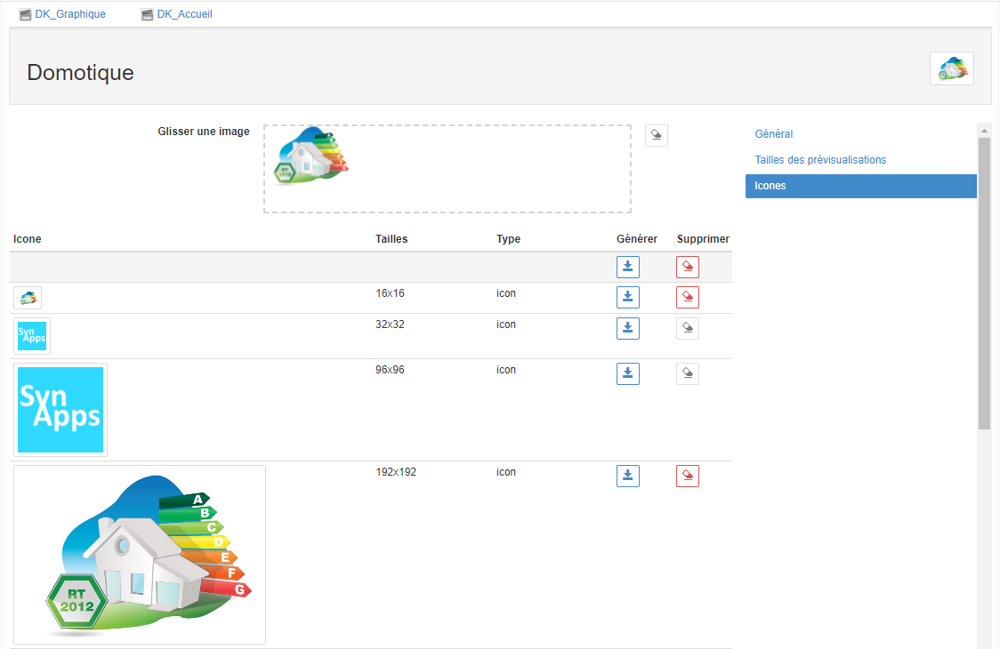

[Accueil](./)

# Changelog

## Juin 2020 - version **1.4.10**

### Ajout : liaison de donnée sur l'identifiant d'une variable WOS

Il est possible maintenant de se lier à l'identifiant unique d'une variable WOS.

## Novembre 2019 - version **1.4.9**

### Quelques changements avec les langues du **Runtime**
- Préparation du support de l'espagnol et du catalan
- correction de l'italien : les acteurs état et journal sont bien traduits maintenant

> A noter que le **Maker** est uniquement en français.

---

## Juillet 2019 - version **1.4.8**

### Correction `undefined` dans les liaisons de données.

Un texte `undefined` apparaissait dans les champs liés avec une donnée de REDY pendant une fraction de seconde, juste avant d'être correctement valorisée. C'est maintenant corrigé : plus besoin de rajouter un script de transformation pour corrigé cette valeur.

### Correction connexion impossible après perte de session avec REDY 11.0.x

Avec les versions 11.0.x du REDY, la perte de session utilisateur entraînait une impossibilité de reconnexion. Seule la suppression du cache navigateur permettait de se reconnecter. C'est maintenant corrigé.


### Quelques corrections et améliorations divers...

---

## Juin 2019 - version **1.4.7**

### Ajout Liaison vers le nombre d'enfants d'un noeud WOS

Un champ contenant le nombre d'enfant d'un noeud WOS est maintenant disponible dans les attributs des liaisons de données.

### Correction mode macro-requête

Une correction du mode macro-requête a été réalisée pour empêcher des disparitions de certaines données lorsqu'elles étaient configurées en mode `initialisation`.

### Quelques corrections et améliorations divers...

---

## Mai 2019 - version **1.4.6**

### Quelques corrections et améliorations divers...

---

## Avril 2019 - version **1.4.5**

### Quelques corrections et améliorations divers...

---

## Mars 2019 - version **1.4.4**

### Sécurisation des liaisons internes :

#### Création de composite depuis un acteur

Il est maintenant impossible de créer un composite depuis un groupe d'acteurs si cela entraîne des ruptures de liaisons internes avec d'autres acteurs ou la scène/composite.

Un message indique quelles liaisons sont incriminées. Il s'agit alors de préparer la création du composite en éliminant ces dépendances.

#### Suppression d'acteur

Aussi, lorsqu'on supprime un acteur ou un groupe d'acteurs, toutes les liaisons internes qui les ciblaient sont supprimées.

Un message indique encore les liaisons incriminées.

#### Suppression d'une propriété additionnelle ou paramètre de scène

Enfin, lorsqu'on supprime un propriété additionnelle ou un paramètre de scène, toutes les liaisons internes qui les ciblaient sont supprimées.

Un message indiquera les liaisons incriminées.


#### Changement de clé d'une propriété additionnelle ou paramètre

Les liaisons éventuelles vers une propriété additionnelle ou paramètre dont ont change la clé sont mise à jour.

### Démultiplication des propriétés de complétion.

Le problème de démultiplication des propriétés additionnelles pour completer un contenu est corrigé.

### Quelques corrections et améliorations divers...


---

## Février 2019 - version **1.4.3**

### Ajout de la navigation par script

Il est maintenant possible de déclencher une navigation par script : la méthode `displayScene(scene)` sur l'objet `synapp` du contexte le permet. Il suffit de lui passer le label de la scène de destination en argument.

```js
context.synapp.displayScene('home');
```

### `[MAKER]` correction de l'acteur modal

Il n'était plus possible de modifier un acteur modal dans le **MAKER** : une erreur survenait dès le changement d'une propriété comme la couleur d'arrière plan. Cette version corrige ce problème.
[#297](https://github.com/witsa/synapps/issues/297)

### correction de l'acteur textarea

Les liaisons en écriture du contenu d'un acteur textarea n'étaient pas effectives. Cette version corrige ce problème.

---

## Janvier 2019 - version **1.4.2**

### Corrections et améliorations diverses ([détails ici](https://github.com/witsa/synapps/issues?utf8=%E2%9C%93&q=milestone%3A1.4.2))

---

## Novembre 2018 - version **1.4.1**

### Réduction de la taille du Runtime

Nous avons effectué une refonte de nos sources afin de séparer complètement ce qui concerne le runtime et ce qui concerne le maker. Ce qui a permis d'obtenir une application Runtime 30% plus légère donc plus rapide à charger dans le navigateur.

### Autres corrections et améliorations ([détails ici](https://github.com/witsa/synapps/issues?utf8=%E2%9C%93&q=milestone%3A1.4.0))

---

## Septembre 2018 - version **1.3.10**

### Amélioration stratégie de requétage des sources de données selon configuration réseau [#272](https://github.com/witsa/synapps/issues/272)

SynApps privilégie les micro requêtes en nombre pour récupérer les ressources (nods) du REDY via les sources de données. Cependant, dans certains cas le temps de chargement de ces ressources est très long notamment lorsque:

- Le REDY est sollicité côté process
- L'infrastructure réseau limite les requêtes en parallèle.

  _Exemple:_ mode de fonctionnement proxy chaînant les requêtes

Pour répondre a cette problématique, 2 stratégies sont désormais proposées à définir selon configuration sur site

- **Macro-requête**: 1 requête par source de données. En recours lorsque le REDY est trés sollicité ou infrastructure réseau limitant les requêtes parallèles
- **Micro-requête**: 1 requête par ressource liée. A privilégier lorsque REDY peu ou normalement sollicité et infrastructure réseau autorisant les requêtes parallèles

Actuellement, cette stratégie est définie globalement dans l'administration de la SynApp



En cas doute, sur la configuration à adopter, il est conseillé de **benchmarker** selon les 2 stratégies

_Important:_ stratégie disponible à partir de **SynApps 1.3.10** et **REDY 9.8.1**

### Runtime avec compte exploitant incomplet [#273](https://github.com/witsa/synapps/issues/273)

SynApps RUNTIME avec un compte exploitant est désormais complètement opérationnel. Les propriétés label et libellé sont désormais **chargées** et **liables**.
Cela permet notamment d'afficher le profil utilisateur dans la SynApp

### Langue systeme du REDY modifiée à la connection sur SynApps [#270](https://github.com/witsa/synapps/issues/270)

A la connection dans SynApps la langue système de l'utilisateur était systématiquement réinitialisée à FR

### Commande envoyée par un acteur ne prend pas en compte la valeur corrigée par le REDY [#271](https://github.com/witsa/synapps/issues/271)

L'acteur à l'origine d'une commande vers le REDY n'était pas mis à jour lorsque la valeur était corrigée. Par exemple: commande marnage hors seuils

[**+ 3 autres issues mineures**](https://github.com/witsa/synapps/issues?utf8=%E2%9C%93&q=milestone%3A1.4.0)

---

## Juin - Juillet 2018 - version **1.3.9**

### Ecran de login adaptatif sur smartphone [issue #239](https://github.com/witsa/synapps/issues/239)

Le rendu du login est désormais adapté aux modes desktop et smartphone



### Logo des SynApps mis à jour non persisté [issue 202](https://github.com/witsa/synapps/issues/202)

Le Logo mis à jour sur la SynApp ne semblait pas déployé dans le REDY. En fait le problème était lié au cache du navigateur. Un fix a été mis en place en attendant une amélioration des directives de cache du REDY

### Amélioration du suivi du contexte des erreurs [issue 201](https://github.com/witsa/synapps/issues/201)

En cas d'erreur dans le _SynApps MAKER_, le contexte d'appel a été ajouté en dessous du **message technique** pour aider à l'identification du problème


### Permettre le nettoyage du cache navigateur [issue 154](https://github.com/witsa/synapps/issues/154)

Ajout d'un **bouton de nettoyage du cache** à côté du numéro de build dans l'administration de la SynApp afin de **forcer** le prochain chargement des SynApps depuis le REDY


### Correction erreur sur acteurs métiers avec session expirée [issue 160](https://github.com/witsa/synapps/issues/160)

Correction d'une erreur dans les **acteurs métiers journal et états** lors d'une navigation ou d'un rafraichissement automatique avec **session expirée**

### Absence de scroll bar dans le MAKER sur écrans avec une faible résolution [issue 155](https://github.com/witsa/synapps/issues/155)

Ajout de **barres de défilements** dans 2 fenêtres modales: _explorateur d'acteurs_ et _éditeur de propriétés_ de SynApps MAKER sur les écrans de faible résolution

[**7 bugs mineurs corrigés**](https://github.com/witsa/synapps/issues?utf8=%E2%9C%93&q=milestone%3A1.3.9)

---

## Mai 2018 - version **1.3.8**

[**3 bugs mineurs corrigés**](https://github.com/witsa/synapps/issues?utf8=%E2%9C%93&q=milestone%3A1.3.8)

---

## Mai 2018 - version **1.3.7**

### Transformation des acteurs [issue 131](https://github.com/witsa/synapps/issues/131)

Ajout de 2 propriétés de transformation dans la catégorie _Position_ de l'inspecteur d'acteur:

* **Rotation**: effectue une rotations en degré
* **Echelle**: effectue une mise à l'échelle



### Nom interne des noms propriétés des acteur [issue 129](https://github.com/witsa/synapps/issues/129)

Les noms internes des propriétés d'acteur sont importants notamment car ils sont utilisés dans les scripts. Ils sont désormais visible dans le tooltip ci-dessous



+[**4 bugs et améliorations**](https://github.com/witsa/synapps/issues?utf8=%E2%9C%93&q=milestone%3A1.3.7)

---

## Mai 2018 - version **1.3.6**

### Compatibilité e@sy-Pilot

SynApps est compatible avec la prochaine version d'e@sy-Pilot 9.5.2.


Le mode de fonctionnement est identique à celui du REDY

### Limitation acteur IFrame

Prendre connaissance des limitations de l'acteur IFrame avec des contenus accédant DOM parent
[Issue 113](https://github.com/witsa/synapps/issues/113)

### Disparition de _librairies_ et _sources de données_

Correction du problème de disparition des ressources SynApps de type _sources de données_ et _librairies_ sur le REDY
[Issue 108](https://github.com/witsa/synapps/issues/108)

### Evolution de l'acteur journal

De nouvelles propriétés peuvent être affichées dans l'acteur journal: _zone_, _consigne_ et _diffusion_.
Le tooltip au survol de la ressource donne également les informations _note_ et _description_
[Issue 55](https://github.com/witsa/synapps/issues/55)

+[**13 bugs et améliorations**](https://github.com/witsa/synapps/issues?utf8=%E2%9C%93&q=milestone%3A1.3.6)

---

## Avril 2018 - version **1.3.5**

### Référencement et génération de favicons

Il est désormais possible de référencer ou définir des **favicons** par SynApp pour tous les types de devices: _IOs_, _Android_. Cela permet notamment d'avoir une icône spécifique lorsque la SynApp est ajoutée sur l'écran d'accueil du smartphone ou sur le bureau  Windows, Mac, etc.



### Limitation des actions utilisateurs

L'information lecture/écriture autorisée sur un nod pour l'utilisateur courant est désormais disponible pour toutes les sources de données de type _WOS_.

Désormais, il est donc possible de définir le comportement d'un acteur en fonction des niveaux d'autorisation d'une ressource. Il suffit de lier une propriété de cet acteur à la propriété lecture ou écriture de la ressource dans la source de donnée.
_Par exemple:_ rendre inactif ou non visible un slider de commande d'un ressource analogique du WOS.

Dans tous les cas, cela demeure de la responsabilité du réalisateur de la SynApp de définir le comportement des acteurs en fonction des droits sur les ressources.


### Ergonomie de la liaison vers les sources de données

L'ergonomie de la liaison des propriétés d'un acteur vers les sources de données a évolué et permet de définir de gauche à droite:

1. Le contexte
2. La propriété de la ressource liée
3. L'accès en lecture/écriture et l'action de liaison


### Définir une image dans un bouton

Explication du mécanisme permettant de définir une image dans un bouton _poussoir_ ou de _navigation_
[issue 93](https://github.com/witsa/synapps/issues/93)

+[**16 bugs et améliorations**](https://github.com/witsa/synapps/issues?utf8=%E2%9C%93&q=milestone%3A1.3.5+)

---

## Mars 2018 - version **1.3.4**

### Acteur **synoptique**

Ajout de l'acteur de rendu des synoptiques permettant de rendre un synoptique existant dans SynApps


_Remarque:_ dans la mesure du possible, il est recommandé de réaliser les Synoptiques **directement avec SynApps**. Cependant, pour intégrer des Synoptiques déjà réalisés ou dans des cas particuliers, non couvert a ce jour par SynApps, il peut être envisagé leurs intégrations. Attention: **certains Synoptiques ne fonctionnent pas** dans SynApps  car ils nécessitent des ressources de la page qui ne sont pas accessibles. Voir les explication dans [issue 113](https://github.com/witsa/synapps/issues/113)

A noter qu'il est possible de profiter de certaines améliorations du rendu apportées par SynApps. Par exemple la _boite à vue_ pour **adapter la taille des synoptiques** aux écrans ...

### Tailles de **prévisualisation**

Vous pouvez désormais **basculer d'une taille de prévisualisation à une autre** simplement


Les tailles sont gérées dans la partie **administration de SynApps** ou en utilisant le menu _gérer_ ci-dessus. Vous pouvez alors sélectionner les tailles d'écrans **standards** prédéfinies et même ajouter des tailles **personnalisées**


### Optimisation du chargement des  **sources de données**

Le mécanisme de chargement des sources de données de type _WOS_ a été modifié en profondeur. En effet certaines ressources avaient des tailles de chargement trop longues car la totalité de la ressource était requettée. Désormais seuls les nœuds **nécessaires aux liaisons** vers les acteurs sont chargés. La ressource est donc obtenue partiellement selon les besoins de la SynApp. Ce mécanisme a permis de **diminuer les temps de chargement de façon très importante** (ratio de 7 à 8)

### Acteur **répartition**

Modification du formulaire de configuration de l'acteur _répartition_ avec la possibilité de **définir** et **appliquer** des **palettes de couleurs** aux secteurs


+Correction de **15 bugs et améliorations** diverses [detail ici](https://github.com/witsa/synapps/issues?utf8=%E2%9C%93&q=milestone%3A1.3.4+)

---

## Février 2018 - version **1.3.1** à **1.3.3**

Correction de bugs et améliorations diverses [detail ici](https://github.com/witsa/synapps/issues?utf8=%E2%9C%93&q=milestone%3A1.3.3+)

---

## Janvier 2018 - version **1.3.0**

### Acteur **slider**

Ajout d'un acteur d'intéraction utilisateur permettant de définir des valeurs analogiques

_A noter:_ deux modes de fonctionnement: curseur **simple** ou **double**

### Acteur IFrame

Modification de l'acteur IFrame pour permettre de définir des urls composées à partir des propriétés d'acteurs

### Encodage des textes

Fix [Symbole € #22](https://github.com/witsa/synapps/issues/22).
Les caractères spéciaux sont désormais correctement encodés. Ex: €.
_Remarque:_ les SynApps avec des caractères spéciaux déployées en version 1.2.1 et inférieure devront être modifiées en 1.3.0

### Polices génériques

Interprétation Graphiques des Navigateurs #28
Fix [Interprétation Graphiques des Navigateurs #28](https://github.com/witsa/synapps/issues/28).
Ajout de tooltips sur les polices informant l'utilisateur du rendu des polices génériques différent selon le navigateur et l'OS

### Statistiques d'usages

Ajout de statistiques d'usages de SynApps MAKER et RUNTIME

Ces statistiques contiennent notamment des informations concernant les erreurs sur le MAKER ou le RUNTIME. Elles peuvent être désactivées à tout moment depuis le MAKER

### Optimisation des temps de chargement

Les SynApps sont désormais cachées dans le navigateur et ne sont chargées sur le REDY que lorsque de nouvelles versions sont déployées. Ce mécanisme s'appuie sur le numéro de _build_ de la SynApp cachée:

comparé à celui du numéro de build dans le REDY:

En cas de différence, la SynApp est complètement rechargée dans le navigateur de l'utilisateur.
_Remarque:_ si vous modifiez une proriété de la SynApp directement dans le REDY sans passer par le MAKER alors vous devez **modifier le numéro de build dans le REDY** pour forcer le rafraichissement de la SynApp.

Les configurations des SynApps sont désormais **gzippées** dans le REDY pour diminuer la quantité de données téléchargées et le temps de chargement.

### MAKER

Fix [Acteur non déplaçable dans la liste #30](https://github.com/witsa/synapps/issues/30).
Problème corrigé

Amélioration [Rangement des scènes #29](https://github.com/witsa/synapps/issues/29).
Les scènes, ainsi que que les composites, peuvent désormais être triés

### RUNTIME

Fix [Une SynApp sans scène génère une erreur sur le RUNTIME #32](https://github.com/witsa/synapps/issues/32).
Un popup d'erreur indique l'abscence de scène à l'utilisateur

### Divers

Corrections et améliorations diverses améliorant l'expérience utilisateur et la robustesse de SynApp
