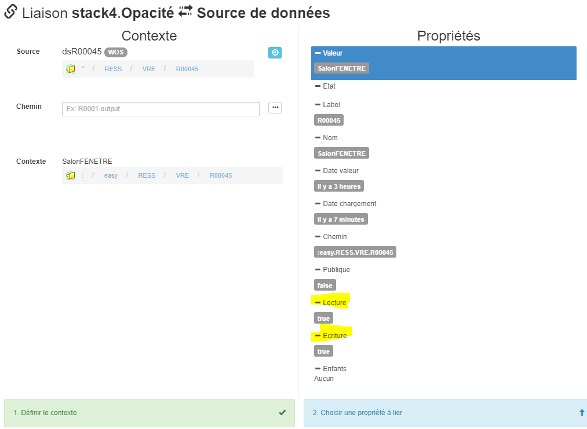
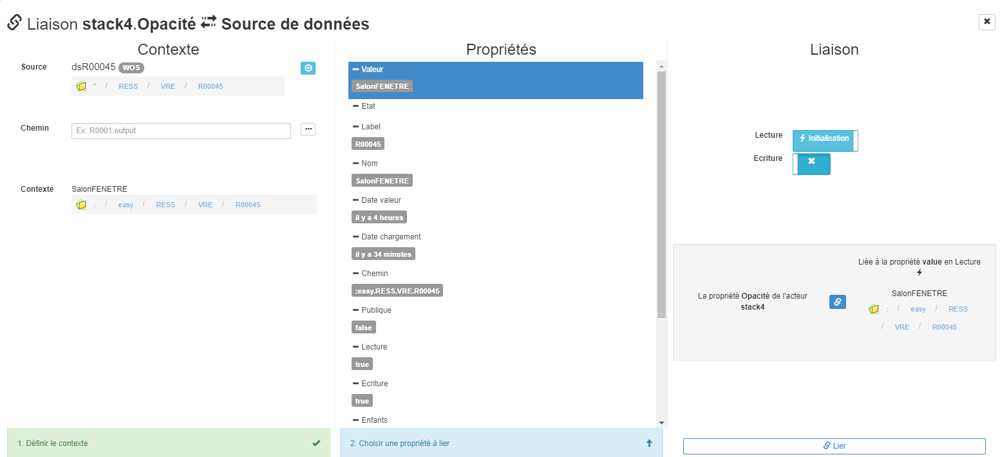
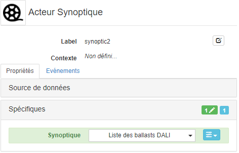
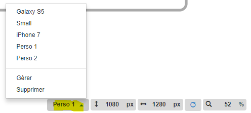
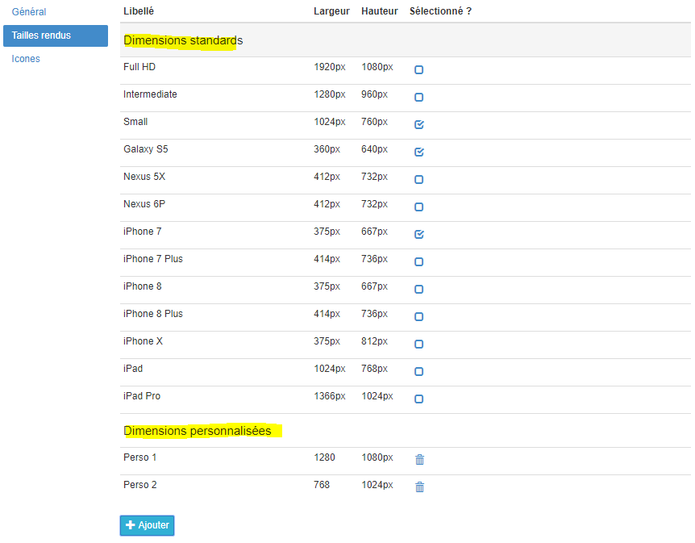
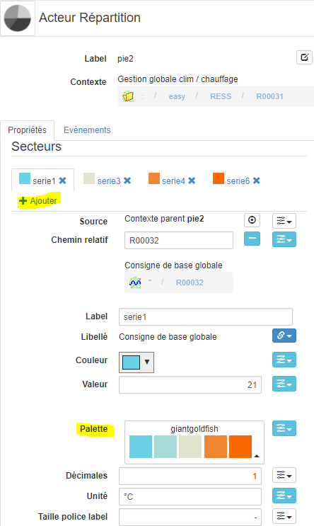
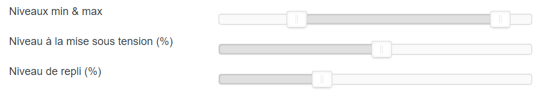
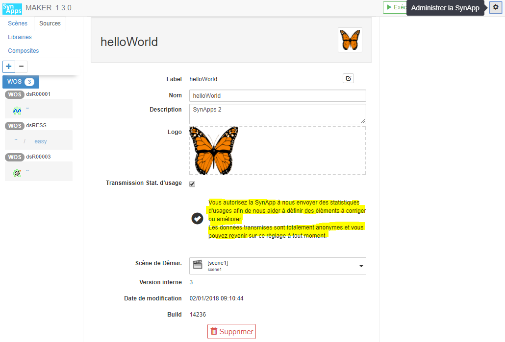
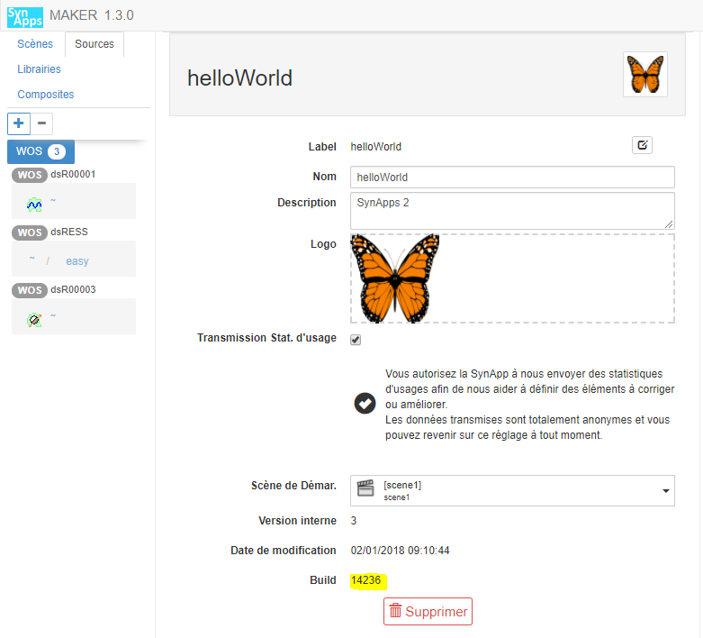
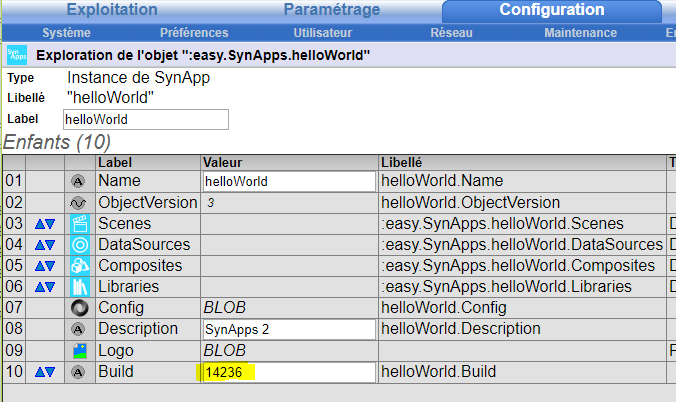

[Home](sitemap.md)

# Changelog

## Avril 2018 (version 1.3.5)

### Limitation des actions utilisateurs

L'information lecture/écriture autorisée sur un nod pour l'utilisateur courant est désormais disponible pour toutes les sources de données de type _WOS_.

Désormais, il est donc possible de définir le comportement d'un acteur en fonction des niveaux d'autorisation d'une ressource. Il suffit de lier une propriété de cet acteur à la propriété lecture ou écriture de la ressource dans la source de donnée.
_Par exemple:_ rendre inactif ou non visible un slider de commande d'un ressource analogique du WOS.

Dans tous les cas, cela demeure de la responsabilité du réalisateur de la SynApp de définir le comportement des acteurs en fonction des droits sur les ressources.

### Ergonomie de la liaison vers les sources de données

L'ergonomie de la liaison des propriétés d'un acteur vers les sources de données a évolué et permet de définir de gauche à droite:
1. Le contexte
2. La propriété de la ressource liée
3. L'accès en lecture/écriture et l'action de liaison

### Définir une image dans un bouton

Explication du mécanisme permettant de définir une image dans un bouton _poussoir_ ou de _navigation_
[issue 93](https://github.com/witsa/synapps/issues/93)

+Correction de **16 bugs et améliorations** diverses [detail ici](https://github.com/witsa/synapps/issues?utf8=%E2%9C%93&q=milestone%3A1.3.5+)

## Mars 2018 (version 1.3.4)

### Acteur **synoptique**

Ajout de l'acteur de rendu des synoptiques permettant de rendre un synoptique existant dans SynApps

_Remarque:_ dans la mesure du possible, il est recommandé de réaliser les Synoptiques **directement avec SynApps**. Cependant, pour intégrer des Synoptiques déjà réalisés ou dans des cas particuliers, non couvert a ce jour par SynApps, il peut être envisagé leurs intégrations.
A noter, qu'il est dans ce cas possible de profiter de certaines améliorations du rendu apportées par SynApps. Par exemple la _boite à vue_ pour **adapter la taille des synoptiques** aux écrans ...

### Tailles de **prévisualisation**
Vous pouvez désormais **basculer d'une taille de prévisualisation à une autre** simplement

Les tailles sont gérées dans la partie **administration de SynApps** ou en utilisant le menu _gérer_ ci-dessus. Vous pouvez alors sélectionner les tailles d'écrans **standards** prédéfinies et même ajouter des tailles **personnalisées**

### Optimisation du chargement des  **sources de données**
Le mécanisme de chargement des sources de données de type _WOS_ a été modifié en profondeur. En effet certaines ressources avaient des tailles de chargement trop longues car la totalité de la ressource était requetée. Désormais seuls les nœuds **nécessaires aux liaisons** vers les acteurs sont chargés. La ressource est donc obtenue partiellement selon les besoins de la SynApp. Ce mécanisme a permis de **diminuer les temps de chargement de façon très importante** (ratio de 7 à 8)

### Acteur **répartition**
Modification du formulaire de configuration de l'acteur _répartition_ avec la possibilité de **définir** et **appliquer** des **palettes de couleurs** aux secteurs

+Correction de **15 bugs et améliorations** diverses [detail ici](https://github.com/witsa/synapps/issues?utf8=%E2%9C%93&q=milestone%3A1.3.4+)

## Février 2018 (version 1.3.1 à 1.3.3)

Correction de bugs et améliorations diverses [detail ici](https://github.com/witsa/synapps/issues?utf8=%E2%9C%93&q=milestone%3A1.3.3+)

## Janvier 2018 (version 1.3.0)

### Acteur **slider**

Ajout d'un acteur d'intéraction utilisateur permettant de définir des valeurs analogiques

_A noter:_ deux modes de fonctionnement: curseur **simple** ou **double**

### Acteur IFrame

Modification de l'acteur IFrame pour permettre de définir des urls composées à partir des propriétés d'acteurs

### Encodage des textes

Fix [Symbole € #22](https://github.com/witsa/synapps/issues/22).
Les caractères spéciaux sont désormais correctement encodés. Ex: €.
_Remarque:_ les Synapps avec des caractères spéciaux déployées en version 1.2.1 et inférieure devront être modifiées en 1.3.0

### Polices génériques

Interprétation Graphiques des Navigateurs #28
Fix [Interprétation Graphiques des Navigateurs #28](https://github.com/witsa/synapps/issues/28).
Ajput de tooltip sur les polices informant l'utilisateur du rendu des polices génériques différent selon le navigateur et l'OS

### Statistiques d'usages

Ajout de statistiques d'usages de SynApps Maker et Runtime

Ces statistiques contiennent notamment des informations concernant les erreurs sur le Maker ou le Runtime. Elles peuvent être désactivées à tout moment depuis le Maker

### Optimisation des temps de chargement

Les SynApps sont désormais cachées dans le navigateur et ne sont chargées sur le Redy que lorsque de nouvelles versions sont déployées. Ce mécanisme s'appuie sur le numéro de _build_ de la SynApp cachée:

comparé à celui du numéro de build dans le Redy:

En cas de différence, la SynApp est complètement rechargée dans le navigateur de l'utilisateur.
_Remarque:_ si vous modifier une proriété de la SynApp directement dans le Redy sans passer par le Maker alors vous devez **modifier le numéro de build dans le redy** pour forcer le rafraichissement de la SynApp.

Les configurations des SynApps sont désormais **gzippées** dans le Redy pour diminuer la quantité de données téléchargées et le temps de chargement.

### Maker

Fix [Acteur non déplaçable dans la liste #30](https://github.com/witsa/synapps/issues/30).
Problème corrigé

Amélioration [Rangement des scènes #29](https://github.com/witsa/synapps/issues/29).
Les scènes, ainsi que que les composites, peuvent désormais être triés

### Runtime

Fix [Une SynApp sans scène génère une erreur sur le runtime #32](https://github.com/witsa/synapps/issues/32).
Un popup d'erreur indique l'abscence de scène à l'utilisateur

### Divers

Corrections et améliorations diverses améliorant l'expérience utilisateur et la robustesse de SynApp
