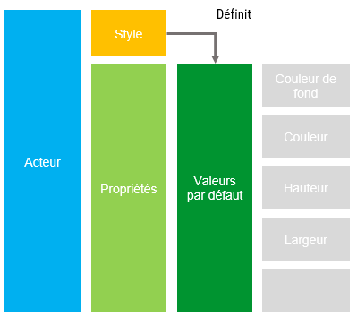
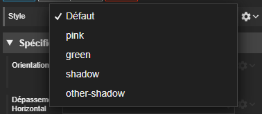
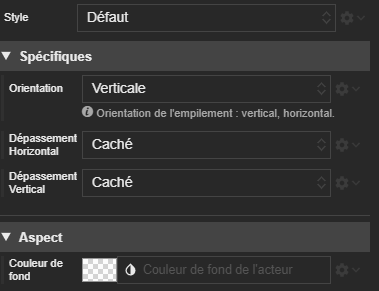
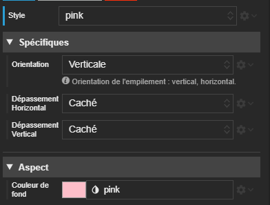



# Style d'un acteur

## Définition

Les propriétés d'un [acteur](./actor.md) sont initialisées avec des valeurs par défaut. Ces dernières sont définies dans le style qu'utilise l'acteur.
Au départ, un acteur utilise le style `default`. Mais il est possible d'établir d'autre style et changer les valeurs par défaut d'un acteur.



Le changement de style s'effectue par script. *TODO lien vers doc*

La définition de style peut s'effectuer par script. *TODO lien vers doc*

Un style est défini pour un type donné.

Un style est toujours défini basé sur un autre (donc au moins celui par défaut!).

## Dans Studio

### Gestion des Styles

La définition des styles d'acteur est une section à part entière dans Studio. Elle est actuellement encore à réaliser en JSON.


Voici un exemple de définition JSON de styles pour les empilements :
```json
{
  "layout/stack": [
    {
      "name": "pink",
      "definition": {
        "backgroundColor": "pink",
        "color": "brown"
      }
    },
    {
      "name": "green",
      "definition": {
        "backgroundColor": "lightGreen"
      }
    },
    {
      "name": "shadow",
      "definition": {
        "borderRadius": "5px",
        "paddingTop": "1em",
        "paddingBottom": "1em",
        "paddingRight": "1em",
        "paddingLeft": "1em",
        "marginTop": "1em",
        "marginBottom": "1em",
        "marginRight": "1em",
        "marginLeft": "1em",
        "boxShadow": "0 0 5px 3px #888"
      }
    },
    {
      "name": "other-shadow",
      "basedOn": "shadow",
      "definition": {
        "borderRadius": "15px",
        "boxShadow": "0 0 15px 7px #888"
      }
    }
  ]
}

```

Vous remarquerez la définition de `other-shadow` basé sur `shadow` qui hérite des définitions du second tout en redéfinissant `borderRadius` et `boxShadow`.

> A moyen terme, un designer sera dédié aux styles.

### Utilisation dans le designer

Dans chaque acteur, le champ **Style** permet de le changer pour un autre correspondant à son type.



Regardez la couleur de fond :



Elle est définie à sa valeur par défaut : aucune.

Après avoir changé de style pour `pink`, la valeur affichée du champ est passée à `pink`. Mais, ne vous y trompez pas : c'est sa valeur par défaut qui a changé. Si une couleur autre que la celle par défaut avait été définie, elle aurait été conservée.


