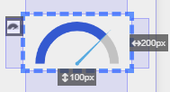
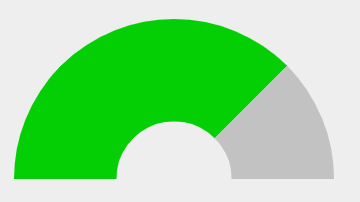
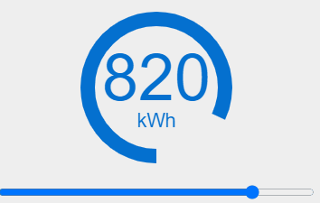

# Jauge



L'acteur jauge permet de représenter graphiquement par un arc de cercle coloré, une valeur dans un intervalle.

Il est possible de la personnaliser en changeant les couleurs
- de l'aiguille
- de l'arc avant l'aiguille
- de l'arc après l'aiguille.
La personnalisation va plus loin en permettant de définir l'épaisseur de l'arc et sont étendue angulaire.

## Quelques recommandations

- Ne sortez pas la valeur de l'intervalle définie par les bornes sous peine de dysfonctionnement de la jauge.
- Fixez sa largeur et sa hauteur pour éviter les problèmes de redimensionnement. Éventuellement, placez la ensuite dans une [Boite à vue](./layout-view-box.md).

## Quelques exemples

### Jauge épaisse sans aiguille


```
SYNAPPS-STUDIO-ACTOR|{"type":"charting/gauge-demo","key":"gauge-demo1","properties":{"height":"200px","width":"350px","gaugeColor":"rgba(224, 224, 224, 0)","gaugeStartColor":"rgba(4, 207, 4, 1)","gaugeWidth":10}}
```

### Jauge annulaire fine sans aiguille


```
SYNAPPS-STUDIO-ACTOR|{"type":"charting/gauge-demo","key":"gauge-demo2","properties":{"height":"200px","width":"350px","gaugeColor":"rgba(224, 224, 224, 0)","gaugeStartColor":"rgba(207, 92, 4, 1)","gaugeWidth":1,"gaugeBackgroundColor":"rgba(194, 194, 194, 0)","gaugeAngle":360,"gaugeValue":80}}
```

### Jauge annulaire fine sans aiguille avec un texte à l'intérieur


Vous noterez que le texte reste bien centré et contenu dans la jauge grâce à une boite à vue avec des marges intérieures

```
SYNAPPS-STUDIO-ACTOR|{"type":"layout/stack","key":"stack2","children":[{"type":"layout/canvas","key":"canvas1","properties":{"height":"200px","width":"350px"},"children":[{"type":"charting/gauge-demo","key":"gauge-demo3","properties":{"height":"100%","width":"100%","gaugeColor":"rgba(224, 224, 224, 0)","gaugeStartColor":"rgba(4, 112, 207, 1)","gaugeWidth":1,"gaugeBackgroundColor":"rgba(194, 194, 194, 0)","gaugeAngle":360,"gaugeValue":10,"gaugeMaxValue":1000}},{"type":"layout/view-box","key":"view-box1","properties":{"height":"100%","width":"100%","paddingTop":"30px","paddingBottom":"38px","paddingRight":"110px","paddingLeft":"110px"},"children":[{"type":"display/text","key":"text1","bindings":{"properties.content":{"sourceType":"actor","sourceKey":"gauge-demo3","path":"properties.gaugeValue"},"properties.color":{"sourceType":"actor","sourceKey":"gauge-demo3","path":"properties.gaugeStartColor"}}}]}]},{"type":"input/text-box","key":"text-box1","properties":{"width":"350px","inputType":"range","min":0,"max":1000,"step":5},"bindings":{"properties.value":{"sourceType":"actor","sourceKey":"gauge-demo3","path":"properties.gaugeValue","canWrite":true}}}]}
```
