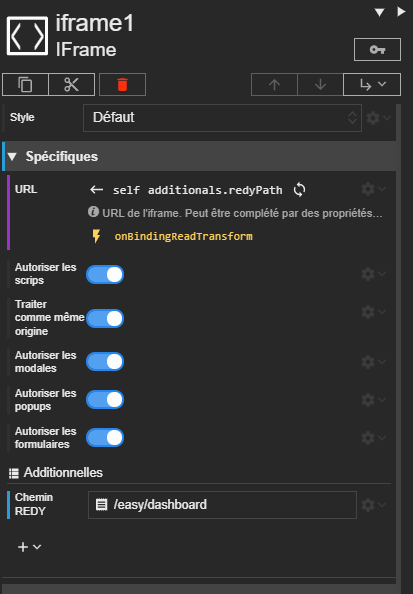



# IFrame

L'acteur Iframe permet d'intégrer une page web dans votre scène.

La définition de l'URL est **jokerable**.



# Propriétés spécifiques









## Autoriser les scripts

Cette propriété permet d'activer ou de désactiver le JavaScript du site web chargé par l'iFrame.
## Traiter comme même origine

Cette propriété permet de d'autoriser que le site web affiché de même origine soit considéré de la sorte.

Si cette propriété est désactivée, les ressources du site d'origine seront donc inaccessible pour l'iFrame alors même qu'il est vraiment sur la même origine. De plus, le site à l'intérieur de l'iFrame aura une origine 'null' ce qui peut empêcher certaines requêtes et limiter certains accès.

*Pour en apprendre plus sur les origines et leurs fonctionnements :*
La documentation MDN peut être trouvée [à cette adresse](https://developer.mozilla.org/fr/docs/Web/Security/Same-origin_policy).
## Autoriser les modales

Cette propriété permet d'activer / désactiver toute les alertes systèmes qui pourraient survenir à la suite d'une action dans l'iFrame.
## Autoriser les popups

Cette propriété permet d'activer / désactiver les popups lors de la navigation dans le site web de l'iFrame.

> **Note**<br>
> Cela peut avoir pour effet de désactiver certains formulaires de connexion.

## Autoriser les formulaires

Cette propriété permet d'activer / désactiver les formulaires lors de la navigation dans la Synapp.


> **Attention**<br>
> Si l'on désactive cette option, il ne sera plus possible d'utiliser les formulaires de connexion, les formulaires de contact, etc ...


# Champs d'informations

## Contenu complété



# Quelques exemples

## iframe vers REDY

<div class="code-example" markdown="1">

Voici un exemple d'iFrame qui montre une page du REDY.



L'additionnelle *Chemin REDY* permet de définir le chemin vers la page, depuis la racine du REDY (ici, on affiche le tableau de bord).

</div>

```text
SYNAPPS-STUDIO-ACTOR|{"type":"display/iframe","key":"iframe1","properties":{"verticalAlignment":"expand"},"additionalDefs":{"redyPath":{"type":"text","label":"Chemin REDY"}},"additionals":{"redyPath":"/easy/dashboard"},"bindings":{"properties.url":{"sourceType":"relative","sourcePath":"self","path":"additionals.redyPath"}},"events":{"properties/url/binding/onReadTransform":["return  `${this.dataStores.redy.host.domain}/WSID${this.dataStores.redy.host.session.sid}${context.value}`;"]}}
```
