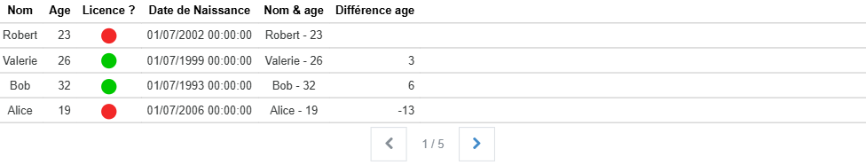



# Tableau de données

Studio **1.5.0**
{: .label .label-green }
Runtime **2.8.0**
{: .label .label-green }
REDY **16.4.0**
{: .label .label-green }

Un acteur qui permet de créer des tableaux de données dynamiques.



{: .important-title }
> 💎 Acteur Avancé
>
> Le tableau de données est un acteur qui nécessite une bonne compréhension de son fonctionnement et de ses propriétés ainsi que des notions de JSON et parfois du JavaScript.

L'entrée des données se fait sous la forme de tableau d'objets `JSON`. Il est possible de définir des colonnes typées et personnalisées.
De nombreux évènements sont disponibles pour interagir avec le tableau ou chaque cellule et avec des boutons de pagination.

Les types de colonnes disponibles sont :

- texte : pour afficher simplement la donnée d'une cellule,
- nombre : pour afficher directement un nombre,
- booléen : pour afficher une valeur vraie ou fausse et définir les textes associés,
- booléen images : pour afficher une image en fonction de la valeur booléenne et définir les textes associés,
- date/heure : pour afficher une date ou une heure avec un format personnalisable,
- personnalisé : pour utiliser un composite comme contenu de la cellule.

## Propriétés spécifiques

### Lignes de données

Cette propriété permet de renseigner un tableau d'objets JSON représentant les lignes de données à afficher dans le tableau de données.



```json
[
  {
    "name": "Robert",
    "age": 23,
    "hasLicence": false
  },
  {
    "name": "Valerie",
    "age": 26,
    "hasLicence": true
  },
  {
    "name": "Bob",
    "age": 32,
    "hasLicence": true
  }
]
```



Le JSON est stucturé sous la forme d'un tableau d'objets, chaque objet représentant une ligne de données. Chaque propriété de l'objet représente une colonne potentielle du tableau de données.

> ⚡Chemin d’accès depuis l’acteur `properties.dataRows`.

### Colonnes

Cette propriété permet de définir les colonnes du tableau de données.
Le JSON est structuré sous la forme d'un tableau d'objets, chaque objet représentant une colonne du tableau de données.

Studio permet de configurer les colonnes via l'inspecteur.

Lorsque vous modifiez une colonne, la prévisualisation du tableau de données n'est pas mise à jour automatiquement. Il faut cliquer sur le bouton "Appliquer les modifications" pour mettre à jour le tableau de données avec les nouvelles définitions de colonnes.

> ⚡Chemin d’accès depuis l’acteur `properties.columns`.

#### Champs de colonne

| Champ              | Propriété     | Description                                                                                           |
| ------------------ | ------------- | ----------------------------------------------------------------------------------------------------- |
| Clé                | `key`         | Clé unique de la colonne ; utilisée pour lier la cellule à la donnée si `fieldPath` n'est pas défini. |
| Nom                | `name`        | Nom affiché dans l'en-tête ; laisser vide pour ne pas afficher de nom.                                |
| Chemin du champ    | `fieldPath`   | Chemin d'accès dans l'objet de la ligne pour récupérer la valeur ; si vide, `key` est utilisé.        |
| Visible            | `isVisible`   | Booléen indiquant si la colonne est visible.                                                          |
| Type               | `type`        | Type de la colonne. Valeurs : `string`, `number`, `boolean`, `boolean-image`, `date-time`, `custom`.  |
| Style              | `style`       | Style d'acteur cellule à utiliser pour cette colonne (seuls les styles compatibles sont proposés).    |
| Style d'en-tête    | `headerStyle` | Style d'acteur cellule pour l'en-tête ; si vide, le style d'en-tête par défaut est utilisé.           |
| Largeur de colonne | `columnWidth` | Largeur de la colonne (`auto`, `max-content`, valeur fixe, etc.).                                     |

#### Types de colonnes

| Type              | Description                                                                                     |
| ----------------- | ----------------------------------------------------------------------------------------------- |
| Texte `string`    | Affiche la valeur comme du texte.                                                               |
| Nombre `number`   | Affiche la valeur comme un nombre.                                                              |
| Booléen `boolean` | Affiche la valeur comme vrai/faux avec un texte.                                                |
| Booléen image     | Affiche la valeur comme vrai/faux avec une image et un texte.                                   |
| Date/heure        | Affiche la valeur comme une date ou une heure au format par défaut comme `23/12/2025 21:30:00`. |
| Personnalisé      | Utilise un composite comme contenu de la cellule.                                               |

Chaque type de colonne utilise un style de cellule. Des styles par défaut sont fournis pour chaque type :

| Type              | Style par défaut                             |
| ----------------- | -------------------------------------------- |
| Texte `string`    | _Texte_ `table-cell-string`                  |
| Nombre `number`   | _Nombre_ `table-cell-number`                 |
| Booléen `boolean` | _Booléen_ `table-cell-boolean-text`          |
| Booléen image     | _Booléen image_ `table-cell-boolean-image`   |
| Date/heure        | _Date/heure_ `table-cell-date-time`          |
| Personnalisé      | _Personnalisé_ `table-cell-custom-composite` |

{: .info }
> Il est possible de créer d'autres styles d'acteur Cellule de donnée pour les personnaliser. Il seront basés sur les styles par défaut pour les utiliser dans les colonnes de type correspondant.<br/>
> Voir la page [Cellule de tableau de données](./data-table-cell) pour plus de détails.


### En-tête ?

Cette propriété permet d'afficher ou non l'en-tête du tableau de données.

> ⚡Chemin d’accès depuis l’acteur `properties.displayHeader`.

### Pagination ?

Cette propriété permet d'afficher ou non les boutons de pagination du tableau de données. Il faut aussi augmenter le nombre de page avec le champ `pageMax` pour que les boutons de pagination apparaissent.

> ⚡Chemin d’accès depuis l’acteur `properties.displayPaging`.

### Nombre de pages

Cette propriété permet de définir le nombre maximum de pages pour la pagination du tableau de données.

> ⚡Chemin d’accès depuis l’acteur `properties.pageMax`.

### Style d'acteur cellule d'en-tête

Cette propriété permet de définir le style d'acteur cellule à utiliser pour l'en-tête du tableau de données lorsqu'aucun style spécifique n'est défini dans la colonne.

Par défaut, le style _Texte entête_ `table-header-cell` est utilisé.

{: .info }
> Il est possible de définir d'autres styles d'en-tête. Pour cela, il faut créer un style de cellule de tableau de données et le baser sur le style _Texte entête_ `table-header-cell` ou _Texte_ `table-cell-string`. Ensuite, il sera proposé dans la liste des styles d'acteur cellule d'en-tête. <br/>
> Voir la page [Cellule de tableau de données](./data-table-cell) pour plus de détails.

> ⚡Chemin d’accès depuis l’acteur `properties.headerStyle`.

## Évènements spécifiques

### ⚡onWillCellRender

Cet évènement est déclenché avant le rendu d'une cellule du tableau de données.
C'est le bon moment pour modifier la donnée d'une cellule avant son traitement et son affichage.

### ⚡onCellContentTransform

Cet évènement est déclenché lors de la transformation du contenu d'une cellule du tableau de données.
C'est le bon moment pour modifier le contenu affiché dans la cellule (texte, image, etc.). Le retour de cet évènement sera dans le champ `transformedValue` stocké après dans le contexte de l'évènement et utilisé pour l'affichage de la cellule.

### ⚡onDidCellRender

Cet évènement est déclenché après le rendu d'une cellule du tableau de données.
C'est le bon moment pour récupérer la cellule rendue et effectuer des actions dessus.

### ⚡onDidTableRender

Cet évènement est déclenché après le rendu complet du tableau de données.
C'est le bon moment pour récupérer le tableau rendu et effectuer des actions dessus.

### ⚡onChangeDataPage

Cet évènement est déclenché lors du changement de page du tableau de données.
C'est le bon moment pour modifier les données affichées en fonction de la page demandée. _Voir la section [La pagination](#la-pagination) pour plus de détails_.

### ⚡Evènements souris et tactile

Dans les éèvènements souris et tactile de l'acteur tableau de données, le context contient des informations supplémentaires sur la cellule ou la ligne de données concernée par l'évènement.
C'est donc un bon moyen pour interagir avec les cellules du tableau.

### Contexte des évènements

Le contexte des évènements contient les informations suivantes :

| Champ              | Type    | Description                         |
| ------------------ | ------- | ----------------------------------- |
| `isHeader`         | Boolean | Vrai si c'est une cellule d'en-tête |
| `isCell`           | Boolean | Vrai si c'est une cellule           |
| `column`           | Object  | La définition de la colonne         |
| `rowKey`           | String  | La clé de la ligne                  |
| `columnKey`        | String  | La clé de la colonne                |
| `dataRow`          | Object  | La ligne de données complète        |
| `dataRows`         | Array   | Toutes les lignes de données        |
| `value`            | Any     | La valeur brute de la cellule       |
| `cell`             | Object  | La cellule en cours de rendu        |
| `transformedValue` | Any     | La valeur transformée de la cellule |
| `text`             | String  | Le texte affiché dans la cellule    |
| `content`          | Any     | Le contenu affiché dans la cellule  |
| `row`              | Object  | La ligne en cours de rendu          |
| `rows`             | Array   | Toutes les lignes en cours de rendu |

### Disponibilité des champs dans les évènements

| Champ              | onWillCellRender | onCellContentTransform | onDidCellRender | onDidTableRender | Evènements souris |
| ------------------ | ---------------- | ---------------------- | --------------- | ---------------- | ----------------- |
| `isHeader`         | ✔️               | ✔️                     | ✔️              | ✔️               | ✔️                |
| `isCell`           | ✔️               | ✔️                     | ✔️              | ✔️               | ✔️                |
| `column`           | ✔️               | ✔️                     | ✔️              | ✔️               | ✔️                |
| `rowKey`           | ✔️               | ✔️                     | ✔️              | ✔️               | ✔️                |
| `columnKey`        | ✔️               | ✔️                     | ✔️              | ✔️               | ✔️                |
| `dataRow`          | ✔️               | ✔️                     | ✔️              | ✔️               | ✔️                |
| `dataRows`         | ✔️               | ✔️                     | ✔️              | ✔️               | ✔️                |
| `value`            | ✔️               | ✔️                     | ✔️              | ✔️               | ✔️                |
| `cell`             | ✔️               | ✔️                     | ✔️              | ✔️               | ✔️                |
| `transformedValue` | ❌               | ❌                     | ✔️              | ✔️               | ✔️                |
| `text`             | ❌               | ❌                     | ✔️              | ✔️               | ✔️                |
| `content`          | ❌               | ❌                     | ✔️              | ✔️               | ✔️                |
| `row`              | Pariellement     | Pariellement           | Partiellement   | ✔️               | ✔️                |
| `rows`             | Pariellement     | Pariellement           | Partiellement   | ✔️               | ✔️                |

## La pagination

Le tableau accèpte la pagination mais doit être implémentée avec l'évènement de changement de page `onChangeDataPage`.

Pour faire apparaitre les boutons de pagination, il faut activer l'option `displayPaging` et augmenter le nombre de page avec le champ `pageMax` dans les propriétés de l'acteur.

En suite, il faut gérer l'évènement `onChangeDataPage` pour modifier les données affichées en fonction de la page demandée.

L'évènement fournit le numéro de la page demandée dans le champ `context.page` de l'objet évènement.

exemple d'implémentation de la pagination :



```javascript
// onChangeDataPage

// taille de chaque page
const pageSize = 10;

const data = [
  /* ... tableau complet des données ... */
];

// Extraction des lignes de données pour la page demandée
const dataPage = data.slice((context.page - 1) * pageSize, context.page * pageSize);

// Mise à jour des lignes de données en fonction de la page demandée. Le format est du JSON texte.
this.properties.dataRows = JSON.stringify(dataPage);
```



Un exemple d'acteur au complet avec la gestion de la pagination :



## Champs d'informations

### Ligne de données

Le champ `dataRows` permet d'obtenir les ligne de données directement sous forme d'un tableau d'objets à la différence de la propriété qui contient le JSON sous forme de texte.

### Nombre de lignes

Le champ `rowsCount` permet d'obtenir le nombre de lignes de données actuellement présentes dans le tableau.

### Colonnes

Le champ `columns` permet d'obtenir les définitions des colonnes directement sous forme d'un tableau d'objets à la différence de la propriété qui contient le JSON sous forme de texte.

### Numéro de page

Le champ `page` permet d'obtenir le numéro de la page actuellement affichée dans le tableau de données.
