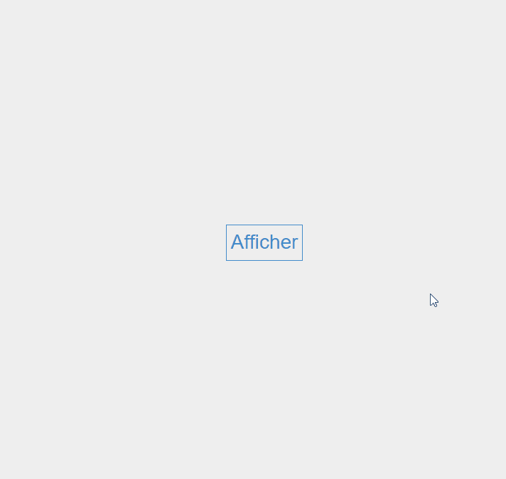
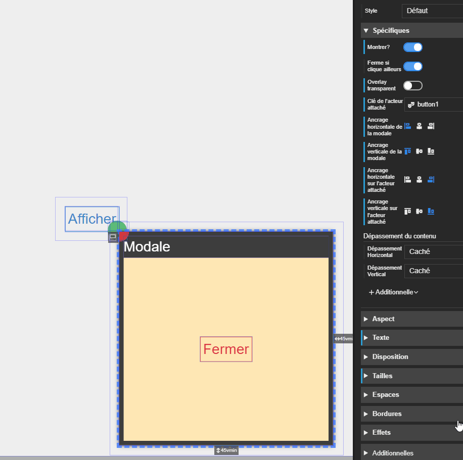



# Modale

Acteur qui permet d'afficher une boite de dialogue ou un menu.



# Propriétés

## Montrer ?

La propriété *Montrer?* permet d'afficher/cacher la modale.

> 💡 **ASTUCE** 
> Activer cette propriété dans le designer pour apercevoir le contenu de la modale ou pour régler son ancrage.

## Ferme si on clique en ailleurs

Cette propriété autorise/interdit la modale de se fermer si l'utilisateur clique en dehors de la modale.

> ⚠️ **ATTENTION** 
> Si vous n'autorisez pas ce comportement, vous avez obligatoirement besoin de définir un bouton pour fermer la modale.

## Overlay transparent

Active/désactive la présence d'un fond transparent opalescent derrière la modale.

## Ancrage de la modale

Par défaut, la modale va s'afficher au centre de l'écran. Vous pouvez définir un ancrage complètement différent.

Pour ancrer la modale, il y à trois points à observer :
- *L'acteur attaché :* par défaut, aucun acteur n'est attaché à la modale. Mais si vous en définissez un, la modale se positionnera par rapport à lui.
- *L'ancrage Horizontal/Vertical de la modale :* ces deux propriétés définissent un point sur la modale qui sera son ancre. C'est ce point qui sera ancré à celui de l'acteur attaché.
- *L'ancrage Horizontal/Vertical de l'acteur attaché :* ces deux propriétés définissent un point sur l'acteur attaché qui sera son ancre. C'est ce point qui sera ancré à celui de la modale.

Dans l'exemple ci dessous, la **modale** est attachée à un **acteur bouton** et son ancre est matérialisé par un cercle rouge, l'ancrage sur le bouton est vert :

## Dépassement de contenu



La valeur par défaut est **Caché**

> ✔️ **CONSEIL** 
> Si votre contenu n'est pas visible, il y a de bonne chance que ce soit à cause de la taille réduite de l'acteur parent.

# Événements



# Usage

La modale est un acteur de disposition qui n'accepte qu'**un seul enfant**. En général, vous y placerez un empilement qui contiendra l'interface de dialogue.

> ✔️ **CONSEIL** 
> Placez le plus souvent possible vos modales tout en bas de vos arborescence d'acteurs. Cela évitera que leur contenu gène l'affichage des autres acteurs dans le designer.

> ⚠️ **ATTENTION** 
> N'oubliez pas de définir une taille pour votre modale. Sinon, elle ne s'affichera pas correctement.

# Réinitialisation des héritages de propriété

L'héritage des propriétés est brisé dans une modale. Il faudra redéfinir ces propriétés à l'intérieure.

Par exemple, si vous définissez une taille de texte de 10px sur l'acteur principal d'une scène, cela ne sera pas appliqué à la modale.

# Variantes

## Modale au clic

Cette variante de modale est préconfigurée pour indiquer l'acteur qui lorsqu'on cliquera dessus déclenchera son affichage et l'acteur qui déclenchera sa fermeture.
