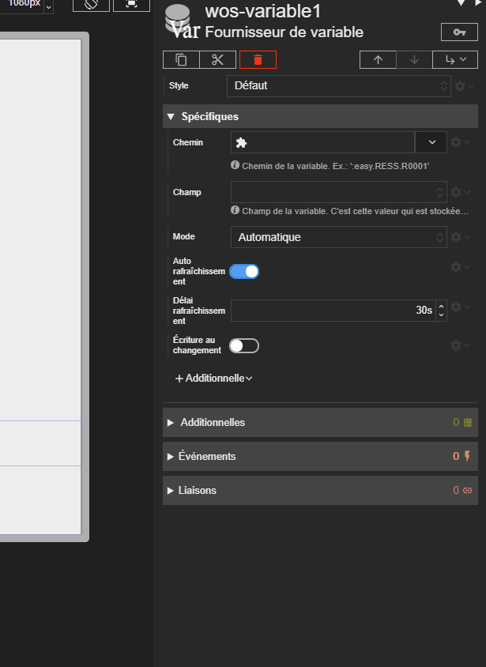



# Fournisseur de variable

Acteur qui permet de communiquer avec une *variable WOS* d'un REDY. Le fournisseur s'occupe de récupérer la variable déterminée par la propriété *Chemin* et va la placer dans le champ d'information *Donnée*. Il est possible d'indiquer plutôt un champ de la variable à placer dans la donnée de l'acteur.

Aussi, l'acteur permet de définir la manière avec laquelle la variable est récupérée et rafraîchie et d'activer ou pas l'écriture dans sa valeur pour l'enregistrer dans le REDY.

La donnée récupérée est disponible pour les liaisons ou par script.

L'acteur sert de fournisseur de base aux éventuels [fournisseurs de variable relative](./redy-wos-relative-variable-source.md) ou liaisons de type [fournisseur de variable](../binding.md#fournisseur-de-variable) qui pointeraient dessus.



# Propriétés

## Chemin

Cette propriété va contenir un *chemin* vers la variable à récupérer. C'est un chemin au sens REDY, par ex : `:easy.RESS.R00001` ou même `:easy.RESS.R00001.Output`.

Un explorateur de paramétrage de REDY aide à saisir le chemin.

## Champ de Variable REDY

Par défaut, c'est la variable toute entière qui est récupérée et placée dans le champ *Donnée*. Si vous voulez récupérer une partie de la variable, vous pouvez indiquer le nom du champ à récupérer parmi les possibilités suivantes :
- **Label** Le label REDY de la variable du REDY. Par exemple : `R00003` ou `RunCount`.
- **Nom** Le nom de la variable REDY. Par exemple : `Compteur 1`.
- **Value** La valeur de la variable. Par exemple : `true`, `"un texte"` ou bien `23` en fonction du type de la variable.
- **État** L'état si la variable est une ressource. Ce sera le texte de l'état comme défini dans le REDY. Par exemple : `"Veille"`, `"En Marche"`.
- **Chemin** Le chemin entier de la variable REDY. Par exemple : `:easy.RESS.R00001` ou même `:easy.RESS.R00001.Output`.
- **ID** L'ID interne de la variable REDY.
- **Date** La date de la dernière mise à jour de la variable REDY.
- **ID de classe** L'ID de la classe de la variable REDY.
- **URL de l'icône** L'URL de l'icône de la variable REDY. Directement exploitable par exemple dans une liaison vers un [acteur image](./display-image.md).
- **Lecture?** Si la variable est accessible par l'utilisateur actuelle en lecture. Tiens compte des groupes et du du niveau de l'utilisateur.
- **Écriture?** Si la variable est accessible par l'utilisateur actuelle en écriture. Tiens compte des groupes et du du niveau de l'utilisateur.
- **Nombre d'enfant** Le nombre d'enfant de la variable REDY.
- **Enfants** Le liste des enfants de la variable REDY.

Choisissez *Valeur* si vous voulez écrire dans ce champ. Ainsi, en vous liant avec l'écriture activée à la donnée de l'acteur, vous pourrez écrire dans la variable REDY et envoyer cette valeur automatiquement si la propriété *Écriture au changement* est activée. Sinon par script.

## Mode

Cette propriété permet de définir le comportement de l'acteur à son arrivée dans la scène ou lorsque le *chemin* ou le *champ* de la variable cible sont modifiés.

- **Automatique** Si toutes les conditions sons réunis, l'acteur va récupérer automatiquement la variable et la placer elle ou le *champ* dans la *donnée*.
- **Manuel** L'acteur attend qu'on change de *mode* ou qu'un script le demande pour récupérer la variable et la placer elle ou le *champ* dans la *donnée*.
- **Relatif** L'acteur se comportera comme dans le mode automatique dès qu'il a des [fournisseurs de variable relative](./redy-wos-relative-variable-source.md) ou liaisons de type [fournisseur de variable](../binding.md#fournisseur-de-variable) qui pointent dessus.

Dans tous les cas, ceci est complètement indépendant du mode de rafraîchissement de l'acteur.

## Auto rafraîchissement?

Cette propriété active/désactive l'auto rafraîchissement de la variable ciblée.

## Délai de rafraîchissement

Cette propriété définit le délai de rafraîchissement (en seconde) de la variable ciblée lorsque l'auto rafraîchissement est activé.

> ✔️ **CONSEIL** 
> Évitez de définir des délais de rafraîchissement trop court. En dessous de 10 secondes, il faut vraiment s'interroger sur la pertinence d'un tel choix.

## Écriture au changement?

Cette propriété active/désactive l'enregistrement de la valeur d'une variable dans le REDY si la *donnée* est modifiée par liaison ou par script. Il bien entendu que le ce soit le *champ* ***Valeur*** qui soit inscrit dans la donnée.

# Événements

## `onRequestDone`

L'évènement `onRequestDone` est déclenché à chaque fois que l'acteur a réaliser une requête pour obtenir ou rafraîchir la variable et le champ souhaité.

> [⚡ `onRequestDone`]({{ site.baseurl }}/script-api/REDY.Actor.WosVariableSource.html#event:onRequestDone){:target="_blank"}

## `onWriteDone`

L'évènement `onWriteDone` est déclenché à chaque fois que l'acteur a réaliser une écriture vers le REDY.

> [⚡ `onWriteDone`]({{ site.baseurl }}/script-api/REDY.Actor.WosVariableSource.html#event:onWriteDone){:target="_blank"}

# Informations

## Donnée

Vous trouverez dans ce champ la variable ou le champ de variable désigné par l'acteur.

Une liaison avec l'écriture activée permet de modifier la valeur de la variable REDY si l'acteur la désigne.

## Requête en cours ?

Cette information permet de savoir si l'acteur est en train de réaliser une requête.

> 💡 **ASTUCE** 
Liez la visibilité d'une acteur sur cette information pour le visualiser lorsqu'il est en train de réaliser une requête.

## Première requête réalisée ?

Cette information sera vrai après avoir effectuer une première requête.

# Usage

Il est possible de créer des fournisseurs dans vos scènes ou composites. Vous pouvez également les créer de manière globale dans la sous-section [Projet / Fournisseurs de variable](../project/variable-source.md) pour en faire profiter toute votre synapp.

> ✔️ **CONSEIL** 
> Essayez de mutualiser les fournisseurs de variable dans vos scènes et composites. Rappelez-vous que des requêtes de données sont réalisées pour chaque fournisseur de variable. Ce qui est responsable d'un trafic de données qui pourrait être important pour l'équipement qui exécute votre synapp. Ceci est particulièrement sensible pour les équipements nomades comme les smartphones et tablettes.
