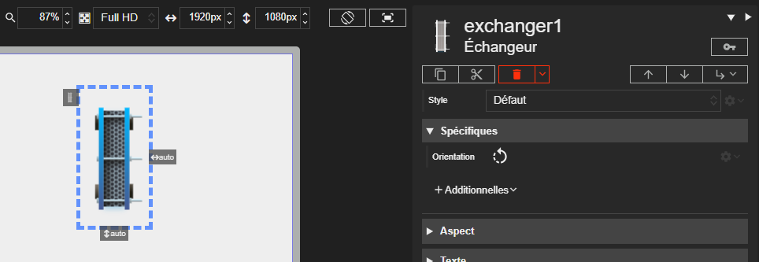



# Échangeur

L'acteur Échangeur est un composant visuel simple représentant un échangeur thermique. Il est principalement utilisé pour la représentation graphique dans les schémas.

## Propriétés spécifiques

### Orientation

- **Type** : `String`
- **Description** : Définit l'orientation du dessin de l'échangeur.

> ⚡Chemin d’accès depuis l’acteur `properties.orientation`
