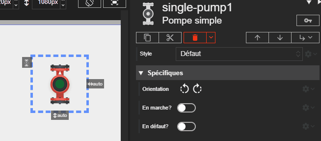



# Pompe simple (Single Pump)

L'acteur Pompe simple représente une pompe avec un seul moteur. Son état visuel (marche, arrêt, défaut) est déterminé par ses propriétés.

## Propriétés spécifiques

### Orientation ``orientation``
- **Type** : `String`
- **Description** : Définit l'orientation du dessin de la pompe. Les valeurs possibles sont `up`, `down`, `right` (droite), ou `left` (gauche).

### En marche ? ``isRunning``
- **Type** : `Boolean`
- **Description** : Si cette propriété est activée, la pompe est considérée comme en marche. L'indicateur LED devient vert et une animation de rotation est appliquée.

### En défaut ? ``isFault``
- **Type** : `Boolean`
- **Description** : Si cette propriété est activée, la pompe est en état de défaut. L'indicateur LED devient rouge et se met à clignoter. L'état de défaut a la priorité sur l'état de marche.