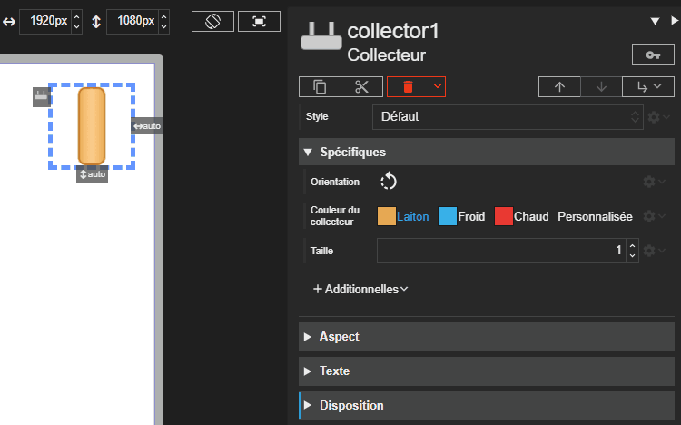



# Collecteur

Studio **1.7.3**
{: .label .label-green }
Runtime **2.9.3**
{: .label .label-green }

L'acteur Collecteur représente un collecteur hydraulique, c'est-à-dire une nourrice qui distribue le fluide vers plusieurs circuits.

## Propriétés spécifiques

### Orientation

- **Type** : `String`
- **Description** : Définit l'orientation du dessin du collecteur. Les valeurs possibles sont `0` (nord), `90` (est), `180` (sud) ou `270` (ouest).

> ⚡Chemin d’accès depuis l’acteur `properties.orientation`

### Couleur du collecteur

- **Type** : `String`
- **Description** : Définit la couleur du collecteur. Les valeurs possibles sont :

  - `brass` : Laiton (valeur par défaut)
  - `blue` : Froid (bleu)
  - `red` : Chaud (rouge)
  - `custom` : Personnalisée, la couleur utilisée est alors celle de la propriété _Couleur du collecteur personnalisée_

> ⚡Chemin d’accès depuis l’acteur `properties.kindColor`

### Couleur du collecteur personnalisée

- **Type** : `String`
- **Description** : Définit la couleur du collecteur lorsque la propriété _Couleur du collecteur_ est : `custom`. Les nuances claires et foncées du dessin sont calculées automatiquement à partir de cette couleur.

> ⚡Chemin d’accès depuis l’acteur `properties.customColor`

### Taille

- **Type** : `Number`
- **Description** : Définit la longueur du collecteur. Plus la valeur est élevée, plus le collecteur affiché est long.

> ⚡Chemin d’accès depuis l’acteur `properties.size`
