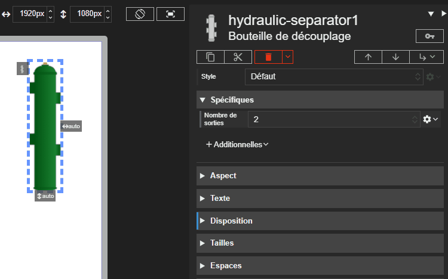



# Bouteille de découplage

Studio **1.7.3**
{: .label .label-green }
Runtime **2.9.3**
{: .label .label-green }

L'acteur Bouteille de découplage représente un séparateur hydraulique, qui découple le circuit primaire (production) des circuits secondaires (distribution). Il est principalement utilisé pour la représentation graphique dans les schémas.

La bouteille dispose toujours de deux piquages côté primaire, à gauche. Le nombre de piquages côté secondaire, à droite, est configurable.

## Propriétés spécifiques

### Nombre de sorties

- **Type** : `String`
- **Description** : Définit le nombre de piquages affichés côté secondaire (à droite) de la bouteille. Les valeurs possibles sont `2`, `4` ou `6`.

> ⚡Chemin d’accès depuis l’acteur `properties.outputsCount`
