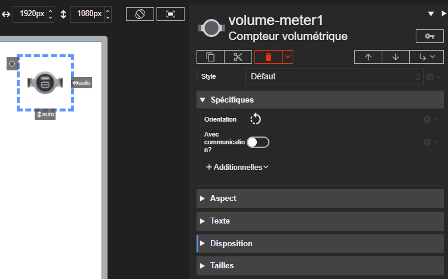



# Compteur volumétrique

Studio **1.7.3**
{: .label .label-green }
Runtime **2.9.3**
{: .label .label-green }

L'acteur Compteur volumétrique représente un compteur volumétrique, qui mesure le volume de fluide circulant dans un circuit. Il peut être utilisé comme simple élément graphique ou, s'il est communicant, afficher son état de fonctionnement grâce à un indicateur LED.

Voici les différents états du compteur volumétrique communicant :

| État          | Description                                       | État LED    | Couleur LED |
| ------------- | ------------------------------------------------- | ----------- | ----------- |
| **Arrêté**    | Le compteur ne fonctionne pas.                    | Éteinte     | ▫️          |
| **En marche** | Le compteur fonctionne normalement.               | Allumée     | 🟩          |
| **En défaut** | Le compteur rencontre un problème.                | Clignotante | 🟥          |

## Propriétés spécifiques

### Orientation

- **Type** : `String`
- **Description** : Définit l'orientation du dessin du compteur. Les valeurs possibles sont `0` (nord), `90` (est), `180` (sud) ou `270` (ouest).

> ⚡Chemin d’accès depuis l’acteur `properties.orientation`

### Avec communication ?

- **Type** : `Boolean`
- **Description** : Si cette propriété est activée, le compteur est considéré comme communicant : son dessin change et l'indicateur LED est affiché. Les propriétés *En défaut ?* et *En marche ?* ne sont disponibles que lorsque cette propriété est activée.

> ⚡Chemin d’accès depuis l’acteur `properties.withCom`

### En défaut ?

- **Type** : `Boolean`
- **Description** : Si cette propriété est activée, le compteur est en état de défaut. L'indicateur LED devient rouge et se met à clignoter.

> ⚡Chemin d’accès depuis l’acteur `properties.isFault`

### En marche ?

- **Type** : `Boolean`
- **Description** : Si cette propriété est activée, le compteur est considéré comme en marche. L'indicateur LED s'allume en vert.

> ⚡Chemin d’accès depuis l’acteur `properties.isRunning`

{: .pin }

> L'état de défaut a la priorité sur l'état de marche.
