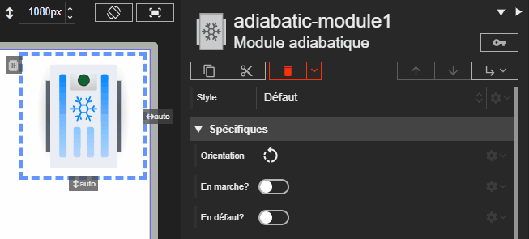



# Module adiabatique

Studio **1.7.2**
{: .label .label-green }
Runtime **2.9.3**
{: .label .label-green }
REDY **16.5.1**
{: .label .label-green }

Un module adiabatique est un organe de CTA qui rafraîchit l'air par évaporation d'eau (refroidissement adiabatique) plutôt que par un échange thermique classique avec un fluide frigorigène.

L'acteur Module adiabatique représente ce composant au sein d'une CTA. Son affichage change selon l'activation et l'état de défaut.

## Propriétés spécifiques

### Orientation

- **Type** : `String`
- **Description** : Définit l'orientation du module adiabatique.

> ⚡Chemin d’accès depuis l’acteur `properties.orientation`

### En marche ?

- **Type** : `Boolean`
- **Description** : Si la valeur est `true`, le module adiabatique est considéré comme actif (LED verte).

> ⚡Chemin d’accès depuis l’acteur `properties.isRunning`

### En défaut ?

- **Type** : `Boolean`
- **Description** : Si la valeur est `true`, l'indicateur LED passe en état de défaut (LED rouge clignotante).

> ⚡Chemin d’accès depuis l’acteur `properties.isDefault`
