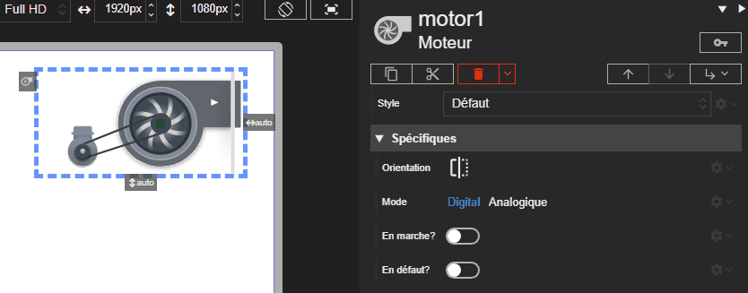



# Moteur

Studio **1.7.0-beta**
{: .label .label-yellow }
Runtime **2.9.0**
{: .label .label-green }
REDY **16.5.0**
{: .label .label-yellow }

L'acteur Moteur représente un moteur de CTA. Il peut fonctionner en mode numérique ou analogic et affiche un indicateur LED d'état.

## Propriétés spécifiques

### Orientation

- **Type** : `String`
- **Description** : Définit le sens d'affichage du moteur. Les valeurs possibles suivent `left` ou `right`.

> ⚡Chemin d’accès depuis l’acteur `properties.orientation`

### Mode

- **Type** : `String`
- **Description** : Définit le mode de commande. Les valeurs possibles sont `digital` et `analogic`.

> ⚡Chemin d’accès depuis l’acteur `properties.mode`

### En marche ?

- **Type** : `Boolean`
- **Description** : Utilisé en mode numérique pour indiquer si le moteur tourne.

> ⚡Chemin d’accès depuis l’acteur `properties.isRunning`

### Vitesse

- **Type** : `Number`
- **Description** : Utilisée en mode analogic. La valeur représente la vitesse d'affichage du moteur, généralement entre 0 et 100.

> ⚡Chemin d’accès depuis l’acteur `properties.speed`

### En défaut ?

- **Type** : `Boolean`
- **Description** : Si la valeur est `true`, la LED passe en état de défaut.

> ⚡Chemin d’accès depuis l’acteur `properties.isDefault`
