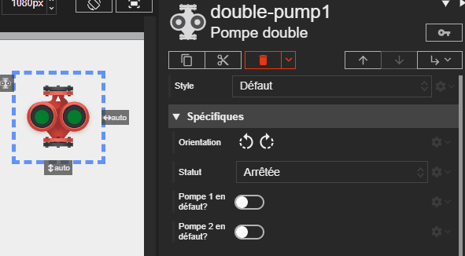



# Pompe double

Studio **1.6.0**
{: .label .label-yellow }
Runtime **2.8.0**
{: .label .label-green }
REDY **16.4.0**
{: .label .label-yellow }

L'acteur Pompe double représente un système de pompage avec deux moteurs. Chaque pompe peut être contrôlée et surveillée indépendamment pour son état de marche et de défaut.

Voici les différents états de la pompe double :

| État                  | Description                                           | État LED | Couleur LED |
| --------------------- | ----------------------------------------------------- | -------- | ----------- |
| **Arrêtée**           | Les deux pompes sont éteintes et ne fonctionnent pas. | Éteinte  | ▫️          |
| **Pompe 1 en marche** | La pompe 1 est allumée et fonctionne normalement.     | Allumée  | 🟩          |
| **Pompe 2 en marche** | La pompe 2 est allumée et fonctionne normalement.     | Allumée  | 🟩          |
| **Pompe 1 en défaut** | La pompe 1 rencontre un problème.                     | Allumée  | 🟥          |
| **Pompe 2 en défaut** | La pompe 2 rencontre un problème.                     | Allumée  | 🟥          |

## Propriétés spécifiques

### orientation

- **Type** : `String`
- **Description** : Définit l'orientation du dessin des pompes.

> ⚡Chemin d’accès depuis l’acteur `properties.orientation`

### status

- **Type** : `String`
- **Description** : Contrôle l'état de fonctionnement des pompes.
  - `stopped` : Les deux pompes sont à l'arrêt.
  - `running1` : La pompe 1 est en marche.
  - `running2` : La pompe 2 est en marche.

> ⚡Chemin d’accès depuis l’acteur `properties.status`

### isFault1

- **Type** : `Boolean`
- **Description** : Si cette propriété est activée (`true`), la pompe 1 est en état de défaut. Son indicateur LED devient rouge et se met à clignoter.

> ⚡Chemin d’accès depuis l’acteur `properties.isFault1`

### isFault2

- **Type** : `Boolean`
- **Description** : Si cette propriété est activée (`true`), la pompe 2 est en état de défaut. Son indicateur LED devient rouge et se met à clignoter.

> ⚡Chemin d’accès depuis l’acteur `properties.isFault2`

{: .pin }

> L'état de défaut de chaque pompe est indépendant et a la priorité sur son état de marche.
