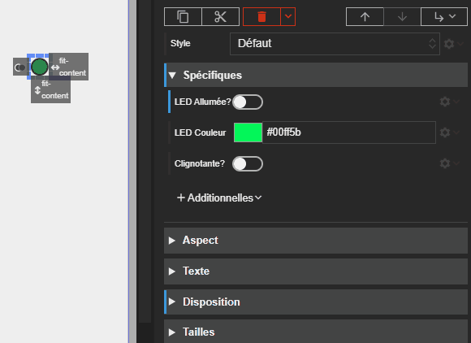



# Led

Studio **1.6.0-beta**
{: .label .label-yellow }
Runtime **2.8.0**
{: .label .label-green }
REDY **16.4.0**
{: .label .label-yellow }

L'acteur Led permet d'afficher un indicateur lumineux simple (semblable à une LED), utile pour représenter un état (par exemple, allumé/éteint, actif/inactif, alarme).

## Propriétés spécifiques

### LED Allumée

- **Type** : `Boolean`
- **Description** : Détermine si la LED est allumée (`true`) ou éteinte (`false`). L'état éteint est représenté par une couleur automatiquement assombrie de `ledColor`.

> ⚡Chemin d’accès depuis l’acteur `properties.isOn`

### LED Couleur

- **Type** : `CssColorString`
- **Description** : Définit la couleur de la LED lorsqu'elle est allumée. La couleur doit être une chaîne de caractères CSS valide (par exemple, `#FF0000`, `rgb(255, 0, 0)`).

{: .pin }

> Les couleurs CSS par mot-clé telles que `red`, `green`, etc., ne sont pas prises en charge.

### Clignotante?

- **Type** : `Boolean`
- **Description** : Si défini sur `true`, la LED clignotera lorsqu'elle est allumée. Le clignotement cesse si `isOn` est `false`.

> ⚡Chemin d’accès depuis l’acteur `properties.isBlinking`
