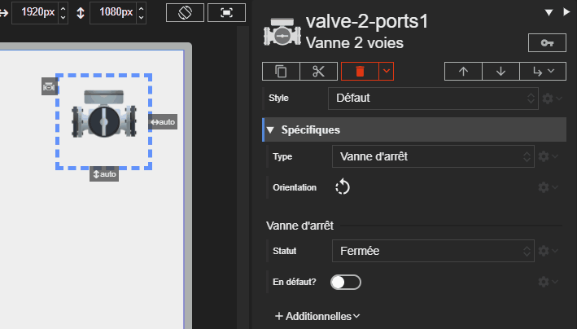



# Vanne 2 voies

Studio **1.6.0-beta**
{: .label .label-yellow }
Runtime **2.8.0**
{: .label .label-green }
REDY **16.4.0**
{: .label .label-yellow }

L'acteur Vanne 2 voies représente une vanne standard. Son état visuel (ouverte, fermée, en mouvement, en défaut) est déterminé par ses propriétés.

## Propriétés spécifiques

### Type

- **Type** : `String`
- **Description** : Définit le type de vanne :
  - Vanne d'arrêt (`shutoff`)
  - Vanne de régulation (`control`)

En fonction du type sélectionné, les autres propriétés disponibles changent.

- Pour la Vanne d'arrêt, utilisez la propriété Statut pour contrôler l'état (ouverte, fermée, en mouvement, ...).
- Pour la Vanne de régulation, utilisez la propriété Valeur pour définir le pourcentage d'ouverture.

> ⚡Chemin d’accès depuis l’acteur `properties.type`

### Orientation

- **Type** : `String`
- **Description** : Définit l'orientation du dessin de la vanne.

> ⚡Chemin d’accès depuis l’acteur `properties.orientation`

### Statut

- **Type** : `String`
- **Description** : Pour le type `digital`, contrôle l'état de fonctionnement de la vanne.
  - `closed` : La vanne est fermée.
  - `opened` : La vanne est ouverte.
  - `closing` : Affiche une animation de fermeture.
  - `opening` : Affiche une animation d'ouverture.
  - `init` : Affiche un état d'initialisation.

> ⚡Chemin d’accès depuis l’acteur `properties.status`

### Valeur

- **Type** : `Number`
- **Description** : Pour le type `analog`, ce pourcentage (0-100) contrôle le degré d'ouverture affiché.

> ⚡Chemin d’accès depuis l’acteur `properties.value`

### En défaut ?

- **Type** : `Boolean`
- **Description** : Si cette propriété est activée (`true`), la vanne est considérée comme en état de défaut. Cet état a la priorité sur les autres.

> ⚡Chemin d’accès depuis l’acteur `properties.isFault`
