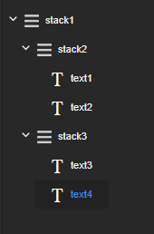
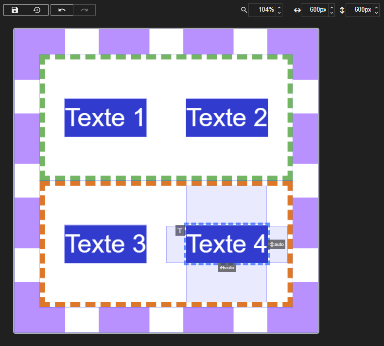
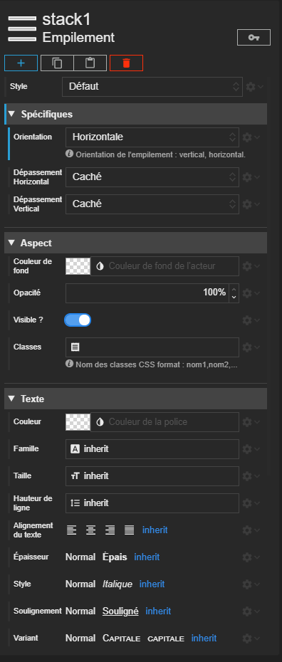
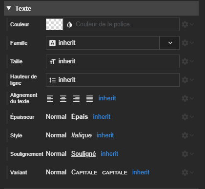
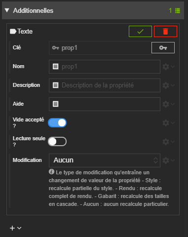
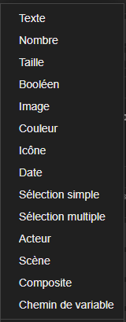
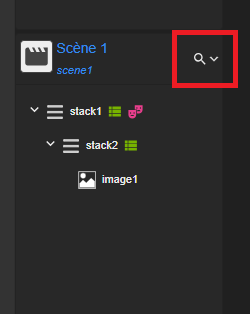

> 🚧 en cours de rédaction...



# Acteur

## Définition

L'acteur est la brique fondamentale de construction de l'interface. Les nombreux types d'acteur et leurs spécificités vont vous permettre d’articuler n’importe quel type d’interface, du formulaire au tableau de bord.

Les acteurs sont organisés sous forme d'arborescence pour constituer ce qu'on appelle la [scène](../scene.md).

## Les types d'acteur

Un acteur possède un type qui va déterminer son comportement.

- voir [les types d'acteur](../actor-types/)

## Les Propriétés

Tous les acteurs partagent des propriétés. Chaque acteur possède des propriétés spécifiques à son type.

Ces propriétés représentent l'état de l'acteur. Elles commandent son aspect, son comportement.

Chaque propriété à une valeur par défaut. Cette dernière est définie par le [style de l'acteur](../actor-style.md).

L'inspecteur est la partie du _designer_ qui permet de paramétrer, de programmer, de lier les propriétés d'un acteur.

### Catégories

Dans l'inspecteur, les propriétés sont rangées par catégorie :

- [**Spécifiques**](../actor-types/index.md) Les propriétés propres au type de l'acteur. Pour les visiter, se rendre sur la page du [type d'acteur](../actor-types/index.md).

- [**Aspect**](./category-aspect.md) Les propriétés relatives à l'aspect de l'acteur comme sa couleur de fond ou bien sa visibilité.

- [**Texte**](./category-text.md) Les propriétés relatives au texte qui sera contenu dans l'acteur ou ses enfants. Certaines propriétés comme la taille ou la couleur de la police sont transmises par _héritage_ aux acteurs enfants.

- [**Disposition**](./category-disposition.md) Les propriétés qui paramètrent la disposition de l'acteur dans son parent. La nature de ses propriétés dépendent du type de disposition auquel appartient le parent.

- [**Tailles**](./category-size.md) Les propriétés relatives à la taille de l'acteur.

- [**Espaces**](./category-space.md) Les propriétés relatives à l'espacement entre les acteurs et les coins de la scène.

- [**Bordures**](./category-border.md) Les propriétés relatives aux bordures de l'acteur et l'arrondi de ses coins.

- [**Effets**](./category-effects.md) Les propriétés relatives aux transformations géométrique (échelle, translation, rotation) ou les ombres portées ou l'affichage de bulle d'aide.

### Valeur héritée

Certaines propriétés peuvent hériter leur valeur de la propriété d'un parent de l'acteur. C'est le cas par exemple de la taille de police. Il est alors possible de définir les valeurs de ces propriétés une fois pour toute au plus haut dans l'arborescence des acteurs pour en faire bénéficier tous les enfants.

Dans l'inspecteur, il est possible d'afficher la valeur héritée d'une propriété et son origine en activant l'option "Montrer l'héritage" dans le menu des paramètres de la propriété.

{: .info }

> Lorsque la propriété ne possède pas la valeur "inherit", l'héritage peut tout de même être visualisé mais il ne sera pas appliqué à la propriété.

### Évènement de modification

Chaque propriété déclenche un évènement de modification lorsque sa valeur change. Il y a 4 types de modification :

- **Aucune** Pas de modification particulière
- **Style** Modification qui entraîne un calcul des styles CSS de l'acteur.
- **Rendu** Modification qui entraîne un nouveau rendu de l'acteur.
- **Gabarit** Modification qui entraîne un nouveau calcul de gabarit et rendu de toute la hiérarchie de l'acteur.

Il est possible d'intervenir par script sur le déclenchement d'un évènement de changement de valeur.

- Voir la partie dédiées aux [Scripts](../scripts/)
  
- Voir la [documentation des scripts]({{ site.baseurl }}/script-api/){:target="\_blank"}
  

## Clé d'acteur

Un acteur est identifiable par sa clé. C'est une chaîne de caractère qui doit être unique dans la scène ou le composite qui contient l'acteur.

Il est possible de changer cette clé dans l'inspecteur d'acteur.

### Caractères autorisés

- Tous les caractères alphanumériques sont autorisés.
- Seul le tiret `-` est autorisé parmi les caractères spéciaux.

{: .tip }

> Il est recommandé de profiter des clés d'acteur pour les qualifier et mieux comprendre le rôle de chaque acteur et la structure de votre scène ou composite.

## Les évènements et cycle de vie

Un acteur va déclencher des évènements pendant toute sa durée de vie : de son initialisation à sa destruction. Il aura aussi des évènements de souris comme le click, le survol... Enfin, certains acteurs possèdent des évènements spécifiques à leur comportement.
Tous ces évènements sont autant d'occasions d'intervenir et d'ajouter des comportements par script.

- En savoir plus sur le [cycle de vie d'un acteur](../scripts/actor-life-cycle.md)
- En savoir plus sur les [Scripts](../scripts/)

## Les additionnelles

Il est possible de définir des propriétés additionnelles sur un acteur. Une catégorie dans l'inspecteur est dédiée à leur gestion.

Voir la section dédiée aux [Additionnelles](../additionals.md).

Chaque additionnelle est identifiée par sa clé qui doit être unique pour un acteur donné.

Lorsqu'une valeur d'additionnelle change, comme toute les autres propriétés, elle déclenche un type de d'évènement de modification. Par défaut c'est la _non modification_ qui est lancé.

## Les liaisons

C'est l'un des points fort de Synapps. Les propriétés d'un acteur peuvent être liées à d'autres éléments. Voir la section dédiée aux [Liaisons](../binding.md).

## Le ruissellement de contexte

C'est une notion Avancée. Voir la section dédiée au [Ruissellement de contexte](../context.md).

## Les fournisseurs de donnée

> 🚧 en cours de rédaction...

## La recherche d'acteur

Il est possible de rechercher un acteur à l'aide de l'outil "loupe". 
La recherche d'acteurs repose sur la correspondance des clés des acteurs avec une chaîne de caractères spécifiée par l'utilisateur.
Lorsque vous effectuez une recherche, l'application parcourt l'arborescence des acteurs et identifie tous les acteurs dont la clé correspond à la chaîne de caractères renseignée.

{: .info }

> Il est important de noter que la recherche n'est pas sensible à la casse, ce qui signifie que les lettres majuscules et minuscules sont traitées de la même manière.
> Par exemple, une recherche pour "acteur123" retournera les résultats pour "Acteur123" et "acteur123" indifféremment.
