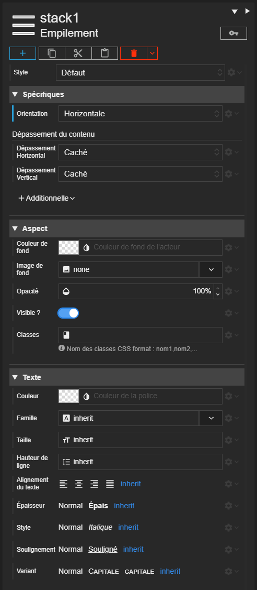

> En cours de rédaction...



# Acteur

## Définition

L'acteur est la brique fondamentale de construction de l'interface. Les nombreux types d'acteur et leur spécificité vont vous permettre d’articuler n’importe quel type d’interface, du formulaire au tableau de bord.

Les acteurs sont organisés sous la forme d'une arborescence et vont constituer la [scène](../scene.md).

## Les Catégories d'acteur

Les acteurs sont regroupés en catégorie.

### Disposition

Les acteurs de disposition permettent d'agencer les autres acteurs et de construire l'arborescence.
Leur différentes spécificités permettent d'épouser toutes les possibilités de disposition.

Les acteurs de disposition forment le squelette de la scène et leur *imbrication* est un *principe de base* de Synapps. C'est ce qui permet de s'adapter au mode de fonctionnement des navigateurs et permet l'adaptabilité de l'interface à tout type de taille d'écran.

> TODO : Liens vers acteurs

### Affichage

Les acteurs d'affichage sont dédiés à la présentation d'information ou même de scène.

> TODO : Liens vers acteurs

### Intéraction

L'utilisateur va pouvoir interagir  avec les acteurs d'interaction comme les boutons ou les zones de saisie.

> TODO : Liens vers acteurs

### Charts

Ces acteurs sont dédié à la représentation graphique de donnée. Pour l'instant, il en existe qu'un seul : la jauge.

> TODO : Liens vers acteurs

### Composites

Les composites sont des acteurs créer à partir d'autres acteurs. Voir la partie dédiée aux [composites](./composite.md).

### REDY

Les acteurs REDY sont disponible dans un projet de synapp pour REDY et présente les interfaces et composant dédié à cette plateforme.

> TODO : Liens vers acteurs

### HighWay

> A venir...

> TODO : Liens vers acteurs

## Les Propriétés

Tous les acteurs partagent des propriétés. Chaque acteur possède des propriétés spécifique à son type.

Ces propriétés représentent l'état de l'acteur. Elles commandent son aspect, son comportement.

Chaque propriété à une valeur par défaut. Cette dernière est définie par le [style de l'acteur](../actor-style.md).

L'inspecteur est la partie du designer qui permet de paramétrer, de programmer, de lier les propriétés d'un acteur.

### Catégories d'acteur

Dans l'inspecteur, les propriétés sont rangées par catégorie :

- **Spécifiques**

Les propriétés propres au type de l'acteur.

- **Aspect**

Les propriétés relatives à l'aspect de l'acteur comme sa couleur de fond ou bien sa visibilité.

- **Texte**

Les propriétés relatives au texte qui sera contenu dans l'acteur ou ses enfants. Certaines propriétés comme la taille ou la couleur de la police sont transmises par *héritage* aux acteurs enfants.

-  **Disposition**

Les propriétés qui paramètrent la disposition de l'acteur dans son parent. La nature de ses propriétés dépendent du type d'acteur de disposition parent.

- **Tailles**

Les propriétés relatives à la taille de l'acteur.

- **Espaces**

Les propriétés relatives à l'espacement entre les acteurs et les coins de la scène.

- **Bordures**

Les propriétés relatives aux bordures de l'acteur et l'arrondi de ses coins.

- **Effets**

Les propriétés relatives aux transformations géométrique (échelle, translation, rotation) ou les ombres portées ou l'affichage de bulle d'aide.

### Valeur héritée

Certaine propriété peuvent hériter de la valeur de la propriété de l'ascendance d'un acteur. C'est le cas par exemple de la taille de police. Il est alors possible de définir les valeurs de ces propriétés une fois pour toute au plus haut dans l'arborescence des acteurs pour en faire bénéficier tous les enfants.

## Clé d'acteur

Un acteur est identifiable par sa clé. C'est une chaîne de caractère qui ne doit pas contenir d'espace. Cette chaîne doit être unique dans la scène qui contient l'acteur.

Il est possible de changer cette clé dans l'inspecteur d'acteur.

> **Conseil** Il est recommander de profiter des clés d'acteur pour les qualifier et mieux comprendre le rôle de chaque acteur et la structure de votre scène.

## Les évènements et cycle de vie

## Les additionnelles

## Les liaisons

## Le ruissellement de contexte

## Les fournisseurs de donnée
