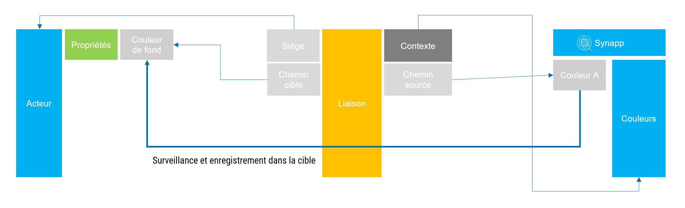
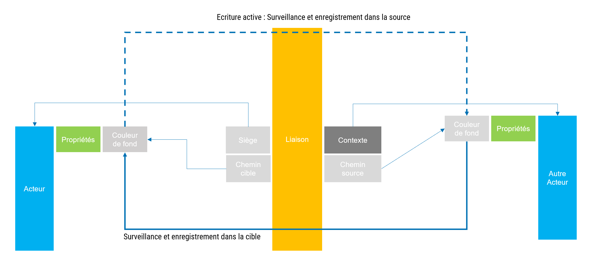
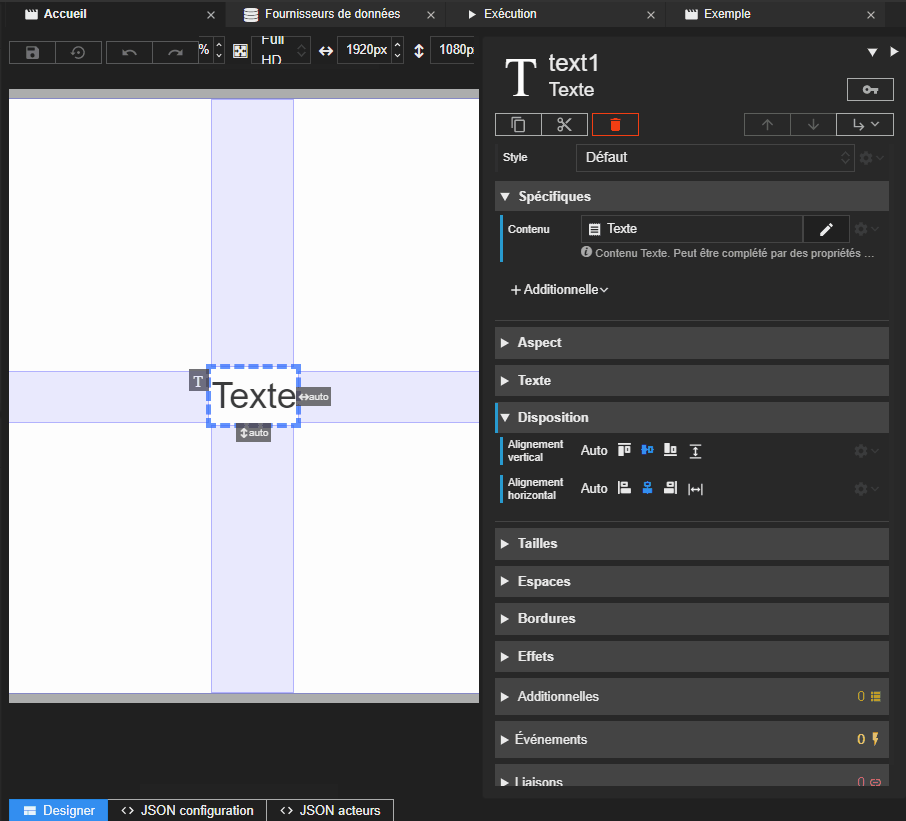
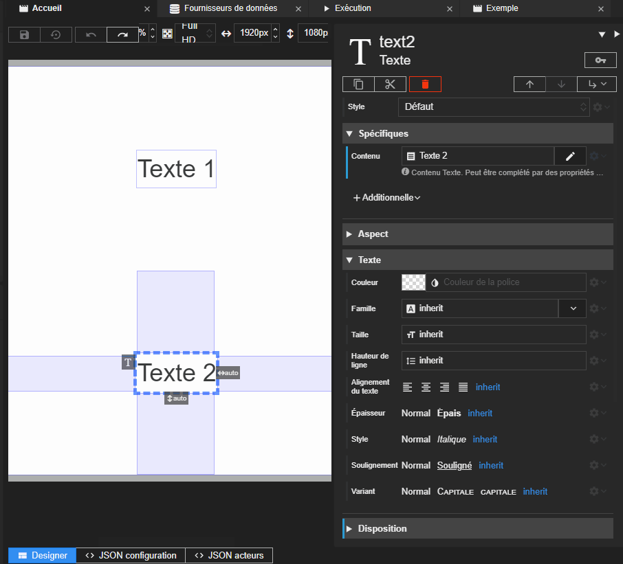



# Liaisons

La liaison est un concept fort de la solution Synapps. En effet, grâce à elle, vous pouvez établir des comportements, des changements de propriété, simplement.
En liant des propriétés d'objet de Synapps ensemble, vous pouvez automatiser des changements, utilisez des librairies, s'accorder avec les tailles de l'afficheur, etc.

## Définition

La liaison est un objet qui, une fois activé, surveille les changements d'une valeur sur une **source** pour les enregistrer immédiatement dans une propriété **cible** d'un acteur.

Seules les propriétés des acteurs peuvent être cible de liaison. En revanche, beaucoup d'éléments de Synapps peuvent être la source dans une liaison :

- La [synapp](./synapp.md)
- La [scène](./scene.md) ou le [composite](./composite.md) accueillant l'acteur cible
- Un autre [acteur](./actor/index.md) ou lui-même
- Un élément de librairie
  - une [couleur](./colors.md)
  - une [image](./pictures.md)
  - une [constante](./constants.md)
  - un [texte](./texts.md)
- Un [fournisseur de variable REDY](#la-liaison-de-type-de-source-fournisseur-de-variable)
- L'[hôte](./project/hosts.md)
- La [session](./session.md)
- L'[utilisateur](./user.md)
- L'[afficheur](./user-agent.md)

Exemple : *une liaison vers la **couleur A** de la librairie des couleurs définie sur la propriété **couleur de fond** d'un acteur*

Un liaison peut aussi être paramétrée pour qu'elle surveille également la cible afin d'enregistrer ses changements dans la source en retour.

Exemple : *une liaison avec écriture active vers la propriété **couleur de fond** d'un acteur définie sur la propriété **couleur de fond** d'un autre acteur et inversement*

## Créer une liaison

Pour créer une liaison, rendez-vous dans le menu d'option d'une propriété d'un acteur et cliquez sur *Lier à...*. Vous ouvrirez la fenêtre de définition de la liaison.

Vous allez construire la liaison d'abord en définissant la source puis les options qui sont offertes par la nature de la source choisie.

Dans l'exemple suivant, une liaison vers le *nom* de la synapp est créée sur la propriété *Contenu* d'un acteur *Texte*.

En résumé, la liaison ici est définie comme suit :

| Cible | Propriété cible | Source | Propriété source |
| ------ | ------------- | ------ | ------------- |
| l'acteur *Texte* | *Contenu* | La synapp | *Nom* |

Un autre exemple, cette fois ci avec une liaison vers la propriété *Couleur* d'un autre acteur :

Observez le suivi de la couleur de l'acteur *Texte 2* lorsque celle de l'acteur *Texte 1* change.

En résumé, la liaison cette fois ci est définie comme suit :

| Cible | Propriété cible | Source | Propriété source |
| ------ | ------------- | ------ | ------------- |
| l'acteur *Texte 2* | *Couleur* | l'acteur *Texte 1* | *Couleur* |

### Chemin de la source

En réalité, lorsqu'on définit la source d'une liaison, on défini réellement deux choses :
- par le type de source, on indique comment la liaison va chercher l'objet source. Nous apprendrons plus tard qu'elle la place dans son contexte de donnée.
- ensuite, par le choix du champ source, on indique un le chemin qui mène à la valeur à surveiller.

Intéressons nous plus particulièrement à ce chemin. Il est visible dans la fenêtre de définition de la liaison dans le champ *Chemin*.

Observez dans le deuxième exemple que ce chemin est `properties.color`. Ce chemin est le même qui permet d'accéder à la valeur par script.

> 📌 **REMARQUE** 
Il est tout à fait possible, si vous le connaissait, de définir un chemin qui n'a pas de correspondance dans la liste des champs disponible pour une source donnée.

### Activation de l'écriture

Si vous désirez que les changements de la cible soient écrits dans la source, vous devez activer l'écriture.

C'est ce qui va permettre entre autre l'écriture dans une valeur de variable REDY dans la liaison de type *Fournisseur de variable*.

Ceci est pratique également pour créer une liaison montante vers une source qui, elle, n'accepte pas de liaison.  Par exemple, il n'est pas possible de créer de liaison sur un paramètre de scène. En revanche, il est possible de créer une liaison sur propriété d'un acteur de la la scène et de le lier à un de ses paramètre avec l'écriture activée. Ainsi, lorsque la propriété va changer, le paramètre de la scène va changer aussi.

### Synchronisation de la source

Par défaut, une liaison active va lire la valeur de la source pour l'écrire dans la cible et surveiller les changements de la source pour le refaire à chaque fois.

Il est possible de définir un autre comportement, désactiver cette synchronisation : il n'y aura qu'une seule écriture, la première.

Ceci est très pratique lorsqu'on se lie à une valeur qui ne va pas changer ou au contraire si elle change mais qu'on veut garder la valeur initiale.

### Échec de la liaison

Dans certain cas, il est possible lors de la création de la liaison, la source définie n'existe pas ou soit introuvable. Dans ce cas la liaison n'aboutit pas et la valeur restera à sa définition initiale.

> 📌 **REMARQUE** 
Pour l'instant, il n'y a pas encore de retour dans Studio qui indique ce type d'échec.

## Menu des options d'une liaison

Un fois qu'une liaison est définie sur une propriété, le menu d'options s'enrichie de possibilités.

### Modifier une liaison

Vous pouvez à tout moment revenir sur la définition d'une liaison.

### Supprimer une liaison

Dans le menu d'option d'une propriété d'un acteur, cliquez sur *Supprimer la liaison* pour effacer la définition.

Vous pouvez également choisir l'option *Aucune liaison* dans la liste des *Types de source* de l'édition de la liaison.

### Copier/Coller une liaison

Option très pratique, vous pouvez copier une liaison et la coller ailleurs. La définition est dans le presse papier, donc vous pouvez coller n'importe où.

### Montrer/Cacher la valeur initiale

Lorsque vous définissez une liaison sur une propriété, la valeur préalablement saisie demeure. Elle est utilisée pour initialiser la propriété.

Il est possible de l'afficher pour la visualiser ou même la modifier même apres que la liaison ait été créée. L'option *Montrer la valeur initiale* permet de faire cela.

Pour la cacher, cliquez sur *Cacher la valeur initiale* dans le menu d'options.

## Scripts de transformation

Lorsque la valeur source est transmise à la cible, il est possible de lui appliquer un script de transformation. De la même façon, il est possible d'appliquer un script de transformation de la valeur cible lorsque l'écriture de la valeur source est activée. Voir ce dans la section [cycle de vie des acteurs](./scripts/actor-life-cycle.md#transformations-de-liaison).

## La liaison de type de source *Fournisseur de variable*

Ce type de source permet de lier une propriété à un champ d'une variable de REDY par l'intermédiaire d'un [fournisseur de variable](./actor-types/redy-wos-variable-source.md).

Voir une illustration [ici](../quick-start/display-redy-data.md)

A la manière d'un acteur [fournisseur de variable relative](./actor-types/redy-wos-relative-variable-source.md), il est possible d'aller chercher le champ d'une sous variable WOS d'une variable ou ressource définie dans un fournisseur parent.

### Clé parent

Ce champ permet d'indiquer le fournisseur parent. C'est lui qui va exécuter les requêtes de lecture et d'écriture. Si aucun  n'est fourni, c'est dans le contexte de donnée que le parent sera cherché.

### Chemin relatif

Ce champ permet d'indiquer le chemin relatif par rapport à la variable parente de la variable WOS qui nous intéresse. Cela peut rester vide auquel cas la variable WOS sera celle définie par le parent.

### Champ

Cette option permet d'indiquer quel champ sera la source de la liaison. N'indiquez rien si vous désirez que la source soit la variable elle-même.

### Mode de récupération

Indiquez ici si vous désirez que la donnée soit récupérée à chaque mise à jour du fournisseur parent ou seulement la première fois.

## La liaison de type de source *Contexte*

Cette liaison, en réalité, ne définit pas comment aller cherche la source. Elle va donc uniquement tenter de se réaliser avec ce qu'elle va trouver dans son contexte de donnée.

Voir la section [Contexte de donnée](./data-context) pour plus de détails.
