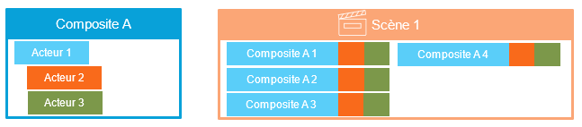



# Composite

La solution permet de définir de nouveaux acteurs en réunissant et programmant d'autres acteurs. Ainsi assemblés ils forment ce qu'on appelle un *composite*.

A la manière du jeu de lego où plusieurs pièces peuvent s’assembler pour en former une nouvelle, plus riche mais tout aussi simple à utiliser que les autres.

Les composites sont réutilisables et partageables entre installateur.
La solution contient un panel de composite qui est enrichi continuellement.

> C’est une des forces majeures de la solution.

Un composite est utilisable dans toutes les scènes et même dans un autre composite.

 

## Défini une fois, utilisable partout

Le composite permet de regrouper un ensemble d'acteur pour qu'il soit démultiplié dans vos scènes. Il est défini qu'une seule fois. Par conséquent, si vous réaliser un changement sur la défintion d'un composite, il sera répercuté sur toutes ses instances.

Imaginons que nous ayons à présenter un fond de plan. En superposition, une dizaine de blocs illustrent les zones de températures. Chacun d’eux est composé d’une icône de thermomètre et d’une valeur avec son unité, reliée à une donnée de l’ULI.
Un composite est créé une seule fois en assemblant quelques acteurs, liaisons et programmation.
Ensuite, c’est ce composite qui est utilisé comme acteur pour ajouter la dizaine de blocs sur le fond de plan.

## Boite noire

Lorsque vous ajoutez une instance de composite dans une scène, vous ne visualisez pas le détail de sa définition dans le plan des acteurs. Il va se comporter exactement comme les autres acteurs. C'est uniquement dans sa définition que vous pouvez accéder à ses "entrailles" et les modifier.

## Propriétés spécifiques

Un composite peut être paramétrable grâce à des propriétés spécifiques, comme n'importe quel acteur. Dans sa définition, il est possible d'ajouter des additionnelles qui vont jouer le rôle de propriété spécifique.

> 💡 **ASTUCE** 
Les valeurs que vous paramétrez dans sa définition serviront de valeurs par défaut pour les instances du composite.

Dans la définition d'un composite, les propriétés spécifiques sont accessibles par liaison ou par script.

## Fournisseur de donnée

Vous pouvez utiliser tous les acteurs dans un composite, sauf lui-même bien sûr. Notamment, vous pouvez utilisez des fournisseurs de données pour accèder aux variables d'un REDY. L'avantage ici est qu'un composite ne s'affiche que lorsque la donnée à récupérer est disponible.

Il est également possible d'utiliser des fournisseurs de variable relative. Ils pouront alors utiliser un fournisseur parent dans les [globaux](./project/global-data-sources.md) ou bien l'obtenir grâce au [contexte de donnée](./context.md).

## Création d'un composite

Rendez-vous dans la section dédiée à la gestion des composites de votre projet .

Dans la partie du haut de la section, vous trouverez l'arborescence des composites. Pour en créer un nouveau, cliquez droit sur un dossier et choissisez un modèle de départ.

> 💡 **ASTUCE** 
> Nommez bien votre composite. C'est avec ce nom que vous l'identifirez dans la liste des acteurs à utiliser. Prochainement, il sera possible de renseigner un logo.
>
> De la même manière, donnez une clé explicite à votre composite. Il sera plus facile aussi d'identifier votre instance de composite dans les scènes même si vous gardez la clé générée automatiquement.

Ensuite, vous verrez que la définition d'un composite est très semblable de celle d'une scène.

## Gestion des composites

Vous pouvez gérer les composites d'un projet exactement comme vous pouvez le faire pour les [scènes](./scene.md). Vous pouvez donc ajouter/supprimer des dossiers, ajouter/supprimer des composites, les copier/coller, etc.

# Composites remarquables

Dans ce qui suit, vous trouverez un ensemble de composites remarquables que vous pouvez librement copier/coller dans vos créations.

## Représentation Bruleur, Vanne, Pompe simple et double

Voici 4 composites pour afficher les représentations graphiques :

- Bruleur
- Vanne
- Pompe simple
- Pompe double

### Bruleur



### Vanne



### Pompe simple



### Pompe double



## Planning Hebdomadaire

Un exemple de composite pour afficher et modifier une ressource Planning Hebdo. Les tailles des cellules sont configurables.

*Compatible tactile !*

> ✔️ **CONSEIL** 
> Par défaut, les cellules font `1cmx1cm` pour qu'un doigt puisse y accéder. Si vous désirer un affichage plus
> petit, choisissez `15px` comme largeur de cellule et laissez `1cm` comme hauteur.



## Icône clignotant

Un Composite qui permet de choisir 2 logos (Normal/Défaut) ainsi que 2 couleurs (Normal/Defaut).
En mode Défaut, le logo clignote.
Il suffit de liaisonner la variable etatDefaut.



## Fond clignotant

Un composite qui permet d'ajouter un comportement de clignotement à un autre acteur.

Il faut en ajouter une instance dans la scène, pas loin de l'acteur qu'on veut faire clignoter. 

Dans ces propriétés on doit choisir l'acteur ciblé.

Ensuite on peut paramétrer la couleur normale, la couleur défaut, la durée de clignotement. 

Et bien sur, il y une propriété qui permet d'indiquer s'il est en défaut ou pas, à lier à la donnée.



## Horloge

Un composite qui affiche une horloge mise à l'heure du *REDY*. Par défault, elle affiche la date et l'heure. Mais vous pouvez changer ça en utilisant le format de date de [MomentJS](https://momentjs.com/docs/#/displaying/format/){:target="_blank"}.



Dans l'exemple ci dessous avec le format `ddd DD MMM Y HH:mm:ss` :

