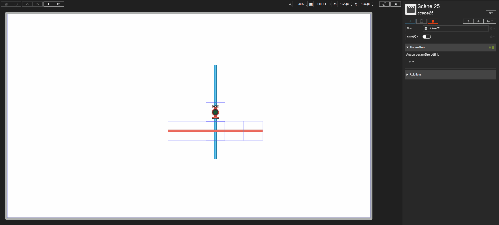



# Sélection contextuelle

Studio **1.7.3-beta**
{: .label .label-yellow }

La sélection contextuelle permet de sélectionner facilement un acteur difficile à atteindre dans la prévisualisation d'une scène, par exemple un acteur recouvert par un autre ou un conteneur entièrement occupé par ses enfants.

# Ouvrir le menu

Un **clic droit** dans la prévisualisation de la scène ouvre un menu contextuel qui liste **tous les acteurs situés sous le curseur**, y compris ceux qui sont masqués par d'autres acteurs.

Si aucun acteur ne se trouve sous le curseur, le menu ne s'ouvre pas.

{: .info }
> La sélection contextuelle n'est pas disponible dans le designer de style.

# Lire le menu

Les acteurs sont présentés sous forme d'arborescence : chaque acteur est affiché sous son conteneur, avec un décalage vers la droite. On retrouve ainsi la même hiérarchie que dans la liste des acteurs de la scène.

L'acteur actuellement sélectionné est mis en évidence dans le menu.

**Survoler** un acteur du menu le met en évidence dans la prévisualisation, ce qui permet de repérer l'acteur avant de le sélectionner.

# Sélectionner un acteur

- **Clic** sur un acteur du menu : l'acteur est sélectionné et son inspecteur s'affiche.
- **Maj + clic** sur un acteur du menu : l'acteur est ajouté à la [multi-sélection](./multi-selection.md), ou en est retiré s'il en faisait déjà partie. Comme pour la multi-sélection classique, seuls les acteurs placés directement dans une toile sont concernés.
