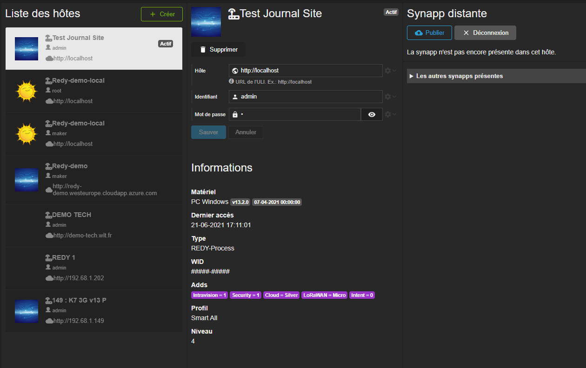

# Dans le Runtime

Dans la synapp, l'hôte est l'objet qui définit son hébergeur et qui contient les données exploitables.

Cela pourra être :

- un REDY
- un REDY-PC
- *bientôt* un serveur HighWay

L'objet hôte est accessible par liaison et par script. Il est porté par le magasin de données de la synapp.

Il contient la [session](./session.md) et permet sa gestion, par script.

> L'hôte est un objet essentiel à l'exécution d'une synapp.

# Dans Studio

Dans un projet, les hôtes sont gérés dans la section *Projet/Hôtes*.

Il est possible de définir plusieurs hôtes dans un même projet mais un seul sera actif en même temps et servira à la visualisation dans le designer ou à l'exécution dans le navigateur.

Aussi, en basculant de l'un à l'autre, il sera possible de visualiser une synapp exploitant différents REDY par exemple ou bien juste changer d'utilisateur sur un même REDY.

C'est dans cet onglet qu'il est possible publier la synapp dans un hôte.

## Création d'un hôte

Lorsque que vous créez un hôte, il faut renseigner son domaine et un les identifiants pour s'y connecter. Studio pourra alors l'utiliser comme hôte actif pour l'exécution et la prévisualisation, s'il vous le désirer.

## Informations

Les informations d'un hôte sont récupérées dès la première connection. Elles renseignent sur sa nature, ses options, ainsi que sur le profil utilisateur.

## Publication

> **Attention** N'oubliez pas qu'un profil d'*installateur* au minimum et l'*adds Intravision* sont requis pour pouvoir publier (ou gérer) un synapp sur un *REDY*.
