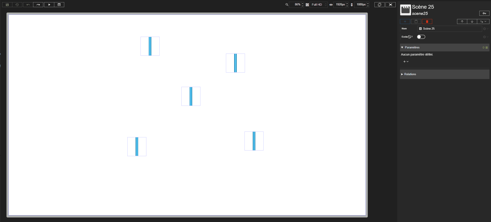



# Multi-sélection

Studio **1.7.3**
{: .label .label-green }

La multi-sélection permet de sélectionner plusieurs acteurs d'une scène pour les manipuler simultanément : les déplacer, les aligner ou les empiler.

{: .info }

> La multi-sélection ne concerne que les acteurs placés directement dans une [toile](./actor-types/layout/canvas.md). Les acteurs placés dans un autre conteneur (pile, slot, etc.) ne peuvent pas être multi-sélectionnés.

# Activer la multi-sélection

## Maj + clic

Maintenir la touche `Maj` (`Shift`) enfoncée et cliquer sur un acteur l'ajoute à la sélection. Cliquer à nouveau sur un acteur déjà sélectionné, toujours avec `Maj`, le retire de la sélection.

Si un acteur était déjà sélectionné avant le premier `Maj + clic`, il est conservé dans la multi-sélection.

Le `Maj + clic` fonctionne aussi bien dans la prévisualisation de la scène que dans la liste des acteurs de la scène.

## Sélection au lasso : Ctrl + glisser

Maintenir la touche `Ctrl` enfoncée, puis cliquer et glisser dans une toile pour tracer un lasso de sélection. Au relâchement du clic, tous les acteurs de la toile touchés par le lasso sont sélectionnés.

- Par défaut, le lasso **remplace** la sélection en cours.
- Si la touche `Maj` est enfoncée au moment de relâcher le clic, les acteurs du lasso sont **ajoutés** à la sélection en cours.

{: .pin }

> Le lasso ne sélectionne que les acteurs placés directement dans la toile où il a été commencé, pas ceux des toiles imbriquées.

## Repérer les acteurs sélectionnés

Les acteurs multi-sélectionnés sont mis en évidence via une couleur orange dans la prévisualisation de la scène ainsi que dans la liste des acteurs de la scène.

# Le panneau Multi-sélection

Dès que plusieurs acteurs sont sélectionnés, l'inspecteur est remplacé par le panneau **Multi-sélection**. Il affiche le nombre d'acteurs sélectionnés et leur liste :

- **Survoler** un acteur de la liste le met en évidence dans la prévisualisation.
- **Cliquer** sur un acteur de la liste quitte la multi-sélection et sélectionne uniquement cet acteur.
- Le bouton ✕ d'un acteur le **retire** de la sélection.
- Le bouton **Effacer la sélection** vide entièrement la sélection.

Une icône 🔗 indique qu'un acteur possède une liaison sur sa disposition (`top`, `left`, `bottom` ou `right`) : il ne peut alors pas être déplacé par les outils d'alignement et d'empilement.

# Actions disponibles

{: .info }

> Actuellement, les actions sur les acteurs telles que la suppression, le copier / coller ou la duplication ne sont pas disponibles lors de la multi-sélection. Ces actions seront disponibles dans une future mise à jour.

## Déplacer

- **À la souris** : glisser l'un des acteurs sélectionnés déplace tout le groupe en conservant les écarts entre les acteurs.
- **Au clavier** : les flèches `←` `→` `↑` `↓` déplacent tous les acteurs sélectionnés d'une unité. Avec `Ctrl`, le déplacement est de 10 unités.

## Aligner

La section **Alignement** du panneau permet d'aligner les acteurs sélectionnés par rapport au rectangle qui les englobe tous :

| Bouton                | Effet                                                               |
| --------------------- | ------------------------------------------------------------------- |
| **Aligner en haut**   | Aligne le bord haut de chaque acteur sur le bord haut du groupe     |
| **Aligner au milieu** | Aligne le centre vertical de chaque acteur sur celui du groupe      |
| **Aligner en bas**    | Aligne le bord bas de chaque acteur sur le bord bas du groupe       |
| **Aligner à gauche**  | Aligne le bord gauche de chaque acteur sur le bord gauche du groupe |
| **Aligner au centre** | Aligne le centre horizontal de chaque acteur sur celui du groupe    |
| **Aligner à droite**  | Aligne le bord droit de chaque acteur sur le bord droit du groupe   |

## Empiler

La section **Empilement** du panneau permet de placer les acteurs sélectionnés les uns à la suite des autres, sans espace entre eux :

| Bouton                      | Effet                                                                                                               |
| --------------------------- | ------------------------------------------------------------------------------------------------------------------- |
| **Empiler horizontalement** | Place les acteurs côte à côte de gauche à droite, dans leur ordre actuel, à partir de l'acteur le plus à gauche     |
| **Empiler verticalement**   | Place les acteurs les uns sous les autres de haut en bas, dans leur ordre actuel, à partir de l'acteur le plus haut |

{: .warning }

> L'alignement et l'empilement nécessitent au moins deux acteurs déplaçables. Un acteur n'est pas déplacé si sa disposition est liée (icône 🔗) ou si sa position n'est exprimée ni en `px` ni en `%`.

## Quitter la multi-sélection

- Appuyer sur `Échap` ;
- cliquer sur le bouton **Effacer la sélection** du panneau ;
- cliquer sur un acteur sans maintenir `Maj`.

# Raccourcis

| Raccourci                                  | Description                                   |
| ------------------------------------------ | --------------------------------------------- |
| `Maj + clic`                               | Ajoute ou retire un acteur de la sélection    |
| `Ctrl + glisser`                           | Trace un lasso qui remplace la sélection      |
| `Ctrl + glisser`, puis relâcher avec `Maj` | Trace un lasso qui ajoute à la sélection      |
| `←` `→` `↑` `↓`                            | Déplace les acteurs sélectionnés d'une unité  |
| `Ctrl` + `←` `→` `↑` `↓`                   | Déplace les acteurs sélectionnés de 10 unités |
| `Échap`                                    | Vide la sélection                             |
