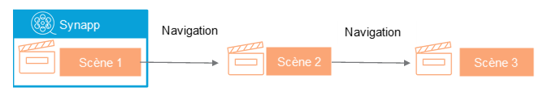

# La navigation dans une synapp

## Navigation simple

La synapp, lorsqu'elle démarre, affiche la scène de départ.

Si votre synapp contient plusieurs scènes, vous pouvez naviguer entre elles simplement en utilisant des [acteurs boutons de navigation](./actor-types/input-nav-button.md).

{: .info }
> Vous pouvez aussi naviguer par script voir [ici](./scripts/usefull-scripts.md#navigation-entre-scènes)

## Navigation dans un acteur écran

Si votre scène contient un [acteur écran](./actor-types/display/screen.md), vous pouvez le faire afficher une autre scène aussi grâce à un [acteur bouton de navigation](./actor-types/input/nav-button.md) en lui spécifiant le nom de l'acteur écran considéré.

{: .info }
Le champ [scène](./actor-types/display/screen.md#scene) de l'acteur écran peut être défini manuelle par liaison ou par script.

## Navigation paramétrée

Un bouton de navigation peut également servir à paramètrer une scène. Pour cela, le designer vous aidera : Sélectionner la scène à afficher, si elle possède des paramètres, le designer vous invitera à les ajouter pour en faire le réglage.

### Dans un acteur écran

Il est possible de paramétrer une scène visualisée dans un acteur écran. [voir ici](./actor-types/display/screen.md#scene)
