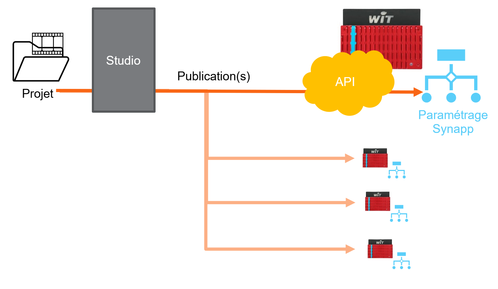
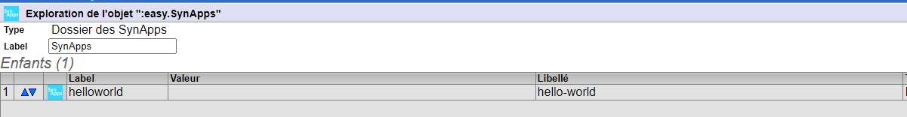
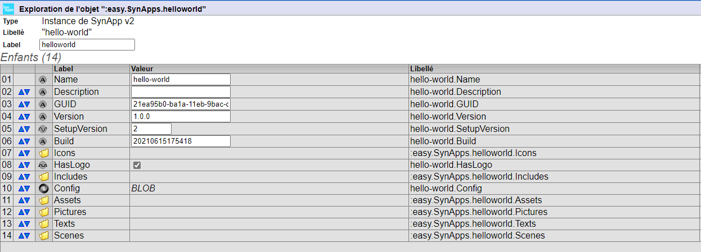



# Dans le Runtime

Dans la synapp, l'hôte est l'objet qui définit son hébergeur et qui contient les données exploitables.

Cela pourra être :

- un REDY
- un REDY-PC
<!-- - *bientôt* un serveur HighWay -->

L'objet hôte est accessible par liaison et par script. Il est porté par le magasin de données de la synapp.

Il contient la [session](../session.md) et permet sa gestion, par script.

> L'hôte est un objet essentiel à l'exécution d'une synapp.

# Dans Studio

Dans un projet, les hôtes sont gérés dans la section *Projet/Hôtes*.

Il est possible de définir plusieurs hôtes dans un même projet mais un seul sera actif en même temps et servira à la visualisation dans le designer ou à l'exécution dans le navigateur.

Aussi, en basculant de l'un à l'autre, il sera possible de visualiser une synapp exploitant différents REDY par exemple ou bien juste changer d'utilisateur sur un même REDY.

C'est dans cet onglet qu'il est possible publier la synapp dans un hôte.

## Création d'un hôte

Lorsque que vous créez un hôte, il faut renseigner son domaine et un les identifiants pour s'y connecter. Studio pourra alors l'utiliser comme hôte actif pour l'exécution et la prévisualisation, s'il vous le désirer.

## Informations

Les informations d'un hôte sont récupérées dès la première connection. Elles renseignent sur sa nature, ses options, ainsi que sur le profil utilisateur.

## Publication

La synapp doit être publiée dans l'hôte pour qu'elle soit accessible par les utilisateurs.

Studio s'occupe de transformer le projet et ce qu'il contient en un morceau de paramétrage, dans l'hôte.

Bien sur, si vous définissez plusieurs hôtes dans le projet, vous pourrez gérez la publication d'une même synapp sur autant d'hôtes.

> ⚠️ **ATTENTION**  N'oubliez pas qu'un profil d'*installateur* au minimum et l'*adds Intravision* sont requis pour pouvoir publier (ou gérer) un synapp sur un *REDY*.

Choisissez un hôte.

Connectez vous. Vous verrez les informations de l'hôte dans la colonne centrale.

Aussi, dans la colonne de droite, vous verrez la partie dédiée à la gestion des synapps de l'hôte.

Dans le haut se trouve la zone dédiée à la synapp correspondant au projet publiée dans le REDY. En dessous, vous pourrez afficher et gérer les autres synapp publiée dans le REDY.

> ⚠️ **ATTENTION**  Chaque synapp est identifiée par le GUID du projet. Mais sur le REDY, c'est son *label* qui l'identifie. Donc faite attention à ne pas écraser une synapp déjà publiée.

A chaque publication, un numéro de *build* est inscrit. En réalité, c'est la date à laquelle la synapp a été publiée.

Vous pouvez aller voir comment se passe la publication dans l'étape qui la concerne dans le [démarrage rapide](../../quick-start/synapp-publish.md).

### La synapp dans le paramétrage

La synapp dans un REDY se traduit par un noeud dans le *paramétrage* :

Il contient toute une arborescence que le runtime de Synapps sait interpréter.

> ⚠️ **ATTENTION**  Surtout, ne changez rien dans cette arborescence. Laissez Synapps Studio gérer ce paramétrage.

> 📌 **REMARQUE**  N'oubliez pas de sauvegarder le paramétrage après avoir publier la synapp.
