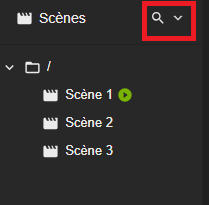




La scène est l'objet qui va définir chaque interface de votre synapp.

# Scène de démarrage
La synapp démarre en affichant une première scène, c'est la **scène de démarrage**. Elle se définie au niveau de la liste des scènes dans Studio et elle est matérialisé par la présence de l'icône .


# Affichage de scène

Les acteurs [boutons de navigation](./actor-types/input-nav-button.md) permettent de changer la scène présentée par la synapp.

Aussi l'[acteur écran](./actor-types/display-screen.md) permet d'afficher une autre scène au sein d'une scène.

Bien entendu, il est possible de commander les affichages de scènes par liaison ou script.

# Champs d'une scène

## Clé

Une scène est identifiée par sa clé. Elle doit être unique dans une synapp.

> ✔️ **CONSEIL**<br>
Il est recommandé de donner définir la clé d'une scène qui correspond à ce qu'elle va afficher.

## Nom

De manière usuelle dans Studio, une scène est caractérisée par son nom. Il ne faut pas hésiter à bien le choisir pour illustrer ce qu'elle va afficher.

## Exclusion

Une scène peut être exclue de la publication dans une ULI. Cette scène ne sera présente que dans votre projet. Ceci peut etre pratique pour définir des scènes de test qui n'ont pas vocation à apparaître dans la synapp définitive.

## Paramètres de scène

Il est possible de définir des additionnelles pour paramétrer une scène. [voir les additionnelles](./additionals.md)
Ces additionnelles sont accessibles par liaison et script, bien entendu.

Elles possèdent une option supplémentaire ici : la possibilité d'afficher le paramètre dans l'`URL` du navigateur. Ainsi, il est possible de paramétrer une scène directement depuis son adresse d'accès.

## Les acteurs

Les [acteurs](./actor/index.md) sont les éléments qui vont définir l'interface qu'est une scène. Ils sont définie comme une arborescence en partant d'un seul acteur : l'**acteur principale**.


# Liste des scène

La liste des scène dans Studio est une arborescence de dossier dans lesquels sont rangé les scène du projet.


La gestion des dossiers et scènes se réalise grace aux actions contenu dans le menu contextuel de chaque élément.

## Ajouter une scène

Pour ajouter une scène, il faut réaliser un clic droit sur un dossier pour afficher le menu contextuelle et choisir dans les options d'ajout la scène de base à ajouter.
Il y a pour l'instant que deux scènes de base : une scène vide et le modèle de scène par défaut.


### Copier/Coller de scène

Il est possible de copier dans votre presse papier une scène grâce au menu contextuel.

Ainsi vous pouvez coller cette scène, toujours grâce au menu, n'importe où :
- dans un dossier de votre projet, elle sera dupliquée
- dans un autre projet
- dans un mail pour la partager.
- dans un fichier pour l'archiver
- ou, comme ici, en exemple.

> ⚠️ **ATTENTION**<br>
> Vous copiez uniquement la scène, pas les éléments de librairie qu'elle utilise éventuellement.

## Ajouter un dossier

De la même manière que les scènes, il est possible d'ajouter un nouveau dossier en affichant le menu du dossier dans lequel on veut l'ajouter.
Vous trouverez l'action qui permet de changer le nom d'un dossier dans son menu contextuel.

# Designer de scène

Dans Studio, lorsque vous cliquer sur une scène dans leur liste, vous afficherez le **designer** de scène. Cette interface vous permet de complètement définir la scène.

Dans le designer, vous allez pouvoir gérer les champs de la scène ainsi que l'arborescence d'acteur que la scène présente.


- Au centre se trouve l'**aperçu** de la scène <span style="color: red;">**A**</span>.
- En dessous de la liste des scènes, sur la gauche, vous trouverez le **plan des acteurs**  <span style="color: red;">**B**</span>.
- Sur la gauche s'affiche l'**inspecteur** de l'objet que vous sélectionnerez dans le panneau de gauche  <span style="color: red;">**C**</span>.

## La recherche de scènes



Il est possible de rechercher une scène à l'aide de l'outil "loupe".<br>
La recherche de scène repose sur la correspondance des clés des scènes avec une chaîne de caractères spécifiée par l'utilisateur.
Lorsque vous effectuez une recherche, l'application parcourt l'arborescence des scènes et identifie tous les acteurs dont la clé correspond à la chaîne de caractères renseignée.

>📌*Remarque*
>
>Il est important de noter que la recherche n'est pas sensible à la casse, ce qui signifie que les lettres majuscules et minuscules sont traitées de la même manière.
>Par exemple, une recherche pour "scene123" retournera les résultats pour "Scene123" et "scene123" indifféremment.

# Scènes remarquables

Dans ce qui suit, vous trouverez un ensemble de scènes remarquables que vous pouvez librement copier/coller dans vos créations.

Vous trouverez un tutoriel qui explique comme coller une scène dans votre projet [ici](../tutorials/copy-paste-actor-scene-composite.md#copiercoller-une-scène).

## Hub choix de gabarit
Voici une scène qui, une fois définie comme départ, permet d'automatiquement naviguer vers une scène faite pour le gabarit Desktop/Tablette ou vers une scène faite pour le gabarit Smartphone du projet. La bonne scène est choisie en fonction de la résolution de l'afficheur et de la présence des fonctions tactiles.

Les scènes cibles sont à définir dans des paramètres de la scène.



```text
SYNAPPS-STUDIO-SCENE|{"config":{"key":"hub","name":"Hub","additionalDefs":{"desktopMaster":{"type":"scene","label":"Gabarit Desktop","helperTxt":"Scène de Gabarit pour PC et tablette"},"smartphoneMaster":{"type":"scene","label":"Gabarit Smartphone","helperTxt":"Scène de Gabarit pour Smartphone"},"size":{"type":"number","label":"Taille limite","unit":"px"}},"additionals":{"size":760}},"leadActor":{"key":"stack1","type":"layout/stack","properties":{"verticalAlignment":"expand"},"events":{"onInit":["const smartphoneMaster = this.scene.additionals.smartphoneMaster;","const desktopMaster = this.scene.additionals.desktopMaster;","const size = this.scene.additionals.size || 760;","const isEmpty = context.utils.isEmpty;","if (isEmpty(smartphoneMaster) || isEmpty(smartphoneMaster)) return;","this._navTimeout = setTimeout(() => {","  if (this.isDestroyed || this.isDestroying) return;","  if (this.synapp.isInDesigner) return;","  var isSmallScreen = window.matchMedia(`only screen and (max-width: ${size}px), only screen and (max-height: ${size}px)`);","  var isTouchEnabled = 'ontouchstart' in window || navigator.maxTouchPoints > 0 || navigator.msMaxTouchPoints > 0;","  var hasMouse = Boolean(window.matchMedia('(hover: hover) and (pointer: fine)').matches);","  if (isSmallScreen.matches && isTouchEnabled && !hasMouse) {","    this.synapp.navigate(this.scene.additionals.smartphoneMaster);","  } else {","    this.synapp.navigate(this.scene.additionals.desktopMaster);","  }","}, 500);"],"onDestroy":["if (this._navTimeout) clearTimeout(this._navTimeout);"]}}}
```

