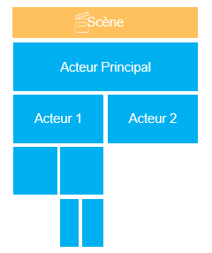



# Cycle de vie d'un acteur

Tous les acteurs ont un cycle de vie lorsqu'il sont affiché puis supprimé d'une scène (c'est valable aussi avec un composite).

A chaque étape du cycle de vie, l'acteur subit des transformations et, parfois, des évènements sont déclenchés. Ces derniers offrent des occasions de d'exécuter des actions définies dans des scripts `Javascript`.

Pour savoir quand et comment intervenir au bon moment sur un acteur, il est important de bien comprendre son cycle de vie dans une scène/composite.

# Affichage d'une scène ou composite

Lorsqu'une scène ou un composite doit s'afficher, Le *Runtime* interprète sa définition de l'acteur principal. Il contient l'arborescence des acteurs qui composent la scène ou le composite. Il contient également toutes les définitions de scripts.

Le *Runtime* va parcourir l'arborescence des acteurs en commençant par l'acteur principal. Il s'occupera ensuite de chaque enfant, de chaque enfant d'un acteur enfant, etc.

Mais l'affichage de l'arborescence se passe en 3 passes :

- L'initialisation
- La post-initialisation
- le premier rendu.

Chaque passe à un role particulier et pendant laquelle des évènements sont déclenchés.

## Initialisation

Pendant la phase d'initialisation, les acteurs sont parcouru en descendant dans l'arborescence pour être créé et initialisé.

Dans cette phase l'acteur va initialiser ses propriétés, valoriser les propriétés définies dans son paramètre, créer ses éventuelles additionnelles et les valoriser.

Un évènement est ensuite déclenché : [`onInit`]({{ site.baseurl }}/script-api/Actor.BaseActor.html#event:onInit){:target="_blank"}.

A ce moment, tous les acteurs définis dans la scène ou le composite ne sont pas encore présents ni disponibles.
Les [liaisons](../binding.md) ne sont toujours pas réalisées.

> ✔️ **CONSEIL** 
> C'est donc une phase privilégiée pour compléter l'initialisation de l'acteur. Par exemple, changer par script des valeurs de propriétés. En effet, on ne risque pas de perdre en performance à cause d'exécution de liaison et leur conséquences puisqu'elles ne sont pas encore effective.

> C'est le meilleur moment également pour définir des logiques métiers à attacher à l'acteur ou à la scène / composite.

En revanche, ce n'est pas le bon moment pour tenter d'accéder à d'autres acteurs puisqu'ils ne sont pas encore tous créés.

Ce n'est pas non plus le moment d'agir sur l'élément DOM correspondant à l'acteur : il n'est pas encore créé !

## Post-initialisation

Une fois que tous l'arborescence est initialisée, le *Runtime* va exécuter la phase de post-initialisation, cette fois-ci en remontant dans cette arborescence.

Dans cette phase, l'acteur va placer l'élément DOM dans le flux HTML, créer ses liaisons, résoudre les sources de ces liaisons et les exécuter.

Un évènement est ensuite déclenché : [`onPostInit`]({{ site.baseurl }}/script-api/Actor.BaseActor.html#event:onPostInit){:target="_blank"}.

> ✔️ **CONSEIL** 
> C'est le bon moment pour agir dans l'élément DOM. Mais attention, le style CSS de l'acteur n'est pas encore défini ni ces classes CSS. Ce n'est pas le moment d'agir sur ces élément.

En revanche, tous les acteurs sont présents et disponibles mais certains acteurs ne sont pas encore post-initialisés.

## Premier rendu

Après que l'acteur principal soit post-initialisé, le *Runtime* va exécuter la phase de premier rendu.

Elle consiste à parcourir l'arborescence en descendant.

Plusieurs étapes vont être réalisées :

A chaque acteur correspond un élément DOM dan le flux HTML. Des classes CSS sont définies en fonction du type d'acteur et du [style d'acteur](../actor-style.md) qu'il utilise. Une [classe unique]({{ site.baseurl }}/script-api/Actor.BaseActor.html#uniqClass){:target="_blank"} est aussi définie en fonction de la clé de l'acteur et de l'endroit où il se trouve. Elle très utile pour identifier l'acteur dans le DOM. Enfin, les classes définies dans la propriété *Classes* de l'acteur sont ajoutées.

Le style CSS de l'élément est renseigné grâce au propriétés de l'acteur ainsi que par le [style d'acteur](../actor-style.md) qu'il utilise.
C'est dans cette phase que ce style CSS est construit et renseigné sur l'élément DOM.

L'évènement [`onCssStyling`]({{ site.baseurl }}/script-api/Actor.BaseActor.html#event:onCssStyling){:target="_blank"} est déclenché.

> ✔️ **CONSEIL** 
> C'est le moment de modifier le style CSS de l'élément DOM ou d'ajouter des classes CSS dessus par script.

Ensuite, un premier calcul de gabarit est réalisé sur l'acteur. Certain acteur ont besoin de cette étape pour s'afficher correctement, comme par exemple la [boite à vue](../actor-types/layout-view-box.md).

Enfin, l'évènement [`onRender`]({{ site.baseurl }}/script-api/Actor.BaseActor.html#event:onRender){:target="_blank"} est déclenché. Dans le contexte de l'évènement, le champ `isFirstRender` est vrai. En effet, cette évènement est déclenché à chaque fois que l'acteur passe par l'étape de rendu, il est donc intéressant de savoir si c'est le premier rendu ou non.

> ✔️ **CONSEIL** 
> Cet évènement est le moment propice pour agir sur l'élément DOM ou à l'intérieur.

## Résumé

| Phase | Description | Parcourt | Évènements | Liaisons | Présence du DOM | Style et Classes CSS | Gabarit calculé |
|:----:|:-----------|:-------:|:----------------------|:--------:|:--------:|:--------:|:-----------------:|
| Initialisation | Création des acteurs et Initialisation des propriétés et additionnelles | Descendant | `onInit` | | | | |
| Post-initialisation | Placement de l'élément DOM dans le flux HTML et création des liaisons | Montant | `onPostInit` | Création | Création | | |
| Premier rendu | Création des classes CSS, du style CSS et du gabarit | Descendant | `onCssStyling` `onRender(isFirstRender=true)` | Oui Oui | Oui Oui | Création Oui | Non Oui |

>📌*Remarque*
>
> L'acteur principal d'une scène possède un évènement supplémentaire : [`onLeadActorDidRender`]({{ site.baseurl }}/script-api/Actor.BaseActor.html#event:onLeadActorDidRender){:target="_blank"}. Cet évènement est déclenché une seule fois, lors du premier rendu de l'acteur principal, lorsque toute la scène sera rendue. Il ne sera pas déclenché lors des rendus suivants.

# Ajout d'un acteur dynamiquement

Lorsqu'un acteur est ajouté après l'affichage d'une scène ou d'un composite, tout ce passe comme si c'était un acteur principale. Le rendu de cet acteur et de ses enfants passent les mêmes phases :
- Initialisation
- Post-initialisation
- Premier rendu

Une fois que l'acteur est rendu, il va se passer déclencher une cascade de changement de taille dans l'arborescence. Il faut donc s'attendre à l’exécution de l'évènement `onComputeLayout` sur une bonne partie de l'ascendance de l'acteur ajouté.

> ✔️ **CONSEIL** 
> A cause de ce phénomène de recalcule des gabarits dû à l'insertion d'un acteur dynamiquement, dans le cas d'ajout massif, il est necessaire de prendre en compte ce temps voir le minimisé (ajout dans une toile, tailles du contenant fixes, délai entre chaque ajout, ajout d'acteurs en une seule fois).

# Suppression d'un acteur

Lors de la suppression d'un acteur par exemple lors d'un changement de scène, les liaisons vont être retirées, l'élément DOM va être retiré également du flux HTML. L'évènement [`onDestroy`]({{ site.baseurl }}/script-api/Actor.BaseActor.html#event:onDestroy){:target="_blank"} est déclenché.

> ✔️ **CONSEIL** 
> C'est le bon moment pour retirer des évènements sur l'élément DOM que vous auriez ajouté manuellement.

Il faut savoir que la suppression d'une arborescence d'acteur est parcourue en montant.

| Phase | Description | Parcourt | Évènements | Liaisons | Présence du DOM | Style et Classes CSS | Gabarit calculé |
|:----:|:-----------|:-------:|:----------------------|:--------:|:--------:|:--------:|:-----------------:|
| Destruction | Destruction des acteurs et Désactivation des liaisons | Montant | `onDestroy` | Oui | Oui | Oui | Oui |

# Changement de valeur de propriété d'un acteur

Lors d'un changement de valeur de propriété ou d'une additionnelle d'un acteur, deux évènements sont déclenchés :

 - `onValueChanged` qui est déclenché pour une propriété donnée de l'acteur. La nouvelle valeur `newValue` et l'ancienne `oldValue` sont présentes dans le contexte de l'évènement.
 - `onPropertyChanged` qui est déclenché pour n'importe quelle propriété ou additionnelle de l'acteur. En plus de l'ancienne et nouvelle valeur, les champ `name` et `propertyPath` sont présents dans le contexte pour identifié la propriété ou l'additionnelle qui a changé.

Avant de déclenchement de ses deux évènements, un changement de valeur peut déclencher ce qu'on appelle un modification.
Il existe 4 modifications possibles :
- Aucune modification : dans ce cas, rien ne se passe. C'est la modification par défaut des additionnelle.
- **Styles CSS** : dans ce cas, le style CSS de l'élément DOM est recalculé. L'évènement [`onCssStyling`]({{ site.baseurl }}/script-api/Actor.BaseActor.html#event:onCssStyling){:target="_blank"} est déclenché une nouvelle fois.
- **Rendu** : dans ce cas, un nouveau rendu globale est réalisé. Les évènements [`onCssStyling`]({{ site.baseurl }}/script-api/Actor.BaseActor.html#event:onCssStyling){:target="_blank"}, [`onComputeLayout`]({{ site.baseurl }}/script-api/Actor.BaseActor.html#event:onComputeLayout){:target="_blank"} et [`onRender`]({{ site.baseurl }}/script-api/Actor.BaseActor.html#event:onRender){:target="_blank"} sont déclenchés.
- **Gabarit** : dans ce dernier cas, le gabarit de toute la ligne d'arborescence est recalculé. Ce qui va entraîner une série d'exécution de l'évènement [`onComputeLayout`]({{ site.baseurl }}/script-api/Actor.BaseActor.html#event:onComputeLayout){:target="_blank"}.

Les propriétés spécifiques d'un acteur possèdent chacune leur type de modification. C'est à vous de définir la modification qu’entraîne le changement de valeur sur une additionnelle.

# Transformations de liaison

Il est possible d'intervenir sur la valeur qui sera inscrite dans la propriété cible d'une [liaison](../binding.md):  
Lorsque la valeur source ou la source elle-même change, la valeur est lue pour être inscrite dans la propriété cible. L'évènement [`onReadTransform`]({{ site.baseurl }}/script-api/Actor.BaseActor.html#event:additionals/[additionalName]/binding/onReadTransform){:target="_blank"} se déclenche pour passer la valeur source par l'intermédiaire du champ `value` du contexte de l'évènement. Elle est, par défaut, directement retournée par l'évènement. Il est possible de modifier ce comportement et de transformer cette valeur afin d'écrire autre chose dans la propriété cible.

> ✔️ **CONSEIL** 
> Très pratique par exemple pour changer le type de valeur : passer d'une valeur booléenne à une couleur.

De la même manière, si l'écriture est activée sur la liaison, un changement de valeur de la cible va déclencher l'écriture dans la valeur source. L'évènement [`onWriteTransform`]({{ site.baseurl }}/script-api/Actor.BaseActor.html#event:additionals/[additionalName]/binding/onWriteTransform){:target="_blank"} se déclenche et permet d'intervenir sur la valeur transmise dans l'autre sens.

>⚠️ **ATTENTION** 
> Dans le cas où vous réalisez une transformation en lecture sur une liaison dont l'écriture est activée, veillez à opérer la transformation inverse. Sinon quoi vous feriez entrer l'interface dans une boucle sans fin où l'écriture défait ce que fait la lecture.
