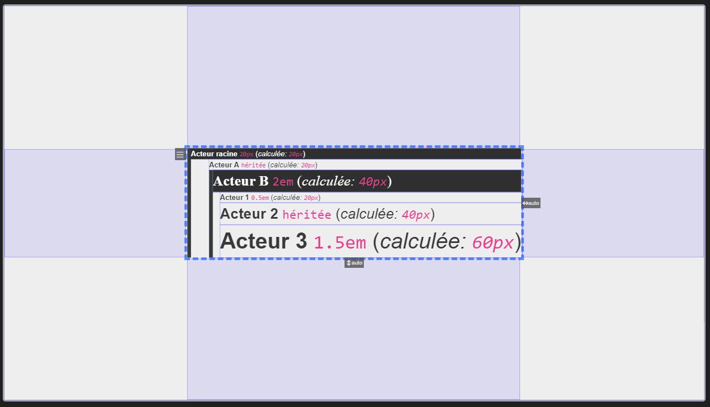

# Tailles

Les propriétés de type tailles dans Synapps prennent comme valeur les tailles CSS. Ici, vous aurez un aperçu des différentes unités de grandeur et instructions utiles pour vos créations.

## Grandeurs et unités

Une grandeur de type taille a toujours une unité. L'unité la plus connue est le pixel `px`. Mais il en existe bien d'autres que Studio reconnaît.

Il y a d'abord les unités de tailles fixes :
- le pixel `px`,
- le centimètre `cm`,
- le pouce `in`.

Ensuite il y a les unités relatives à la taille du texte :
- le `em`,
- le `rem`,
- le `ch`.

Et enfin les unités relative à la taille du conteneur, de l'équipement ou bien de la fenêtre du navigateur :
- le pourcentage `%`,
- `vw`,
- `vh`,
- `vmin`,
- `vmax`,

### Le pixel `px`

Le pixel est une unité fixe, c'est à dire que pour un appareil et une échelle donnée, le pixel a toujours la même taille. C'est une unité facile à employer.

> 💡 **ASTUCE** 
> Toujours employer cette unité lors de montage d'acteurs qui se chevauchent comme les constructions de plan ou des dessins précis dans un acteur [Toile](./actor-types/layout-canvas.md). Ensuite, laisser faire un acteur [Boite à vue](./actor-types/layout-view-box.md) pour que l'ensemble s'adapte à n'importe quelle taille.

Le pixel est défini comme étant le plus petit élément de l'écran suffisamment grand pour être visible.

### Le centimètre `cm` et le pouce `in`

Le centimètre et le pouce sont proches des unités réelles tant que l'écran est suffisamment grand.
Il sont très pratiques pour définir des tailles *organique*. Par exemple, pour s'assurer qu'un objet soit *touchable*, il est possible de lui donner une taille supérieure à `1cm`.

> ⚠️ **ATTENTION** 
> Le `cm` d'un écran de petite taille peut être plus petit qu'un vrai centimètre.

### Le `em`

`1em` fait la taille du texte de l'acteur. Rappelons que la taille du texte est une propriété héritée.
Ainsi, si votre acteur a une taille de texte définie à `15px`, `1em` représente `15px`.
Si le un acteur parent (de disposition, ou un composite, ...) a défini sa taille de texte à `30px`, `1em` représentera `30px` pour tous les acteurs enfants.

Cette unité est très pratique pour définir une taille de texte de référence tout en haut de votre arborescence d'acteur et de définir des tailles relatives en dessous.
Exemple:

Imaginons que vous ayez l'arborescence suivante :
- Acteur racine (Taille de texte : `25px`)
  - Acteur A
  - Acteur B (taille de texte : `2em`)
    - Acteur 1 (taille de texte : `0.5em`)
    - Acteur 2
    - Acteur 3 (taille de texte : `2em`)

Cela va se traduire effectivement par les tailles suivantes :
- Acteur racine (Taille de texte : `25px`)
  - Acteur A
  - Acteur B (taille de texte *calculée* : `50px`)
    - Acteur 1 (taille de texte *calculée* : `25px`)
    - Acteur 2
    - Acteur 3 (taille de texte *calculée* : `100px`)

Si vous changez la taille de l'acteur racine, automatiquement, les autres acteurs suivent sans changer leur réglage.

> 💡 **ASTUCE** 
> La démarche de renseigner quelques tailles en racine de votre interface et de définir les propriétés qui héritent en `em` est très pratique. Cela fait gagner un temps précieux pour ajuster les tailles et réaliser des modifications globales.

### Le `rem`

L'unité `rem` est sensiblement la même que `em`. La seule différence est que la taille de référence est celle de la taille du texte définie sur le *corps* de la page `HTML` (son `body`). Dans Synapps, vous n'avez pas directement accès au réglage de cette taille qui est de 12px`. Mais il est possible de la changer par script ou par CSS.

### Le pourcentage `%`

Cette unité est le pourcentage de la gradeur du contenant. Elle n'est toujours facile à utiliser. En effet, il est parfois difficile de savoir de quelle dimension du contenant la référence est prise : la largeur ou la hauteur. En générale, lorsqu'il s'agit d'une grandeur verticale, la référence est prise sur la hauteur du contenant. Lorsqu'il s'agit d'une grandeur horizontale, la référence est la largeur du contenant. Si c'est vrai pour la hauteur, la largeur, la taille de texte, ce n'est pas vrai pour les marges intérieures et extérieures.

### Le `vh` et le `vw`

Le `vh` est un pourcentage de la hauteur de la fenêtre de navigateur ou de l'écran pour un appareil nomade.
Le `vw` est un pourcentage de la largeur de la fenêtre de navigateur ou de l'écran pour un appareil nomade.

Ainsi, un acteur qui fait `50vh` de hauteur et `33vw` de largeur fait la moitié de la fenêtre en largeur et le tier en hauteur.

Ces deux unités permette de commencer à définir des tailles qui sont liées aux caractéristiques de la fenêtre ou écran.

### Le `vmin` et le `vmax`

Le `vmin` est un pourcentage de la taille de la dimension de l'écran la plus petite des deux. C'est à dire, pour un écran plus large que haut, ce sera en pourcentage de la hauteur.

Le `vmax` est un pourcentage de la taille de la dimension de l'écran la plus grande des deux. C'est à dire, pour un écran plus large que haut, ce sera en pourcentage de la largeur.

Ces deux unités s'avèrent être encore plus pratiques que les deux précédentes sur les appareils nomades notamment. En effet, quelque soit l'orientation de l'écran, si vous définissez une taille en `vmin` ou `vmax`, elle restera inchangée !
Ainsi, vous pouvez définir des tailles de texte en `vmin` afin de vous assurez de sa lisibilité, quelque-soit l'orientation.

