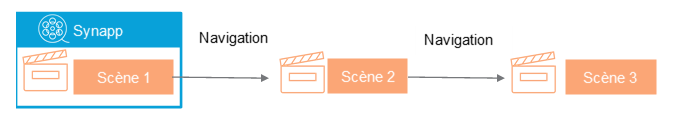

> En cours de rédaction...

La synapp est l'application IHM à proprement parler. Elle contient les définitions essentielles à son exécution.

La synapp a une identité, un nom, une icône qui lui est propre.

C'est cet objet qui orchestre l'affichage de la scène en cours et qui va contenir tous les éléments de l'application comme les librairies, les fournisseurs de données, les composites, etc.

## Dans Studio

Les réglages de la synapp sont gérés dans Studio dans la sous-section [Projet/Généralités](./project.md#généralités).

## Identifiant de la synapp

### Le label

C'est ainsi que le REDY identifie la synapp. Le paramètrage de la synapp dans le REDY est d'ailleurs stockée dans chemin `:easy.SynApps.<son label>`.

### Le `guid`
La synapp porte le `guid` du projet qui a servi à sa création et publication. C'est ce qui permet à un projet de reconnaitre "sa" synapp dans le REDY.

## Définition d'une synapp au log d'un utilisateur

> En cours de rédaction...
