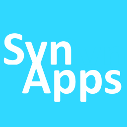
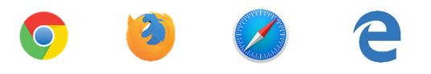
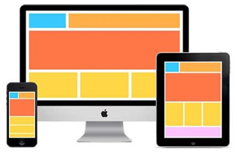
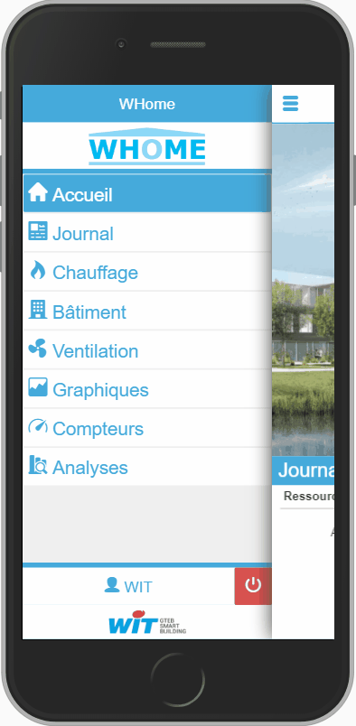
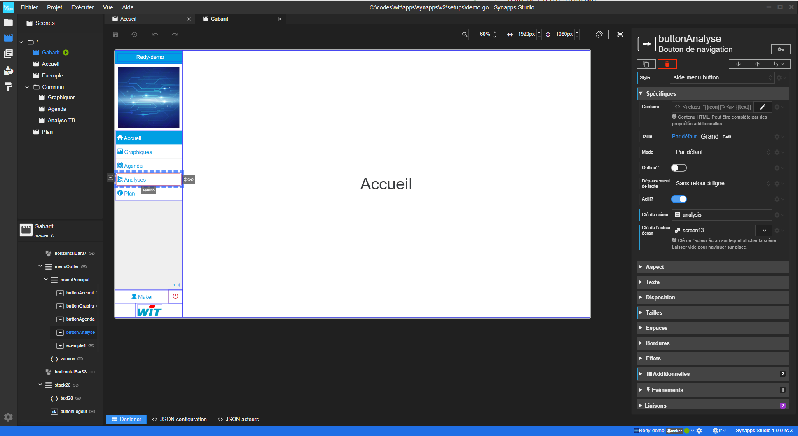

Documentation de la solution Synapps
====================================

> en cours de rédaction
> Progression **7%**



## **SynApps**: Construisez des apps **multi-plateformes** avec le **REDY**

SynApps est une **nouvelle solution** de WIT avec un **nouvel outil** de construction d'applications web avec le REDY. Il respecte les **standards** du WEB de manière à profiter des fonctionnalités modernes des navigateurs comme, entre autres, la capacité à s'adapter aux différentes tailles d'écrans et smartphones.

> Il ne s'agit pas d'une simple évolution des synoptiques mais d'une **rupture** complète dans la façon de construire des applications !

Les utilisateurs ciblés par les applications générées par SynApps sont **tous les acteurs** du bâtiment (occupants, gestionnaires, exploitants, …) équipés par nos gammes d'ULIs REDY: SynApps s'inscrit dans une démarche **Smart Building** et **Smart Water** et à pour ambition de répondre à ces **nouveaux usages**

## Synapps Studio : outil de *construction* et de *déploiement*.

Véritable environnement de développement intégré (IDE), Synapps Studio est l'outil de *construction* et de *déploiement*.
Avec Studio,
 - vous construisez votre application WEB avec des outils d'édition d'interface simples et intuitifs,
 - vous tester l'exécution de l'application sur des ULIs.
 - vous déployer votre application dans des ULIs.

### Quelques fonctionnalités
  - Construction de librairies de couleurs, images, constantes.
  - Construction de nouveaux acteurs à partir d'autres : Les Composites.
  - Support Multi-langue.
  - Gestion de style.
  - Entièrement programmable, sur une base évènementielle : Les Scripts. Language : **Javascript**. Une API de référence est disponible (*en construction*). Utilisation de **HTML** et **CSS**

## Démarrage Rapide

Vous trouverez un guide de démarrage rapide pour une première prise en main de l'outils et appréhender les concepts de la solution.

## Le précurseur de Studio : La Maker

La documentation de Synapps Maker, l'éditeur précurseur de Synapps Studio est toujours accessible.

[Voir la Documentation Synapps Maker](./maker/README.md){: .btn .btn-blue }
