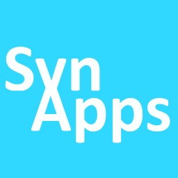
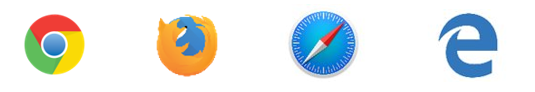
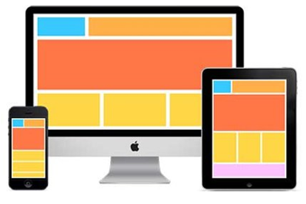
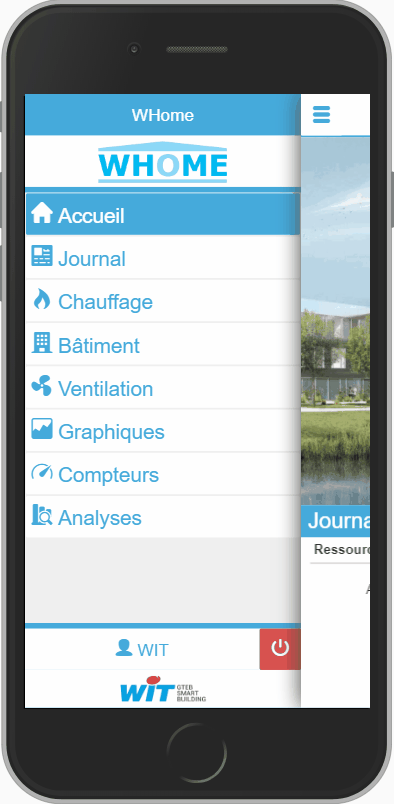
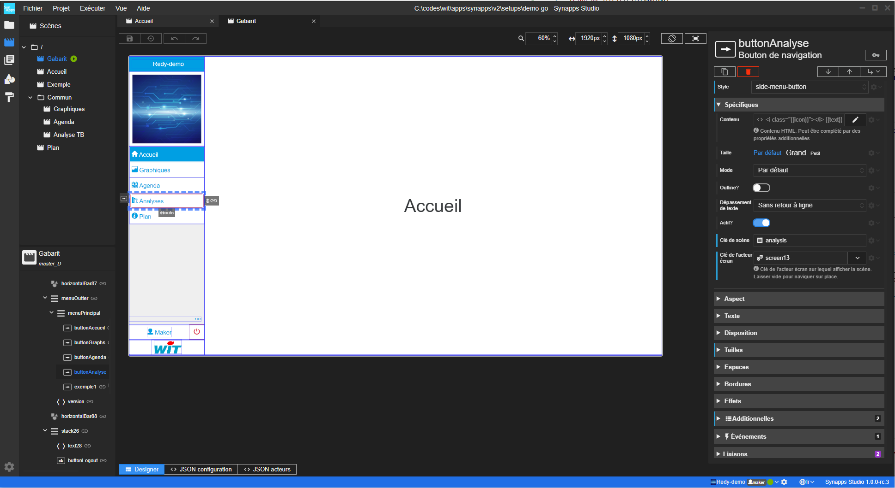

Solution Synapps
================

------



## **Synapps**: Pour rendre chaque détail spectaculaire

Synapps est la **nouvelle solution** de WIT de construction d'imagerie pour le REDY. La solution respecte les **standards** du WEB pour profiter des fonctionnalités modernes des navigateurs comme, entre autres, la capacité à s'adapter aux différentes tailles d'écrans et smartphones.

> Il ne s'agit pas d'une simple évolution des synoptiques mais d'une **rupture** complète dans la façon de construire des applications !

**Tous les acteurs** du bâtiment (occupants, gestionnaires, exploitants, …) équipés par nos gammes d'ULIs REDY sont ciblés par les applications générées par Synapps : Synapps s'inscrit dans une démarche **Smart Building** et **Smart Water** et à pour ambition de répondre à ces **nouveaux usages**

## Synapps Studio : outil de *construction* et de *déploiement*.

Véritable environnement de développement intégré (IDE), Synapps Studio est l'outil de *construction* et de *déploiement*.
Avec Studio,
 - vous construisez votre application WEB avec des outils d'édition d'interface simples et intuitifs,
 - vous testez l'exécution de l'application sur des ULIs.
 - vous déployez votre application dans des ULIs.

### Quelques fonctionnalités
  - Editeur visuel d'interface
  - Copier/coller partout
  - Construction de librairies de couleurs, images, constantes.
  - Construction de nouveaux acteurs à partir d'autres : Les Composites.
  - Support Multi-langue.
  - Gestion de style.
  - Entièrement programmable, sur une base évènementielle en **Javascript**. Une API de référence est disponible.
    - Utilisation de **HTML** et **CSS**

## Démarrage Rapide

Vous trouverez un [guide de démarrage](./quick-start) pour une première prise en main de l'outils et appréhender les concepts de la solution.

## Rejoignez la communauté des créateurs Synapps Studio

Les fonctionnalités de Studio encouragent le
partage de vos créations. Copier/coller dans
un mail un modèle de projet, un acteur, une
scène ou un composite n’a jamais été aussi
simple. De plus, Studio vous permet de
documenter les fonctionnalités de vos
créations afin qu’elles soient facilement
réutilisables par d’autres créateurs.

### Discussions et échanges

La plateforme de [discussion de GitHub](https://github.com/witsa/synapps/discussions) est ouverte à tous les utilisateurs pour poser des questions, proposer des idées, partager vos création ou tout simplement discuter de la solution.

Pour y participer, créer un compte GitHub si vous n'en avez pas déjà un.

> 💡 **ASTUCE**  [Une discussion](https://github.com/witsa/synapps/discussions) en particulier porte sur les mise à jour de cette documentation. Vous y trouverez aussi la liste des rubriques à venir.
>
> **Abonnez vous à ses notifications et vous serez prévenu des nouveautés.**

### Problèmes et demandes d'évolution

{:target="_blank"}

La plateforme [GitHub Issues](https://github.com/witsa/synapps/issues) de la solution
Synapps permet aux créateurs de partager
des retours de leur usage, facilement.
Posez une question, proposez une
fonctionnalité ou communiquez un
dysfonctionnement : la communauté des
créateurs vous répondra.
Captures d’écran, extrait de code, fichiers
joints pourront enrichir vos retours et vos
réponses.

Essayer d'être le plus **exhaustif** possible et communiquer, quand c'est possible, étapes de reproduction d'un bug, copies d'écrans et description détaillée!

Dans un second temps, vous pouvez également contacter le **support** WIT

---------------------

## Le précurseur de Studio : Maker

La documentation de Synapps Maker, l'éditeur précurseur de Synapps Studio est toujours accessible. Il reste disponible pour la maintenance des Synapps de première génération.

[Voir la Documentation Synapps Maker](./maker/README.md){: .btn .btn-blue }
