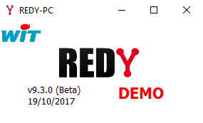

[Home](sitemap.md)

# Installation

## Prerequis

Le minimum pour construire et déployer une SynApp est:
* un **Maker** qui est l'outil de construction et de déploiement de SynApps
* un **REDY** ou un **REDY PC** en version **9.3.1** et **supérieure** sur lequel sera déployé la *SynApp*

### Maker

Le Maker est l'outil de construction et de déploiement de SynApps. Il est distribué sous la forme de:

1. **WebApp** via le cloud WIT: voir **équipe SynApps** pour les modalités d'accès. Voir également la [matrice de compatibilité des navigateurs](browers.md)

2. Executable **Windows** avec un installeur:
```
\\WIT-FILE\Echange\SynApps\Maker\win32\SynApps-X.X.X Setup.exe
```
_Remarque:_ des versions **Mac** et **Linux** du maker seront également disponibles ultérieurement

### REDY PC

Dans un premier temps, nous suggérons d'utiliser un REDY PC. Vous pouvez-récupérer la dernière version sur WIT-File puis l'installer localement
```
\\WIT-FILE\Logiciels\REDY\REDY-PC-Setup.exe
```
Procédure détaillée pour [installer un REDY PC](redy/install.md)

Exécuter **REDY-PC.exe** et double cliquer pour ouvrir le navigateur



### REDY

Les UTLs REDY en version 9.3.1 et supérieures sont déja compatibles SynApps
Si votre UTL est dans une version inférieur, une version Beta du REDY compatible est disponible ici:
```
\\WIT-FILE\Logiciels\REDY\REDY.K4PCK
```
Procédure détaillée pour [mettre à jour le .K4PCK d'un REDY](redy/install.md)

Attention: **NE PAS DEPLOYER** cette version sur un site de production

### Désactiver le mode RIA local

Les versions de SynApps **évoluent régulierement**. Il est préferrable de désactiver le mode *Hébergement RIA local* pour forcer le chargement de la **dernière version** du *runtime Synapps* depuis le cloud RIA

[Désactiver le mode *Hébergement RIA local* du REDY](redy/configure.md)

## Etapes suivantes

Vous avez le **Maker** de *SynApps* (Windows ou cloud RIA) et un **REDY PC** (ou REDY) compatible avec SynApps **>=9.31**, nous pouvons commencer la création et le déploiement d'une première SynApp simple sur le REDY !

[Tutorial 1: première SynApp "Helloworld"](tutos/tuto01/index.md)