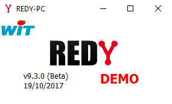

# Installation

## Prerequis

Le minimum pour construire et déployer une SynApp est:
* un Maker qui est l'outil de construction et de déploiement de SynApps
* un Redy ou un Redy Pro PC version 9.3 et supérieur sur lequel sera déployé la SynApp

### Maker

Le Maker est l'outil de construction et de déploiement de SynApps. Il est distributé sous la forme de:
* **WebApp**: via le cloud WIT (voir EV/EF)

* Executable **Windows** *(1)*. Installeur:
    ```
     \\\wit-file\Software\K4\Synapps\Maker\win32\SynApps-1.2.0 Setup.exe 
    ```

*(1)* des versions Mac et Linux seront également disponibles ultérieurement

### Redy Pro PC 

Dans un premier temps, nous suggérons d'utiliser un Redy Pro PC. Vous pouvez-récupérer la dernière version sur WIT-File puis l'installer localement
```
\\WIT-FILE\Software\K4\OpenRedy\Builds\Redy\Redy-9.3.0-20171019.1\REDY-PC\REDY-PC.exe
```
[Installer un Redy Pro PC](installRedyProPC.md)

Exécuter REDY-PC.exe et double cliquer pour ouvrir le navigateur



### Redy

Les UTLs Redy en version 9.3.0 et supérieurs sont déja compatibles SynApps *(2)*.
Si votre UTL est dans une version inférieur, une version Beta *(3)* du Redy compatible est disponible ci:
```
\\WIT-FILE\Software\K4\OpenRedy\Builds\Redy\Redy-9.3.0-20171019.1\REDY\REDY.K4APP
```
*(2)* Les versions de SynApps évoluent régulierement. Il est préferrable de désactiver le mode *Hébergement RIA local* pour forcer l'utilisation du cloud et obtenir la dernière version du runtime Synapps

[Configurer le mode *Hébergement RIA local* d'un Redy Pro PC](configureRedyProPC.md)

*(3)* Attention: **NE PAS DEPLOYER** cette version sur un site de production

## Etapes suivantes

Vous avez un SynApps Maker (Windows ou cloud RIA) et un Redy Pro PC (ou Redy) compatible avec SynApps (version >=9.3), nous pouvons commencer la création d'une première SynApp connectée au Redy !

[Tutorial 1: "Helloworld", première SynApp](tutos/tuto01Helloworld.md)