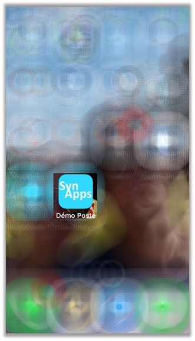

# Installation de SynApps RUNTIME sur **iOs**

## SynApp sur l'écran d'accueil

1. Naviguer sur l'écran d'accueil de la SynApp avec le navigateur Safari et cliquer sur le **bouton d’action**

    

2. Cliquer sur le bouton **Sur l’écran d’accueil**

    

3. La SynApp est désormais accessible directement depuis **l'écran d'accueil** du smartphone avec le logo de l'application lorsque défini

    
