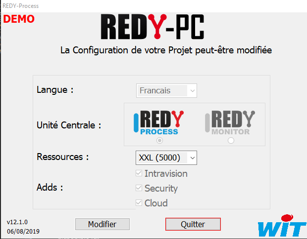

# Installation

## Installation REDY-PC

Récupérer la dernière version de l'installeur du *REDY-PC* sur le site WIT puis l'installer localement

[Téléchargement REDY PC](https://www.wit.fr/telechargement-par-produits/download-info/redy-pc-logiciel/)

Installer REDY-PC-Setup puis éxécuter *REDY-PC.exe*

Vérifier que la version est **12.0.1** ou **supérieure**

Double cliquer pour ouvrir le navigateur sur l'application d'exploitation du REDY et vérifier que tout fonctionne

## Installation REDY

Récupérer la dernière version sur WIT-File puis l'installer dans l'UTL _(*)_

[Téléchargement soft REDY](https://www.wit.fr/telechargement-par-produits/download-tag/redy,logiciel/)

Vérifier que la version est **12.0.1** ou **supérieure**

Se reporter à la documentation de la [mise à jour du REDY](https://www.wit.fr/telechargement-par-produits/download-info/faq-70-mise-a-jour-dun-redy/)
