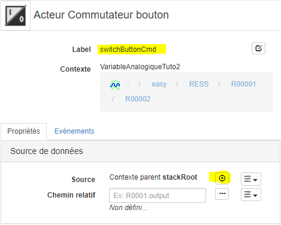
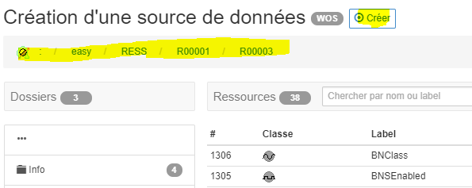
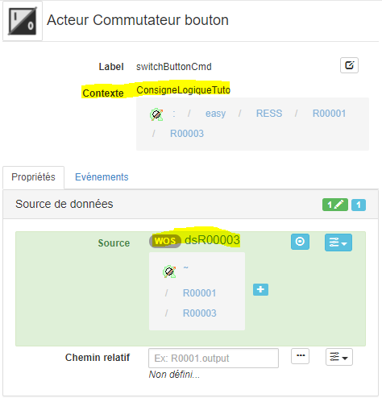
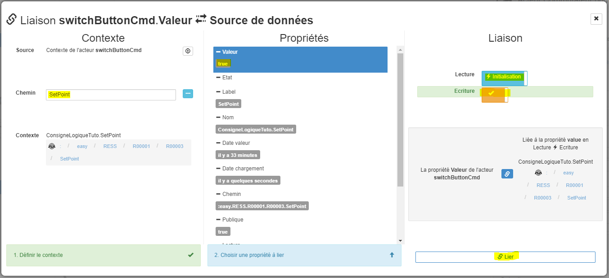
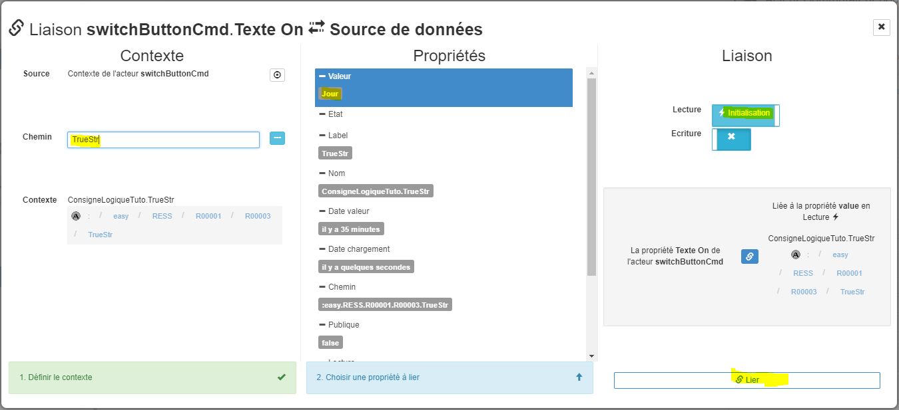
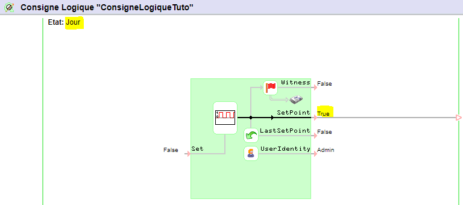
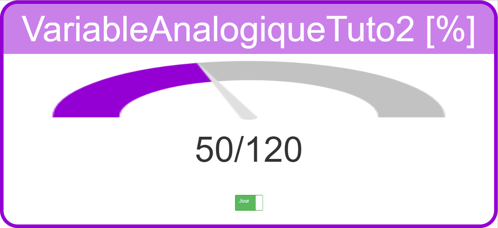
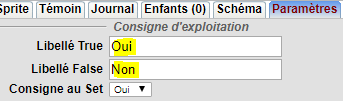

[Accueil](../../) / [Tutoriaux](../index.md) / [Tutorial 02](index.md)

# Tutorial 2: les liaisons **5/6** *[9 nov 17]*

## Liaisons **sources de données** en écriture

Dans la quatrième partie de ce tutorial, les acteurs ont été liés à une *source de donnée* en **lecture** mais actuellement aucune **intéraction** avec l'utilisateur, ni **commande** avec une ressource du REDY ne sont configurées

La prochaine étape va donc consister à ajouter des **acteurs d'intéractions** avec l'utilisateur et les **lier en écriture** vers la ressource du REDY *ConsigneLogiqueTuto* de type consigne digitale

### Ajout acteur **Commutateur bouton**

1. L'acteur *stackRoot* étant sélectionné, ajouter un acteur enfant de type *Interactions* > *Commutateur bouton* et renommer le label avec *switchButtonCmd*

2. Modifier l'acteur commutateur bouton *switchButtonCmd* avec les propriétés *Spécifiques* suivantes:
  * *Spécifiques* > *Taille*: **Large**
  * *Spécifiques* > *Style On*: **Succès**
  * *Spécifiques* > *Style Off*: **Danger**

3. Tester le visuel en cliquant sur la *checkbox* de propriété *Spécifiques* > *Valeur* à plusieurs reprises

### Définition de la source de donnée de l'acteur

Actuellement le contexte de l'acteur *switchButtonCmd* est hérité de l'acteur *stackRoot*. Nous devons définir une nouvelle source de donnée pour cet acteur vers la ressource *ConsigneLogiqueTuto* du REDY

1. L'acteur *switchButtonCmd* étant sélectionné, éditer sa *source de données*


2. Dans l'explorateur, créer une nouvelle *source de données* WOS vers la ressource
```
:easy.RESS.R00001.R00003
```


3. La propriété *Source* de l'acteur *switchButtonCmd* est désormais définie sur **dsR00003** et le *Contexte* est sur la ressource *ConsigneLogiqueTuto*


4. Lier la propriété additionnelle *Spécifiques.Valeur* de l'acteur *switchButtonCmd* à la propriété *Valeur* du chemin *SetPoint* du contexte en accès *lecture à l'initialisation* et **Ecriture**


5. Lier la propriété additionnelle *Spécifiques.Texte On* de l'acteur *switchButtonCmd* à la propriété *Valeur* du chemin *TrueStr* du contexte en accès *lecture à l'initialisation*


5. Lier la propriété additionnelle *Spécifiques.Texte Off* de l'acteur *switchButtonCmd* à la propriété *Valeur* du chemin *FalseStr* du contexte en accès *lecture à l'initialisation*

Toutes les liaisons des acteurs vers la **source de donnée** sont désormais définies

## Vérification des liaisons **sources de données**

Vérifier que tout fonctionne comme attendu:

1. Connectez-vous sur le REDY et afficher le paramétrage de la ressource:
```
:easy.RESS.R00001.R00003
```


2. **Déployer** puis **éxécuter** la SynApp


3. Cliquer sur le *bouton commutateur* et vérifier que l'état *Jour*/*Nuit* **change**

4. Modifier les libellés *True*/*False* de la ressource
* *Libellé True*: remplacé *Jour* par **Oui**
* *Libellé False*: remplacer *Nuit* par **Non**
* Valider, modifier la *Consigne au Set* et revalider


5. Constater que les libellés *True*/*false* demeurent toujours inchangés à *Jour*/*Nuit* et pas *Oui*/*Non*

6. Forcer le rafraîchissement de SynApps (F5) et constater que les libellés reflètent désormais bien les nouveaux libellés *Oui*/*Non*

*Remarque:*
* les liaisons vers *TrueStr*, *FalseStr* sont en *mode initialisation* et donc leurs changement de valeur ne sont pas rafraîchies sur l'acteur *commutateur bouton*.
Le rafraîchissement de SynApps (F5) force la réinitialisation de l'acteur, les changements sont alors pris en compte

**Repasser en mode MAKER**

Suite du [tutorial](part6.md)
