[< 3. Les acteurs dispositions](./index.md)



# Tutoriel 3: l'acteur de disposition **empilement**


La première partie de ce tutoriel est consacrée à l'acteur **_Empilement_** qui permet d'**empiler** des acteurs enfants **horizontalement** ou **verticalement** et repondre au besoin de restitution adaptative

## Prerequis

Créer une nouvelle SynApp **tuto03** avec le _MAKER_. Modifier le _label_ de la première scène en **sceneStack** et le _nom_ avec **Empilement** puis déployer.


## Construction de la scène

1. Dans la scène courante _sceneStack_ définissez l'acteur principal avec un acteur **empilement**

2. **Ajouter** un acteur enfant de type texte et modifier son alignement horizontal et vertical pour qu'il s'étende sur toute la surface disponible de l'acteur Empilement

    * définir la propriété _Position > Align. vertical_ à ```Etendre```
    * définir la propriété _Position > Align. horizontal_ à ```Etendre```

    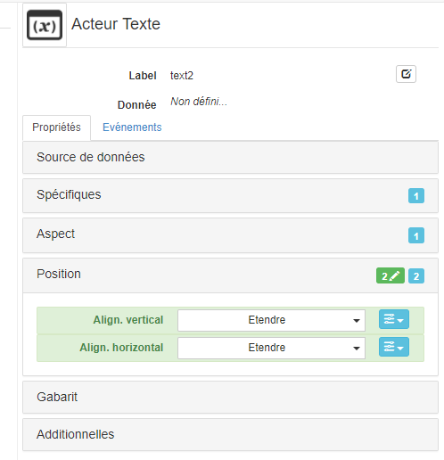

3. **Dupliquer** 3x l'acteur avec le bouton _Dupliquer_ ci-dessous. Vous aurez alors 4 acteurs _Texte_ enfant de l'acteur _Empilement_

    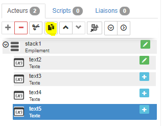

    La zone de prévisualisation doit ête celle-ci:

    

4. **Augmenter** la taille du texte des 4 acteurs peu visible car trop petite. On pourrait répéter cette modification dans la taille de police des 4 acteurs mais il est **préferrable de modifier cette proprité directement sur l'acteur Empilement** parent _stack1_. La taille du texte est alors automatiquement appliqué sur les enfants.

    Sélectionner l'acteur _Empilement_ **stack1** et modifier:
    * la propriété _Aspect > Police > Taille_ à ```100px```
    * la propriété _Aspect > Police > Alignement texte_ à ```Centre```

    

    La zone de prévisualisation est alors celle-ci:

    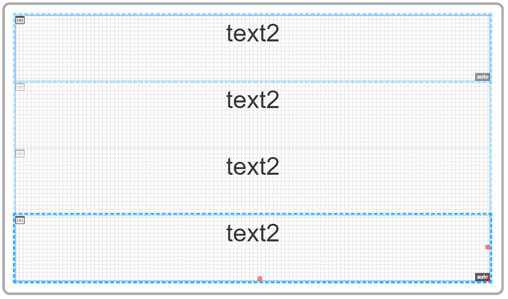

5. **Changer** la couleur de fond des 4 acteurs _texte_. Sélectionner l'acteur _text2_ et modifier:

    * la propriété _Aspect > Couleur de fond_ avec une couleur

     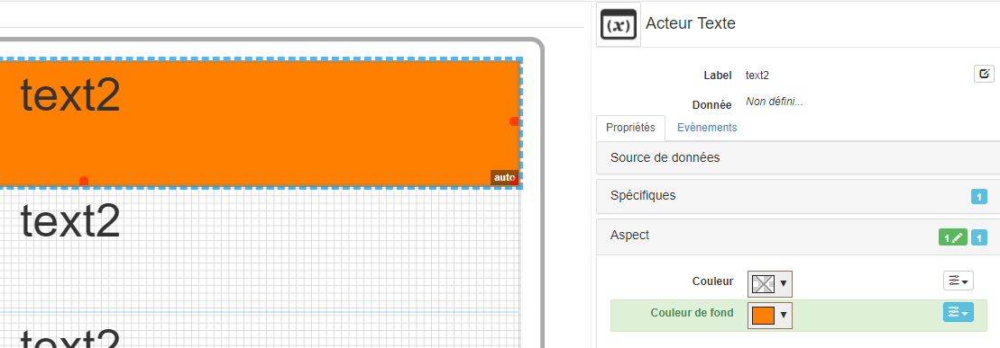

    Répéter l'opération pour les 3 autres acteurs _texte_ avec des couleurs de fond **différentes**

    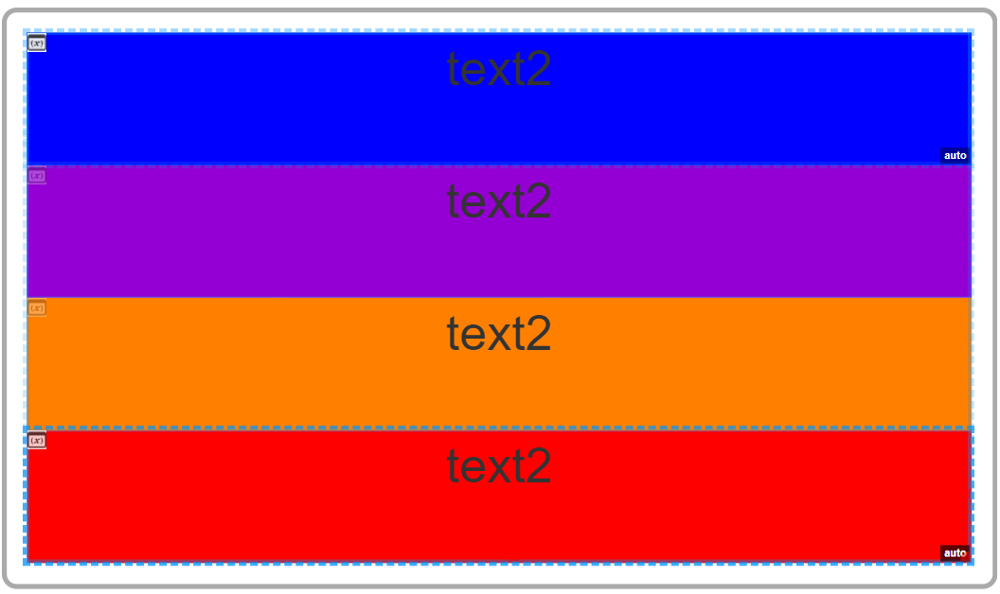

6. Les couleurs de fond choisies étant plutot foncées,**changer** la couleur de la police des 4 acteurs textes avec du _blanc_. Cette couleur devra être appliquée aux 4 acteurs, donc même stratégie que ci-dessus: modifier la couleur sur l'acteur _Empilement_ **stack1**

    * la propriété _Aspect > Couleur_ à blanc ```#ffffff```

    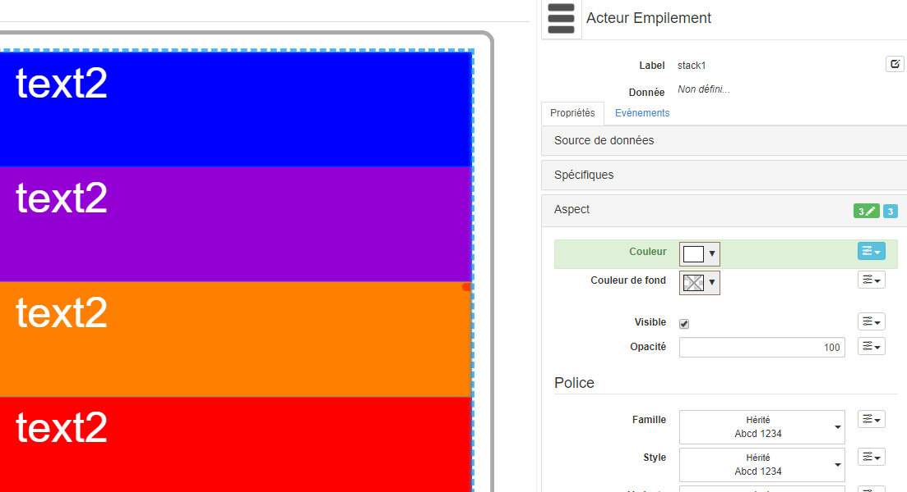

7. **Exécuter** la SynApp pour observer le résultat puis modifier la taille du navigateur et vérifier que les 4 acteurs _texte_ se répartissent équitablement l'espace

## Configuration de l'acteur _Empilement_

1. **Modifier** l'orientation de l'acteur _Empilement_ pour qu'il rende les acteurs enfants texte à l'**horizontal**

    * la propriété _Spécifiques > Orientation_ à ```Horizontale``` et observer le résultat

    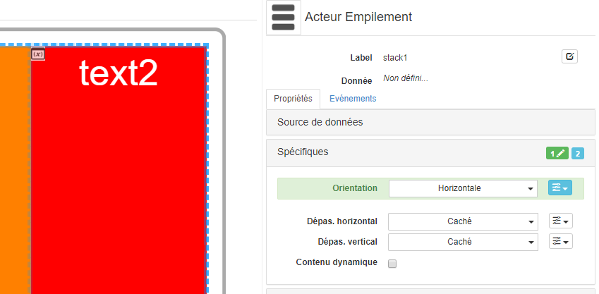

2. **Repositionner** l'acteur _Empilement_ à la **verticale**

## Ajout d'un acteur _Empilement_ enfant

Nous allons modifier la scène pour que
les 2 premiers acteurs _texte_ soient empilés horizontalement, les 2 derniers restant empilés verticalement

1. **Sélectionner** l'acteur _Empilement_ **stack1** et **ajouter** un nouvel acteur _Empilement_ **stack6** et le configurer à l'horizontal

    * la propriété _Spécifiques > Orientation_ à ```Horizontale```
    * la propriété _Position > Align. vertical_ à ```Etendre```
    * la propriété _Gabarit > Hauteur_ à la valeur par défaut ```[vide]```

2. **Déplacer** l'acteur _Empilement_ **stack6** en première position en utilisant le bouton _Déplacer_

    

3. **Couper** l'acteur _texte_ **text2**

    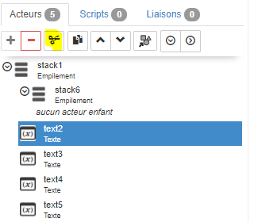
    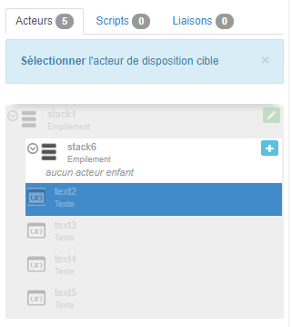

    et le coller sur l'acteur _Empilement_ **stack6**

    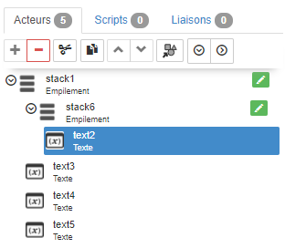

4. Procéder de la même façon avec l'acteur _texte_ **text3**

    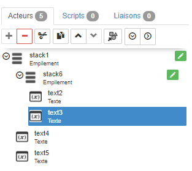

5. Le résultat dans la zone de prévisualisation doit être celui-ci
    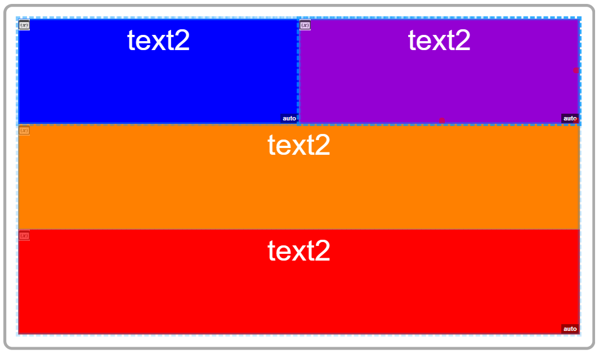

6. **Exécuter** la SynApp pour observer le résultat puis modifier la taille du navigateur

## Les dépassements

Les acteurs dispositions ont d'autres propriétés spécifiques secondaires: le comportement en cas de dépassement horizontal ou vertical des acteurs enfants

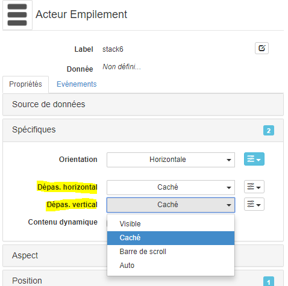

Les valeurs possible sont:

* **visible**: l'acteur n'est pas rogné. Le contenu peut éventuellement être affiché en dehors de l'acteur _disposition_

* **caché**: l'acteur est rogné si besoin pour s'inscrire dans l'acteur _disposition_

* **barre de scroll**: le contenu est rogné pour s'inscrire dans l'acteur _disposition_ et les navigateurs de bureau affichent des barres de défilement dans tous les cas. Cela évite d'avoir des barres qui apparaissent et disparaissent sans cesse avec du contenu dynamique.

* **auto**: Le comportement est laissé à la discrétion de l'agent utilisateur. Les navigateurs comme Firefox affichent des ascenseurs si le contenu dépasse dans l'acteur _disposition_
* **nouvelle ligne**: non disponible pour l'instant

  Pour plus d'informations concernant les dépassements vous pouvez vous reporter à la description sur [developer.mozilla](https://developer.mozilla.org/fr/docs/Web/CSS/overflow)

# Que retenir

Vous avez réalisé la construction de la scène avec 2 acteurs dispositions de type _Empilement_:

* le principe des **empilements imbriqués est un principe de base** de la construction de la scène d'une SynApp. Il est adapté au mode de fonctionnement des navigateurs HTML et permet de construire **des interfaces adaptatives**.

* Cet acteur est un de ceux les **plus utilisés** pour construire des scènes et **bien comprendre son mode de fonctionnement** constitue une des clés de SynApps.

Le tutoriel suivant est complémentaire à celui-ci puisque nous allons utiliser l'acteur **_toile_** qui permet, non pas d'empiler, mais **superposer** des acteurs enfants et repondre au besoin de construction de synoptiques notamment !

[Tutoriel acteur disposition **_toile_**](part2.md)
