[Accueil](../../) / [Tutoriaux](../index.md) / [Tutorial 03](index.md)

# Tutorial 3: l'acteur de disposition **Modal**


La quatrième partie de ce tutorial est consacrée à l'acteur **_modal_** qui permet d'**ouvrir** une fenêtre modale pour optenir ou fournir une information à l'utilisateur

## Prerequis

Ajouter une **nouvelle scène** dans la SynApp **tuto03** créée précédemment. Modifier le _label_ de la scène en ```sceneModal``` et le _nom_ avec ```Modal``` puis déployer
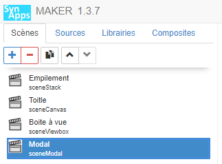

## Construction de la scène avec modale **indépendante**

Nous allons construire une scène simple qui affiche une fenêtre modale indépendante, au centre de l'écran, sur activation d'un commutateur

1. Dans la scène courante ```sceneModal``` définissez l'acteur principal avec un acteur **empilement**

2. **Ajouter** un acteur enfant de type **Commutateur bouton** (Interactions dans l'_explorateur d'acteur_):

    * Définir la propriété _Gabarit > Hauteur_ à ```100px```
    * Définir la propriété _Gabarit > Largeur_ à ```200px```
    * Déselectionner la propriété _Spécifiques > Valeur_
    * Définir la propriété _Spécifiques > Texte On_ à ```Ouvert```
    * Définir la propriété _Spécifiques > Texte Off_ à ```Fermé```
    * Définir la propriété _Spécifiques > Taille_ à ```Large```
    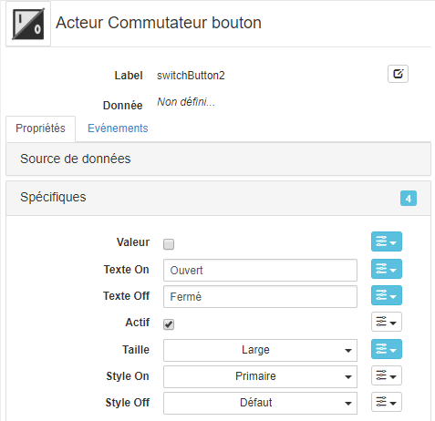

3. **Sélectionner** l'acteur _Empilement_ ```stack1``` et **ajouter** un acteur enfant de type **Modal** (Dispositions dans l'_explorateur d'acteur_)

    * Définir la propriété _Gabarit > Hauteur_ à ```400px```
    * Définir la propriété _Gabarit > Largeur_ à ```600px```

4. **Observer** que la _zone de prévisualisation_ est composés de deux éléments:
    * La scène à proprement parlé en haut
    * Le contenu de l'acteur modale en bas
        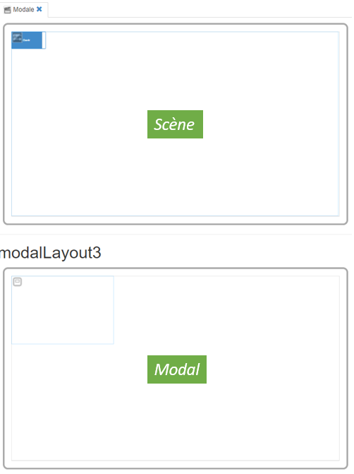

5. **Sélectionner** l'acteur _modal_ ```modalLayout3``` et **ajouter** un acteur enfant de type **Text** (Affichages dans l'_explorateur d'acteur_)

    * Définir la propriété _Spécifiques > Contenu_ à ```Ceci est le contenu de la fenêtre modale !```
    * Définir la propriété _Aspect > Police > Taille_ à ```50px```

    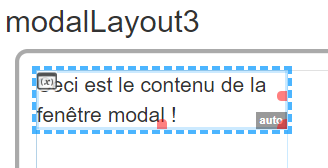

6. **Sélectionner** l'acteur _modal_ ```modalLayout3``` et lier son ouverture à la valeur de l'acteur _commutateur bouton_

    * Lier en _interne_ la propriété _Spécifiques > Afficher_ à la propriété _Spécifiques > Valeur_ de l'acteur ```switchButton2```

        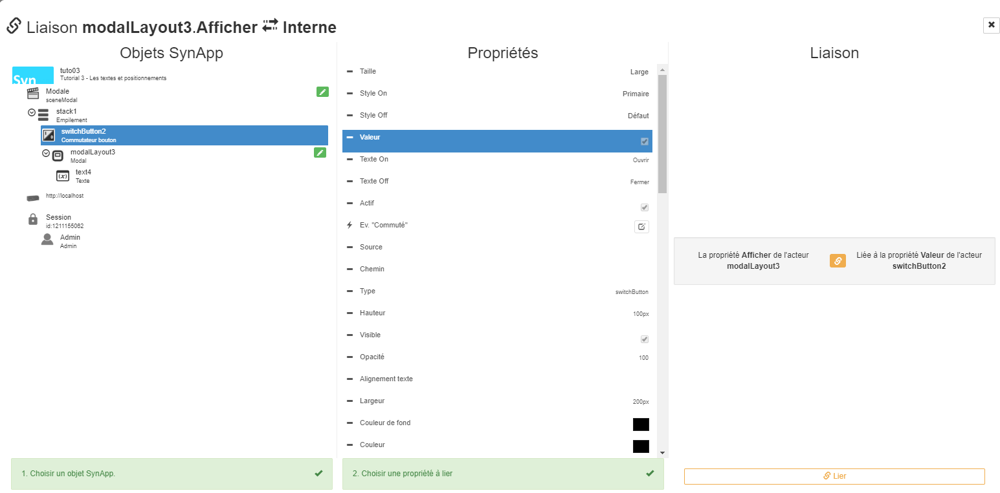
        Le tooltip de la propriété _Afficher_ est alors celui-ci
        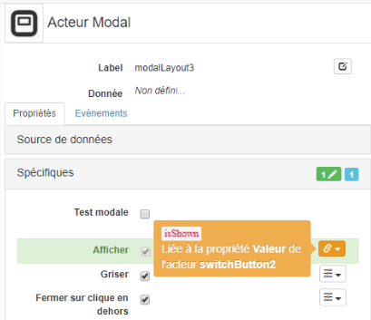

    * Définir la propriété _Aspect > Couleur de fond_ à _Orange_ ```#ff8000```

7. **Déployer** et **Exécuter** la SynApp. Cliquer sur le commutateur, la fenêtre modale s'affiche au centre de l'écran
    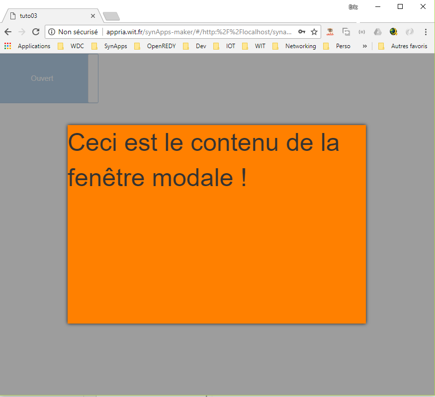

## Construction de la scène avec modale **attachée**

Dans la partie précédente, la fenêtre modale s'affiche au centre de l'écran de manière indépendante. Cela correspont à un cas d'usage fréquent mais il est parfois nécessaire que la modale soit relative à un acteur de la scène: ne pas masquer une zone par exemple. Dans ce cas, on parle de **modale attachée**.

1. **Sélectionner** l'acteur _Empilement_ ```stack1``` et **ajouter** un acteur enfant de type **Texte** (Affichage dans l'_explorateur d'acteur_)
    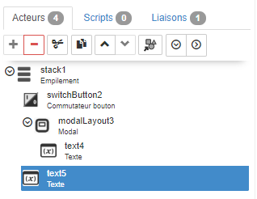

    * Définir la propriété _Spécifiques > Contenu_ à ```Ceci est l'acteur d'attachement !```
    * Définir la propriété _Aspect > Couleur de fond_ à _Bleu_ ```#0000ff```
    * Définir la propriété _Aspect > Couleur_ à _Blanc_ ```#ffffff```
    * Définir la propriété _Aspect > Police > Taille_ à ```50px```
    * Définir la propriété _Position > Align. vertical_ à ```Centré```
    * Définir la propriété _Position > Align. horizontal_ à ```Centré```
    * Définir la propriété _Gabarit > Largeur_ à ```350px```
    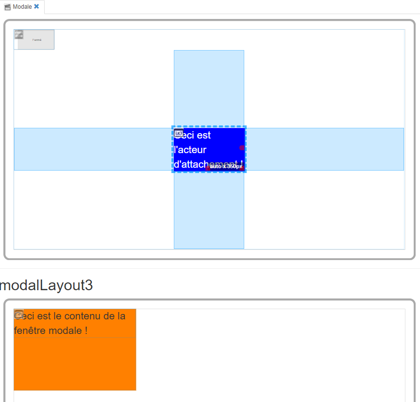

2. **Sélectionner** l'acteur _modal_ ```modalLayout3``` et l'attacher à l'acteur _text_ précédemment créé:

    * Définir la propriété _Spécifiques > Acteur attaché_ avec l'acteur ```text5```

      _Remarque:_ si l'acteur ```text5``` n'est **pas visible** dans la liste, rafraichissez la page avec **F5** _(BUG en cours de correction)_
      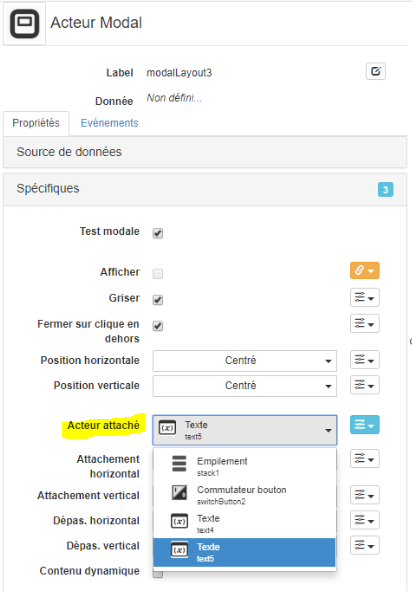

    * Sélectionner la propriété _Spécifiques > Test modale_ pour constater que la position de l'acteur _modal_ dans la scène est désormais centrée par rapport à l'acteur ```text5```
      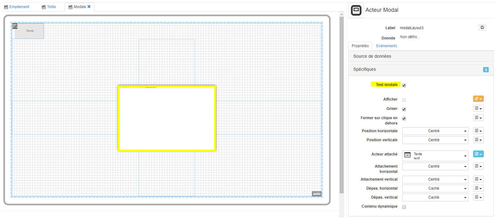

      _Remarque:_ la propriété _Test modale_ permet der **prévisualiser le positionnement** de la fenêtre modale dans la scène **sans son contenu**

3. **Modifier** le positionnement de la _modal_ ```modalLayout3``` pour qu'elle s'ouvre à **droite** de l'acteur _text_ ```text5``` et **aligner** par le haut:

    * Définir la propriété _Spécifiques > Position horizontale_ à ```Gauche```
    * Définir la propriété _Spécifiques > Position verticale_ à ```Haut```
    * Définir la propriété _Spécifiques > Attachement horizontale_ à ```Droite```
    * Définir la propriété _Spécifiques > Attachement verticale_ à ```Haut```

    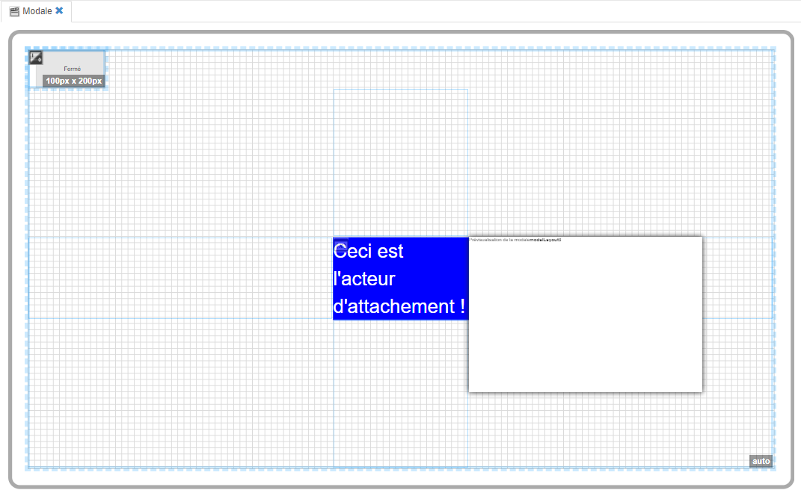

4. **Déployer** et **Exécuter** la SynApp. Cliquer sur le commutateur, la fenêtre modale s'affiche à droite et aligner par le haut de l'acteur d'attachement
    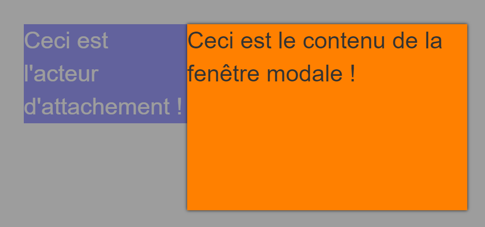

5. **Modifier** les quatre propriétés ci-dessus, avec la propriété _Test modale_ sélectionnée, pour essayer de comprendre le principe de fonctionnement:

    * les propriétés _Spécifiques > Position horizontale & verticale_ permettent de définir le point de référence d'attachement de l'acteur _modal_

    * les propriétés _Spécifiques > Attachement horizontal & vertical_ permettent de définir le point de référence de l'acteur d'attachement

    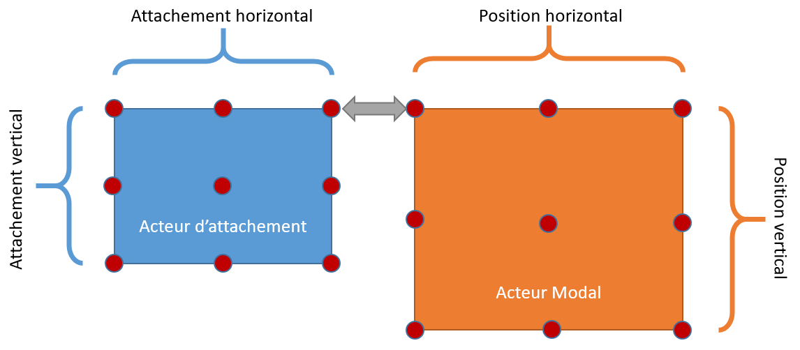

## Les autres propriétés de la modale

Deux autres propriétés permettent de personnaliser le comportement et le rendu de l'acteur _modal_

1. La propriété _Spécifiques > Griser_ permet de griser le contenu de la scène lorsque la fenêtre modale s'ouvre afin de favoriser le focus de l'utilisateur sur son contenu

2. La propriété _Spécifiques > Fermer sur clique en dehors_ permet de fermer la fenêtre modale lorsque l'utilisateur clique sur la scène. En cas de déselection de cette propriété, il est nécessaire de prévoir un mécanisme de fermeture dans le contenu de l'acteur _modal_

## Que retenir

Vous avez mis en oeuvre l'acteur _modal_ **indépendant** et **attaché** à un acteur de la scène avec des possibilités de placement variés

L'acteur _modal_ est important pour optenir ou fournir une information à l'utilisateur

Il est possible d'automatiser l'ouverture d'une modale en **liant** sa propriété _Afficher_ à un autre acteur, voir à une source de données

L'acteur modale a une taille fixe dans ce tutorial, mais il est tout à fait possible de définir des tailles relatives afin d'adapter au mieux la modale au support de restitution

L'acteur modale doit être utilisé avec discernement, dans le cadre mentionné ci-dessus. Il est parfois préférrable de faire naviguer l'utilisateur sur une nouvelle scène: se sera l'objet du prochain [Tutoriel suivant](../tuto04/index.md) sur la navigation

## Conclusion

Le **tutorial 3** sur les acteurs _dispositions_ est **terminé**. Certains sont plus utilisés que d'autres mais ils sont tous trés importants car ils savent disposer des acteurs enfants. Ils peuvent bien sur être combinés entre eux afin de construire des applications **ambitieuses adaptées** à tous les types d'écrans

Vous pouvez remonter les **bugs** & **remarques** concernant ce tutorial, SynApps RUNTIME & MAKER sur [GitHub](https://github.com/witsa/synapps/issues)

[Tutoriel suivant sur la navigation](../tuto04/index.md)
