[< 7. Acteurs REDY](./index.md)



# Tutoriel 7: les acteurs métiers natifs du REDY - Part 1: **Journal**

L'acteur journal est un des plus utilisé et fonctionne simplement sans la moindre configuration. Plusieurs propriétés _spécifiques_ permettent de personnaliser et filtrer son rendu. Ces propriétés sont **explicites** et nous ne rentrerons pas dans le détail de chacune d'entre elles !


Nous allons plutot intégrer le journal dans une **scène évoluée** contenant une barre de commande permettant de configurer le **comportement** et les **filtres** du journal

## Ossature de la scène

1. **Modifier** le _label_ de la première scène en ```sceneJournal``` et le _nom_ avec ```Journal avancé``` puis déployer

2. **Définir** l'acteur principal avec un acteur _Empilement_ qui contiendra la barre de commande, le journal à proprement parlé ainsi qu'une modale de configuration

    * renommer le _Label_ avec ```stackRoot```
    * modifier la propriété _Aspect > Police > Taille_ en ```20px```

### Barre de commandes

1. **Ajouter** un acteur enfant de type _Empilement_ qui contiendra les éléments de la barre de commande

    * renommer le _Label_ avec ```stackCmd```
    * modifier la propriété _Spécifiques > Orientation_ en ```Horizontale```
    * définir la propriété _Aspect > Couleur de fond_ avec la couleur ```#e0e0e0```
    * réinitialiser la propriété _Gabarit > Hauteur_ avec la valeur par défaut ```[vide]```
    * définir les 4 propriétés _Gabarit > Marge > Marge int. gauche_, _droite_, _haute_, _bas_ avec la taille ```10px```

2. **Ajouter** un acteur enfant de type _HTML_

    * renommer le _Label_ avec ```htmlInfo```
    * modifier la propriété _Spécifiques > Contenu_ avec le code HTML
      ```html
      Journal <span class="badge" style="font-size:1em">{{nbEvents}}</span> événements
      ```
    * compléter le contenu en créant la propriété additionnelle _nbEvents_ de type _nombre_. Vous pouvez également donner des informations additionnelles sur cette propriété, comme le nom et la description, dans _Additionnelles > Gestion des propriétés additionnelles_
    * définir la propriété _Position > Align. vertical_ avec la sélection ```Centré```

3. **Sélectionner** l'acteur ```stackCmd``` et **ajouter** un acteur enfant de type _Commutateur bouton_ qui permettra de changer le **mode** du journal _complet_ & _en-cours_

    * renommer le _Label_ avec ```switchButtonMode```
    * modifier la propriété _Spécifiques > Text On_ avec le texte ```Tout```
    * modifier la propriété _Spécifiques > Text Off_ avec le texte ```En-cours```
    * modifier la propriété _Spécifiques > Taille_ avec la sélection ```Large```
    * modifier la propriété _Spécifiques > Style On_ avec la sélection ```Défaut```
    * modifier la propriété _Spécifiques > Style Off_ avec la sélection ```Danger```
    * définir la propriété _Position > Align. vertical_ avec la sélection ```Centré```
    * définir la propriété _Gabarit > Largeur_ avec la taille ```100px```
    * définir la propriété _Gabarit > Marge > Marge ext. gauche_ avec la taille ```20px```

4. **Sélectionner** l'acteur ```stackCmd``` et **ajouter** un acteur enfant de type _Période_ qui permettra de définir la **période** de filtre du journal

    * renommer le _Label_ avec ```periodFilter```
    * réinitialiser la propriété _Gabarit > Largeur_ avec la valeur par défaut ```[vide]```
    * modifier la propriété _Spécifiques > Période_ avec la sélection ```Tout```
    * modifier la propriété _Spécifiques > Périodes_ avec uniquement les éléments ```Tout```, ```Aujourd'hui```, ```Dernière 24h```, ```Semaine courante```, ```Mois courant```, ```Année courante```
    * définir la propriété _Position > Align. vertical_ avec la sélection ```Centré```
    * définir la propriété _Position > Align. horizontal_ avec la sélection ```Centré```

5. **Sélectionner** l'acteur ```stackCmd``` et **ajouter** un acteur enfant de type _Bouton poussoir_ qui permettra de configurer les paramêtres avancés

    * renommer le _Label_ avec ```buttonFilters```
    * modifier la propriété _Spécifiques > Contenu_ avec le code HTML
      ```html
      <span class="glyphicon glyphicon-download-alt" aria-hidden="true"></span> {{selSet}} | <span class="glyphicon glyphicon-refresh" aria-hidden="true"></span> {{period}} <span class="caret"></span>
      ```
    * compléter le contenu en créant les propriété additionnelle _selSet_ de type _text_ qui contiendra l'_ensemble_ sélectionné et _period_ de type _nombre_ qui contiendra la période de rafraichissement du journal. Donner éventuellement des informations additionnelles sur ces propriétés dans _Additionnelles > Gestion des propriétés additionnelles_
    * modifier la propriété _Spécifiques > Taille_ avec la sélection ```Large```
    * modifier la propriété _Spécifiques > Couleur model_ avec la sélection ```Défaut```
    * modifier la propriété _Aspect > Police > Alignement texte_ avec la sélection ```Centre```
    * définir la propriété _Gabarit > Marge > Marge ext. gauche_ avec la taille ```20px```
    * définir les 2 propriétés _Gabarit > Marge > Marge int. gauche_ et _Marge int. droite_ avec la taille ```15px```
    * définir l'événement _Commun > Ev. "Clic souris"_
      ```javascript
      const modalFilter = context.synoStage.findByLabel('modalFilter');
      modalFilter.set('isShown', true);
      ```
      _Remarque:_ ce code a été déja mis en place dans le [Tutoriel 6: les événements et fonctions javascripts](../tuto06/index.md) et permet d'ouvrir la fenêtre modale

L'ossature de la barre de commande est terminée

### Journal

1. **Sélectionner** l'acteur ```stackRoot``` et **ajouter** un acteur enfant de type _Journal_

    * renommer le _Label_ avec ```journal```
    * définir la propriété _Position > Align. vertical_ avec la sélection ```Etendre```

L'ossature du journal est terminée !

### Modale de configuration

1. **Sélectionner** l'acteur ```stackRoot``` et **ajouter** un acteur enfant de type _Modal_

    * renommer le _Label_ avec ```modalFilter```
    * lier en _interne_ la propriété _Aspect > Police > Taille_ avec la même propriété dans l'acteur ```stackRoot``` en _lecture_
    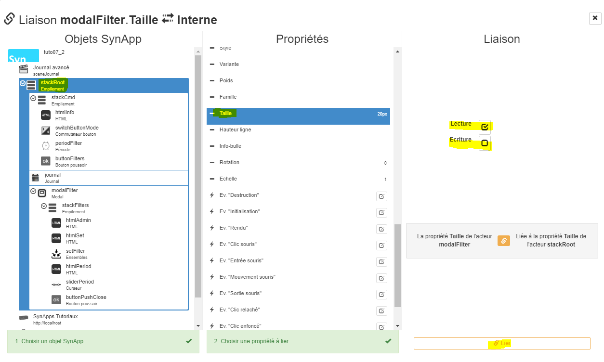
    _Remarque:_ dans une modale, la taille du texte n'est pas héritée du parent

    * définir la propriété _Gabarit > Hauteur_ avec la taille ```80vh``` (=80% de la hauteur de la fenêtre)
    * définir la propriété _Gabarit > Largeur_ avec la taille ```80vw``` (=80% de la largeur de la fenêtre)

2. **Ajouter** un acteur enfant de type _Empilement_

    * renommer le _Label_ avec ```stackFilters```
    * réinitialiser la propriété _Gabarit > Hauteur_ avec la valeur par défaut ```[vide]```
    * définir les 2 propriétés _Position > Align. vertical_ et _horizontal_ avec la sélection ```Etendre```
    * définir les 2 propriétés _Gabarit > Marge > Marge int. gauche_, _Marge int. droite_ avec la taille ```40px```
    * définir les 2 propriétés _Gabarit > Marge > Marge int. haut_, _Marge int. bas_ avec la taille ```20px```

3. **Ajouter** un acteur enfant de type _HTML_

    * renommer le _Label_ avec ```htmlAdmin```
    * modifier la propriété _Spécifiques > Contenu_ avec le code HTML
      ```html
      <h1><span class="glyphicon glyphicon-cog" aria-hidden="true"></span> Configuration</h1>
      ```
    * modifier la propriété _Gabarit > Marge > Marge ext. basse_ avec la valeur par défaut ```30px```

4. **Sélectionner** l'acteur ```stackFilters``` et **ajouter** un acteur enfant de type _HTML_

    * renommer le _Label_ avec ```htmlSet```
    * modifier la propriété _Spécifiques > Contenu_ avec le code HTML
      ```html
      <span class="glyphicon glyphicon-download-alt"></span> Ensembles <span class="badge" style="font-size:1em;">{{count}}</span>
      ```
    * modifier la propriété _Gabarit > Marge > Marge ext. basse_ avec la taille ```30px```
    * compléter le contenu en créant la propriété additionnelle _count_ de type _nombre_ qui contiendra le nombre d'ensembles définis dans le REDY
    * modifier la propriété _Apect > Couleur de fond_ avec la couleur ```#e0e0e0```
    * définir les 2 propriétés _Gabarit > Marge > Marge ext. haute_ et _Marge ext. basse_ avec la taille ```20px```
    * définir les 4 propriétés _Gabarit > Marge > Marge int. gauche_, _Marge int. droite_, _Marge int. haut_, _Marge int. bas_ avec la taille ```10px```

5. **Sélectionner** l'acteur ```stackFilters``` et **ajouter** un acteur enfant de type _Ensembles_ qui permettra de sélectionner un ensemble

    * renommer le _Label_ avec ```setFilter```

6. **Dupliquer** l'acteur ```htmlSet```

    * renommer le _Label_ avec ```htmlPeriod```
    * modifier la propriété _Spécifiques > Contenu_ avec le code HTML
      ```html
      <span class="glyphicon glyphicon-refresh" aria-hidden="true"></span> Période de rafraichissement <span class="badge"style="font-size:1em;">{{period}}</span>
      ```
    * compléter le contenu en créant la propriété additionnelle _period_ de type _nombre_. Vous pouvez également donner des informations additionnelles sur cette propriété, comme le nom et la description, dans _Additionnelles > Gestion des propriétés additionnelles_

7. **Sélectionner** l'acteur ```stackFilters``` et **ajouter** un acteur enfant de type _Curseur_ qui permettra de modifier la période de rafraichissement du journal

    * renommer le _Label_ avec ```sliderPeriod```
    * modifier la propriété _Spécifiques > Max_ avec la valeur ```300```
    * modifier la propriété _Spécifiques > Bar_ avec la sélection ```Avant curseur```
    * modifier la propriété _Spécifiques > Couleur bar_ avec la couleur ```#5bc0de```
    * modifier la propriété _Spécifiques > Interval_ avec la valeur ```5``` pour configurer la période par intervalle de 5 secondes
    * sélectionner la propriété _Spécifiques > Valeur gliss._

8. **Sélectionner** l'acteur ```stackFilters``` et **ajouter** un acteur enfant de type _Bouton poussoir_ qui permettra de fermer la fenêtre modale

    * renommer le _Label_ avec ```buttonPushClose```
    * modifier la propriété _Spécifiques > Contenu_ avec le code HTML
        ```html
        <span class="glyphicon glyphicon-remove" aria-hidden="true"></span> Retour
        ```
    * modifier la propriété _Spécifiques > Taille_ avec la sélection ```Large```
    * modifier la propriété _Spécifiques > Couleur model_ avec la sélection ```Défaut```
    * définir la propriété _Position > Align. vertical_ avec la sélection ```Bas```
    * définir la propriété _Position > Align. horizontal_ avec la sélection ```Centré```
    * définir l'événement _Commun > Ev. "Clic souris"_
      ```javascript
      const modalFilter = context.synoStage.findByLabel('modalFilter');
      modalFilter.set('isShown', false);
      ```
      _Remarque:_ ce code permet de fermer la fenêtre modale

9. **Vérifier**

    * la liste des acteurs

        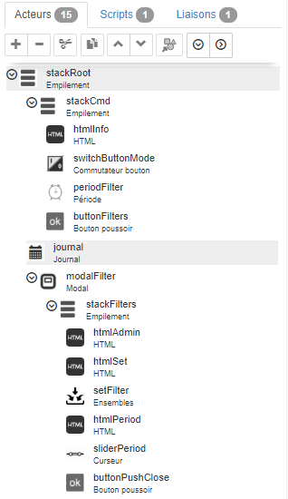

    * la prévisualisation de la scène

        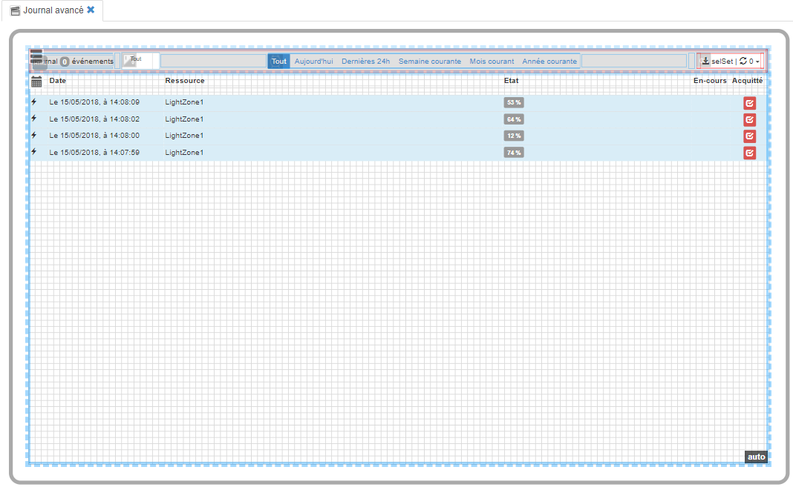

    * la prévisualisation de la modale

        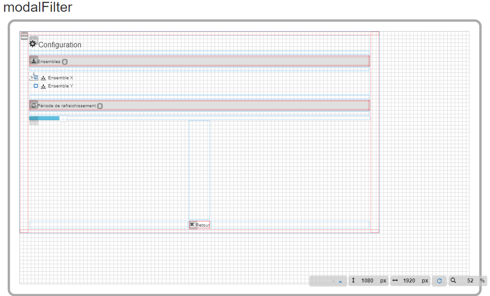

10. **Déployer** et **éxécuter** la SynApp. Les filtres doivent encore être configurés et ne sont donc pas opérationnels. Tester l'ouverture de la modale en cliquant sur le bouton en haut à droite

    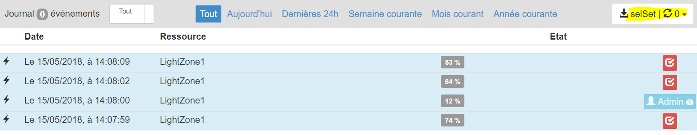

## Définition des liaisons

Nous allons finaliser la configuration de la scène et lier les propriétés des acteurs

1. **Sélectionner** l'acteur ```htmlInfo``` pour lier le nombre d'événements au journal

    * Lier en _interne_ la propriété _Spécifiques > nbEvents_ (ou nom personnalisé que vous avez éventuellement défini) à la propriété  _Spécifiques > Nombre filtré_ de l'acteur ```journal``` en lecture uniquement

        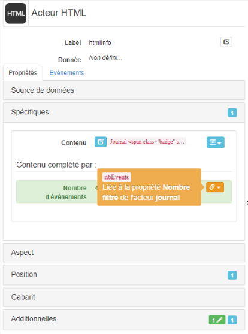

2. **Sélectionner** l'acteur ```buttonFilters```

    * Lier en _interne_ la propriété _Spécifiques > selSet_ (ou nom personnalisé que vous avez éventuellement défini) à la propriété  _Spécifiques > Ensemble_ de l'acteur ```journal```

        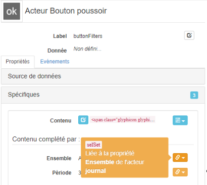

    _Remarque:_ ```null``` est affiché car aucun ensemble n'est défini dans le journal. Sélectionner l'acteur ```journal``` et définir un ensemble. L'identifiant de l'ensemble est alors affiché en haut à droite de l'écran de prévisualisation
        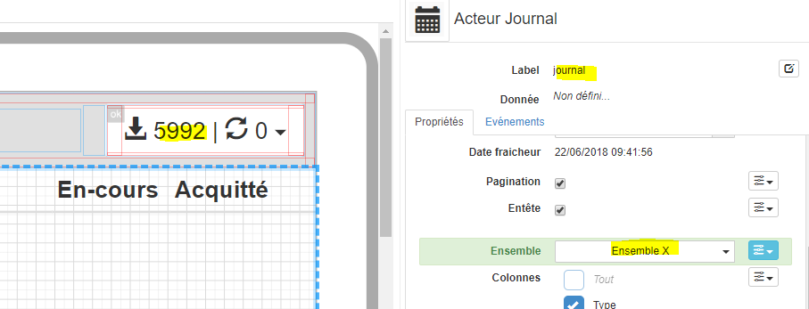
    Ce n'est pas vraiment compréhensible pour l'utilisateur ! Nous allons définir un script de transformation en lecture afin d'afficher l'ensemble sélectionné, ou pas, de façon plus intelligible

    * Resélectionner l'acteur ```buttonFilters``` et éditer le _Script de lecture_ de la propriété _Spécifiques > selSet_ (ou celui que vous avez défini)

        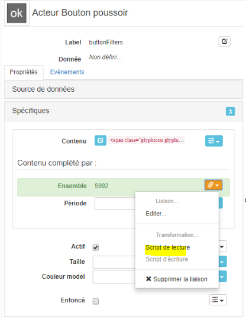

    Copier le javascript
    ```javascript
    const journal = context.synoStage.findByLabel('journal');
    return journal.get('setName');
    ```
    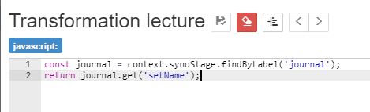

    _Remarque:_ le code javascript retourne la propriété _setName_, nom de l'ensemble, de l'acteur journal. La question étant comment faire pour connaitre la liste des propriétés du journal accessible dans un script ? a terme la liste des propriétés sera documentée pour chaque acteur mais, en attendant, le mieux est d'utiliser la fonction _inspect()_ en mode débug expliqué dans le [tutoriel 6: les événements et fonctions javascripts](../tuto06/index.md)

    Déployer et exécuter la SynApp dans **Chrome** puis appuyer sur F12 pour ouvrir les outils developpeurs et placer un point d'arrêt sur la ligne 4 de la fonction _onReadSource/attribute-buttonPush-buttonFilters-selSet-sceneJournal.js_

    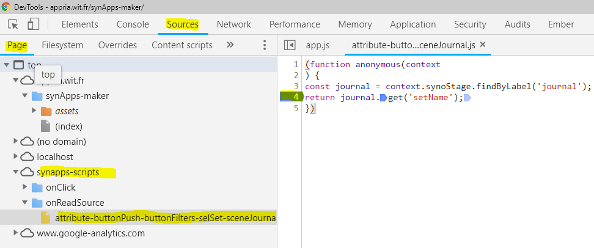

    Appuyer sur F5 pour recharger la SynApp et attendre le point d'arret

    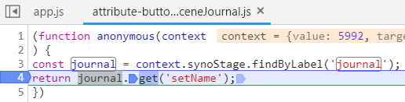

    Taper dans la console le code pour inspecter le journal()
    ```javascript
    journal.inspect();
    ```
    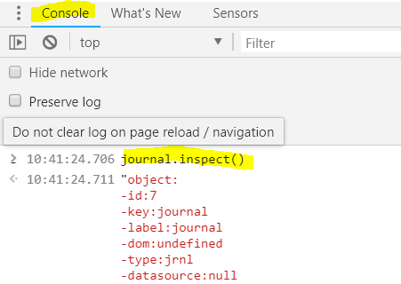
    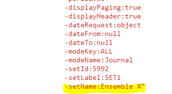

    Toutes les propriétés du journal sont alors listées dont la propriété _setName_ avec la valeur ```Ensemble X```

    _Important:_ la fonction inspect() est trés pratique pour connaître les propriétés de tous les objets SynApps dans les scripts

    * Lier en _interne_ la propriété _Spécifiques > period_ (ou nom personnalisé que vous avez éventuellement défini) à la propriété  _Spécifiques > Période_ de l'acteur ```journal``` en lecture uniquement

3. **Sélectionner** l'acteur ```journal```

    * Lier en _interne_ la propriété _Spécifiques > Mode_ à la propriété _Spécifiques > Valeur_ de l'acteur ```switchButtonMode``` en lecture uniquement

    * Editer le _Script de lecture_ de la propriété _Spécifiques > Mode_
    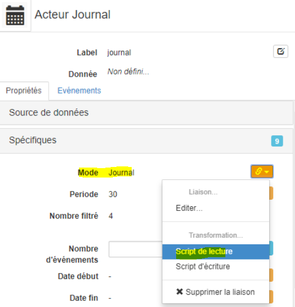

    * Copier le javascript
        ```javascript
        return context.value ? 'ALL' : 'PENDING';
        ```
    _Remarque:_ la propriété _Mode_ du journal attend une valeur de type texte avec les valeurs ```ALL``` ou ```PENDING``` pour afficher respectivement le journal _complet_ ou _en-cours_. Actuellent, rien ne permet de savoir que ces valeurs sont attendues ! nous proposerons rapidement une mécanisme pour connaître les valeurs possibles sur les listes fermées

    * Lier en _interne_ la propriété _Spécifiques > Période_ à la propriété _Spécifiques > Valeur_ de l'acteur ```sliderPeriod``` en lecture uniquement

    * Editer le _Script de lecture_ de la propriété _Spécifiques > Période_ pour arrondir à un entier la valeur du curseur
    

    * Copier le javascript
        ```javascript
        return Math.round(context.value);
        ```

        _Remarque:_ plus de détails sur les fonctions [Math](https://developer.mozilla.org/fr/docs/Web/JavaScript/Reference/Objets_globaux/Math)

    * Lier en _interne_ la propriété _Spécifiques > Date début_ à la propriété _Spécifiques > Date début_ de l'acteur ```periodFilter``` en lecture uniquement

    * Lier en _interne_ la propriété _Spécifiques > Date fin_ à la propriété _Spécifiques > Date fin_ de l'acteur ```periodFilter``` en lecture uniquement

    _Remarque:_ les propriétés spécifiques _Date début_ et _Date fin_ de l'acteur de type _Période_ sont mis à jour en fonction de la période sélectionnée

    * Lier en _interne_ la propriété _Spécifiques > Ensemble_ à la propriété _Spécifiques > Ensemble_ de l'acteur ```setFilter``` en lecture uniquement

4. **Sélectionner** l'acteur ```htmlSet``` pour afficher le nombre d'ensemble total

   * Lier en _interne_ la propriété _Spécifiques > count_ (ou nom personnalisé que vous avez éventuellement défini) à la propriété  _Spécifiques > Nombre total_ de l'acteur ```setFilter``` en lecture uniquement

5. **Sélectionner** l'acteur ```htmlPeriod``` pour afficher la périodicité de rafraichissement

   * Lier en _interne_ la propriété _Spécifiques > period_ (ou nom personnalisé que vous avez éventuellement défini) à la propriété  _Spécifiques > Période_ de l'acteur ```journal``` en lecture uniquement

Les liaisons sont configurées, le journal avancé est terminé

## Test et éxécution

**Déployer**, **éxécuter** et **vérifier** que tout fonctionne correctement

    * Basculement entre en-cours et journal complet
    * Nombre d'événements dans le journal
    * Sélection de la période
    * Sélection/déselection de l'ensemble
    * Nombre d'ensembles
    * Modification de la période de rafraichissement
    * Période de rafraichissement actuelle
    * Acquittement de l'événement

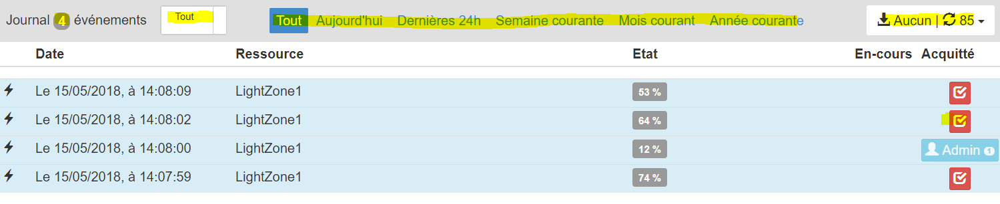

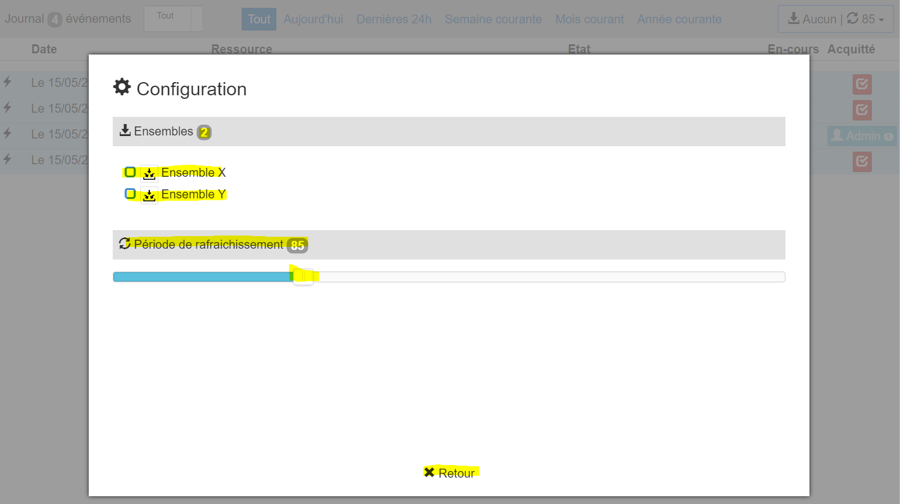

## Que retenir

Nous avons utilisé un acteur journal qui fonctionne sans **aucune configuration** et nous l'avons complété avec des filtres personnalisés pour enrichir son fonctionnement et répondre à un besoin particulier. Nous avons d'ailleurs utilisé un autre acteur métier natif: le filtre **Ensembles**

Nous avons mis en oeuvre de nombreux concepts et mécanismes vus dans les précédents tutoriels: les fenêtres **modales**, les **empilements**, les **événements** et **fonctions de transformation***, le **débugging**

Vous pourriez faire évoluer la scène pour répondre précisemment à vos besoins. Par exemple: ajouter de nouveaux filtres dans la fenêtre modale:

* **Groupes**, **Zones** et **Equipements**: propriété _Spécifiques > Equipements_, _Zones_ et _Groupes_ du journal
* **Nombre maximum d'événements** affichés dans la page: propriété _Spécifiques > nombre d'événements_ du journal
* etc

Quand la scène correspondra completement à vos besoins, vous souhaiterez pouvoir réutiliser cette scène dans d'autres SynApps: la solution est son intégration dans un **composite**

A ce sujet, tester la **création d'un composite** directement depuis la scène:

* Sélectionner ```stackRoot``` et cliquer sur le bouton de génération de composite
    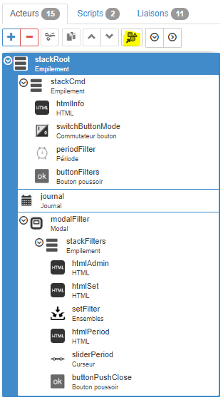

* Vous pouvez désormais **réutiliser** ce composite dans n'importe quelle SynApp et le **partager** avec d'autres utilisateurs !

## Conclusion

La **première partie du tutoriel 7** portant sur l' acteur métier natif journal est **terminée**, l'intérêt de ces acteurs réside dans le fait qu'ils sont simples d'utilisation car ils embarquent tout le comportement métier

Vous pouvez remonter les **bugs** & **remarques** concernant ce tutoriel, SynApps RUNTIME & MAKER sur [GitHub](https://github.com/witsa/synapps/issues)

[Tutoriel suivant](part2.md)
