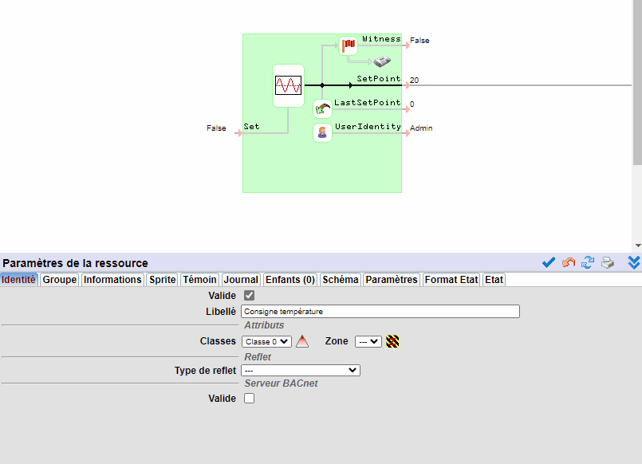
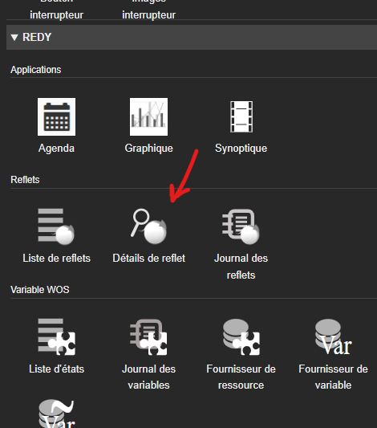
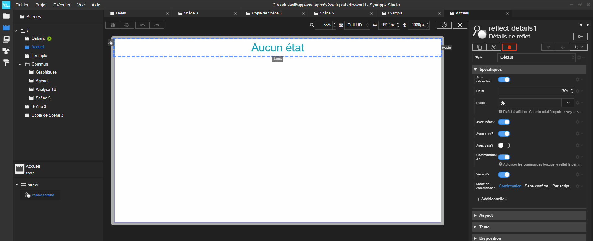
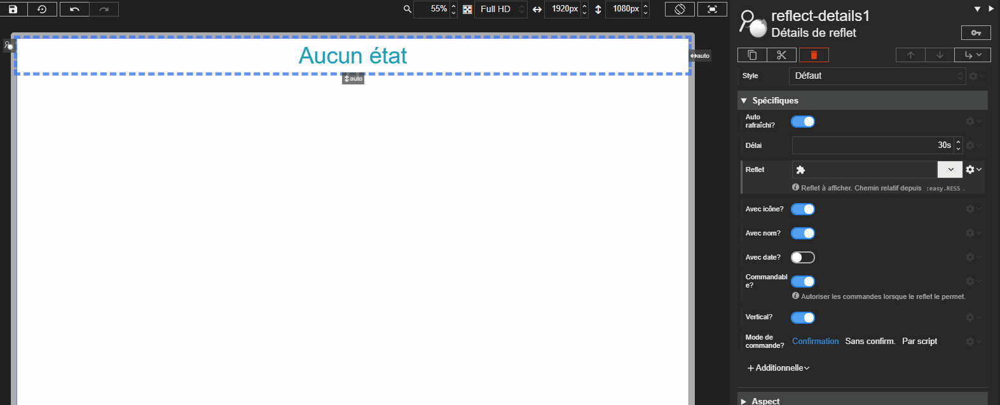
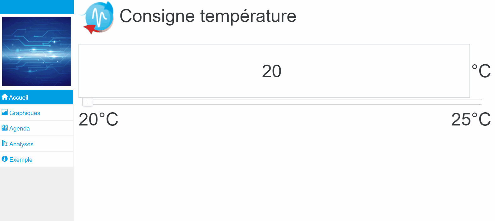
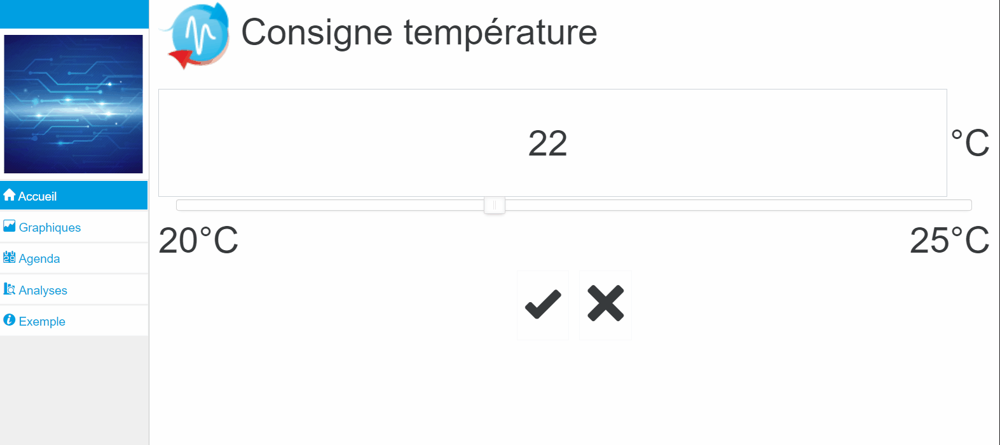

[◀ Affichage d'un état](./display-redy-data.md){: .btn } [Pour aller plus loin ▶](./and-more){: .btn }

------



# Commander une ressource

Vous avez vu précédemment comment afficher l'état d'une ressource avec une liaisons de type *Fournisseur de variable*. Il est tout à fait possible d'utiliser la même méthode en activant l'écriture version une liaison du champ *Valeur* de la sa variable ``SetPoint``. Mais ce n'est pas cette méthode que nous verrons ici.
Dans la plupart des cas, lorsque vous devrez réaliser une commande, il sera plus facile et donc judicieux d'utiliser le *Reflet* d'une ressource.

## Création de reflet

Tout d'abord, dans votre paramétrage vous allez déclarer un reflet dans la ressource consigne analogique que vous avez créée dans l'étape précédente.

Rendez-vous dans le paramétrage de la ressource, onglet identité. Nous allons déclarer son reflet de type *Analogique*. Cela permet de rendre disponible dans le REDY cette ressource sous la forme d'un objet avec des propriétés bien connues comme ses limites, son unité, ...
Il sera disponible pour la communication avec Synapps ou plus généralement par l'API du REDY.

> N'oublier pas de rendre le reflet commandable.

> 📌 **REMARQUE** 
Toutes les ressources ont un ou des types de reflet possibles. Au moins le reflet état est disponible et permet à minima d'afficher l'état de la ressource. Les autres sont à chaque fois plus spécialisé (reflet analogique, reflet de type digital, vanne, pompe, ...).

## Acteur détails de reflet

Rendez-vous dans Studio sur le designer de la scène *Accueil*.

- Supprimez l'acteur texte avec la liaison avec fournisseur de donnée.
- Ajouter un acteur qui se trouve dans la rubrique REDY, **Détails de reflet**.

Vous visualisez ce nouvel acteur dans l’aperçu :

Cette acteur permet de visualiser un reflet.

Vous allez lui indiquer celui que vous venez de déclarer grâce à sa propriété *Reflet* et son explorateur de ressource :

> L'acteur va maintenant se charger d'afficher l'état commandable de la ressource et la mettre à jour (par défaut toutes les 30 secondes).

Pour voir comment configurer cet acteur,  [c'est ici](../concepts/actor-types/redy-reflect-details.md).

Vous remarquerez que l'on retrouve les bornes de valeur de la ressource ainsi que son unité.

## Réalisez une commande

Après avoir sauvegardé la scène, exécutez la synapp. Vous allez maintenant modifier la valeur, soit en tapant directement dans la zone de saisie, soit en glissant le curseur.

Dans tous les cas, vous verrez que des boutons de validation apparaissent.

> Tant qu'une modification est en cours, l'état n'est pas mis à jour sur l'interface.

Si vous cliquez sur *Annuler*, l'état revient à sa valeur en cours. Sinon, la commande est envoyée.

> 📌 **REMARQUE** 
L'acteur a d'autres modes de commande : un mode automatique et un mode manuel.

---------
[◀ Affichage d'un état](./display-redy-data.md){: .btn } [Pour aller plus loin ▶](./and-more){: .btn }
