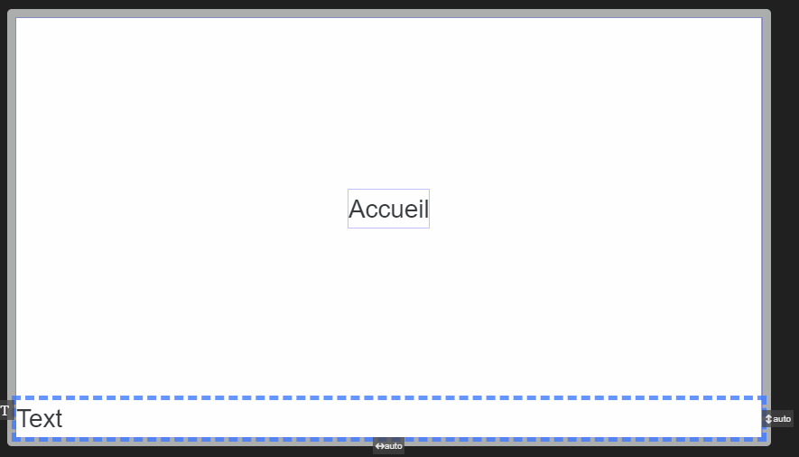

[◀ Exécution](./synapp-run){: .btn } [Publication ▶](./synapp-publish){: .btn }

----------------



# Premiers pas avec le Designer de scène

Nous allons modifier le projet de manière à afficher un message de bienvenue en accueil.

Mais d'abord, voyons quelques concepts :

## La scène

Une synapp est composée de page que nous appelons **scène**.

L'application est constituée d’une ou plusieurs scènes que l’utilisateur affiche en navigant de l’une vers l’autre.

## Ouverture du designer de scène

Nous allons sélectionner une des scènes du projet. Affichons l'arborescence des scènes du projet :

La scène avec le  est la celle que la synapp va afficher en premier : c'est la **scène de démarrage**. Mais ce n'est pas celle-ci que nous allons modifier ici.

Sélectionnez la scène **Accueil** pour afficher son **designer**.

- Au centre se trouve l'**aperçu** de la scène **A**.
- En dessous de la liste des scènes, sur la gauche, vous trouverez le **plan des acteurs**  **B**.
- Sur la gauche s'affiche l'**inspecteur** de l'objet que vous sélectionnerez dans le panneau de gauche  **C**.

## L'acteur

Chaque scène contient les instructions et la programmation des éléments d'interface appelées [**acteurs**](/synapps/concepts/actor/) qui vont du plus simple des boutons d'action à l'acteur qui affiche le détail d'un reflet.
Les acteurs permettent de construire et d’articuler n’importe quel type d’interface, du formulaire au tableau de bord.

Ils sont organisés sous forme d'arborescence :

Le premier acteur, l'**acteur principal** de la scène, `stack1` ici est de type [**Empilement**](/synapps/concepts/actor-types/layout-stack.md).

C'est un acteur de disposition. Son role est de disposer, de placer sur l'interface, les acteurs qu'il va contenir. Dans le cas d'un empilement, il va empiler les acteurs verticalement par défaut.
D'autres types de disposition existent *([voir doc](/synapps/concepts/actor-types/#layout))*.

Nous allons ajouter un acteur [**Texte**](/synapps/concepts/actor-types/display-text.md) à l'empilement.

### Ajout

Pour ajouter un acteur, vous allez effectuer un clic droit sur `stack1`. Le menu contextuel d'action sur les acteurs va s'afficher.

> **Remarque :** La gestion des scènes s'effectue également par l'intermédiaire d'un menu contextuel sur les éléments de l'arborescence.

Choisissez *Ajouter un acteur...*. Le panneau de choix de nouvel acteur va s'afficher.

Cliquez sur l'acteur *Texte* qui se trouve dans la section *Affichage*.

L'acteur `text2` a été ajouté dans l'arborescence :

Dans l'aperçu, l'acteur se retrouve empilé en dessous de `text1`.

### Suppression

Nous allons supprimer le premier acteur qui va être inutile ici, toujours à l'aide du menu contextuel d'acteur.

Cliquez droit sur l'acteur `text1` et choisissez *Supprimer*.

L'acteur à disparu :

Et dans l'aperçu :

### Modification

Nous allons positionner le texte au centre de la scène. Il s'affichera en dessous de celui qui est deja présent.

Si ce n'est pas déjà le cas, sélectionner l'acteur `text2`.

> **Remarque :** vous pouvez aussi sélectionner un acteur en cliquant simplement sur son aperçu.

Concentrons nous sur l'inspecteur :

Déroulez la partie *Disposition*.

Cette section permet de gérer la disposition de l'acteur dans son acteur parent. ici, vous pouvez changer l'alignement de l'acteur et choisir *centré* verticalement et horizontalement.

Et dans l'aperçu :

> **Remarque :** Les actions réalisées dans le designer sont *annulables*.   Raccourci **Ctrl+Z** / **Ctrl+Shift+Z**

Profitons-en pour jeter un oeil sur les autres sections offertes par l'inspecteur de l'acteur.

Nous allons maintenant changer le contenu du texte :

Cela se passe dans la section *Spécifiques*.

Comme son nom l'indique, cette section varie en fonction du type d'acteur qui est sélectionné.

Ici, nous pouvons modifier le texte affiché par l'acteur en cliquant sur le bouton avec un stylo. Le panneau d'édition de texte s'affiche :

Saisissons `Salut le monde!` à la place de `Text`. Puis cliquons sur le bouton pour sauver notre saisie.

> **Astuce :** Raccourci pour sauver la saisie **Ctrl+S**

Nous pouvons fermer le panneau en cliquant ailleurs ou directement sur la croix, en haut à droite. Le texte a changé dans l'aperçu.

## Sauvegarde et Exécution

Nous allons sauvegarder les modifications réalisées en cliquant sur le bouton dédié dans la barre d'action au dessus de l'aperçu de la scène.

> **Astuce :** Raccourci pour sauver la scène **Ctrl+S**

Maintenant, si nous exécutons la synapp, nous pourrons voir :

.

> **Astuce :** Raccourci pour exécuter la synapp dans Studio **Ctrl+R**. Raccourci pour exécuter la synapp dans le navigateur **Ctrl+Shift+R**

## Encore quelques modifications

### Utilisation de librairie

Nous allons maintenant changer la couleur du texte. Pour cela, nous allons nous intéresser à la section *Texte* de l'inspecteur et plus particulièrement au champ *Couleur*.

.

Ce champ attend une [couleur CSS](/script-api/global.html#CssColorString){:target="_blank"} qu'il est possible de saisir ou de choisir à l'aide du sélecteur proposé. Nous pouvons en essayer plusieurs et visualiser le résultat.

.

Nous allons utiliser la **librairie** de couleur définie dans la synapp et en profiter pour aborder le sujet de la **liaison**.

La simplicité d'édition des interfaces repose entre autres sur ce concept. Les champs des acteurs peuvent être liés à d'autres éléments de l'application, un autre acteur, une couleur, un texte, une image et une donnée dans l’ULI...

Cliquons sur le bouton d'option de champ sur la droite, en forme d'engrenage et choisissez *Lier à...*.

.

Le panneau d'édition de liaison s'affiche alors.

.

Pour l'instant, aucune liaison n'est définie. Mais si nous ouvrons le menu déroulant, nous pourrons observer les sources de liaisons possibles. Choisissez *Librairies/Couleur*.

L'interface a changé :

.

Dans le champ *Couleur* qui est apparu, nous allons pouvoir choisir une des couleurs définies dans la librairie :

.

Choisissons `themeColor` et cliquons sur le bouton *Lier à...* en bas pour valider la création de la liaison.

.

> **Remarque :** La librairie de couleur, comme toutes les autres librairies est accessible dans la rubrique dédiée . Celle-ci ne possède pas encore son *designer*. Il faudra modifier un fichier `JSON` très simple.

## Prochaine étape
[Publier la synapp dans le REDY-PC](./synapp-publish).

---------------------

[◀ Exécution](./synapp-run){: .btn } [Publication ▶](./synapp-publish){: .btn }
