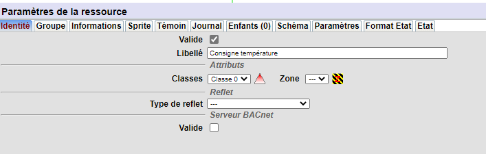
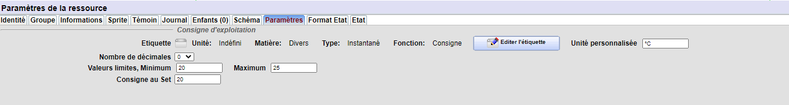
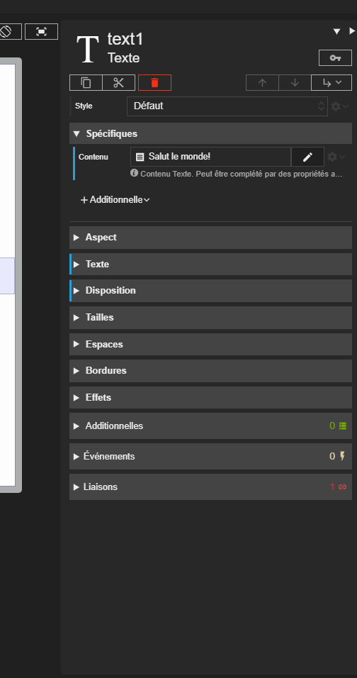
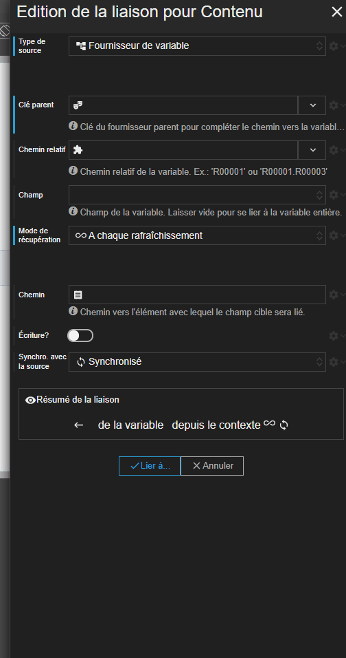
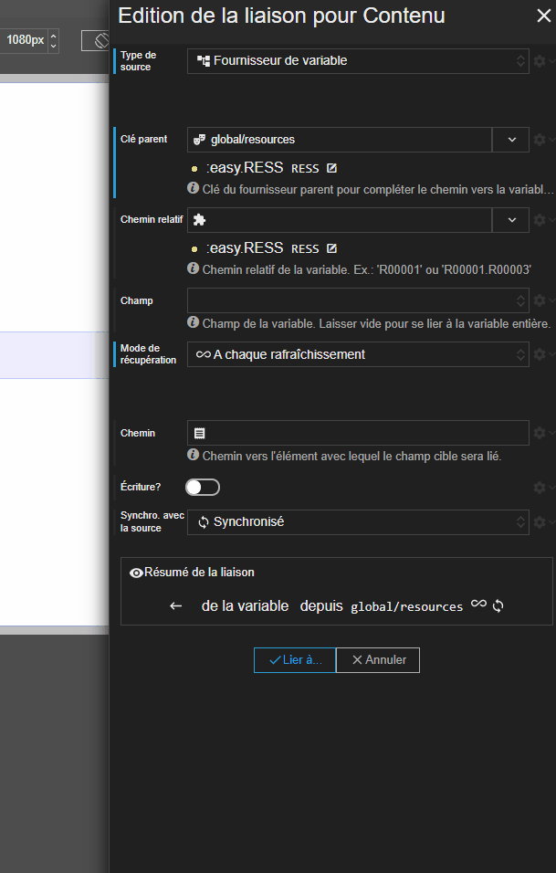
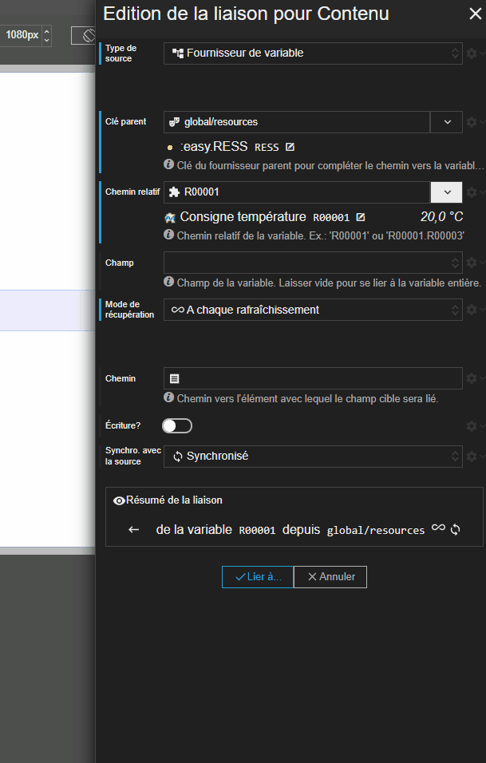
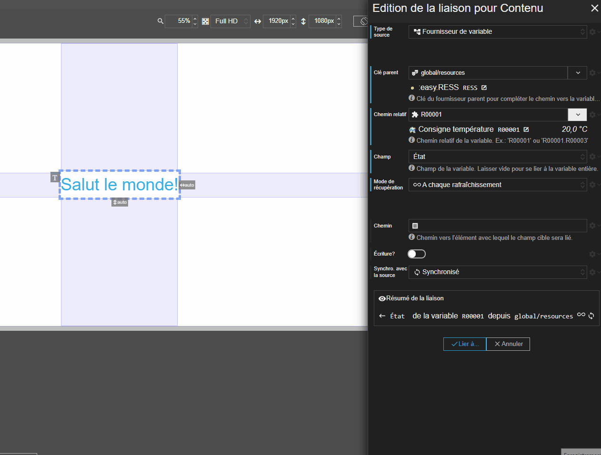
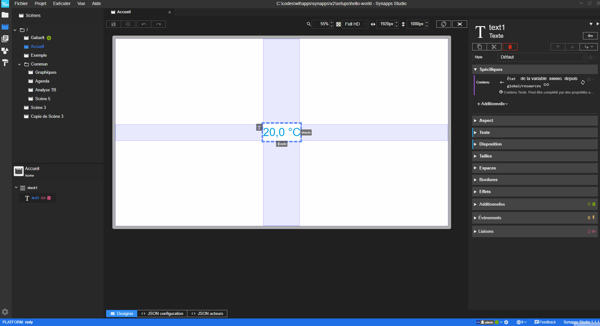

[◀ Publication](./synapp-publish){: .btn } [Commander une ressource ▶](./command-redy.md){: .btn }

------------------



# Affichage l'état d'une ressource

Votre synapp va devoir forcément présenter des données des ressources ou variables du paramétrage du REDY. Contrairement aux synoptiques, la page ne va pas se charger et se rafraîchir avec les données. Elle va charger les données et les rafraîchir **séparément**.

Ce que vous allez voir ici est l'une des méthodes pour **obtenir et afficher l'état d'une ressource** : la liaison de type *Fournisseur de variable* vers l'état de la.

> 📌 **REMARQUE** 
D'autres méthodes existent. Elles impliquent l'utilisation d'[**acteurs fournisseurs de données**](../concepts/actor-types/redy-wos-variable-source.md) notion à voir dans les concepts.

## Préparation de la ressource

Tout d'abord, dans votre paramétrage vous allez ajouter une ressource **consigne analogique**. Rendez-vous dans le paramétrage pour en créer une de ce type.

Configurez la comme ceci :

- Libellé : `Consigne température`
- Nombre de décimale : `0`
- Valeurs limites : entre `20` et `30`
- Unité personnalisée : `°C`

## Liaison de type *Fournisseur de variable*

Rendez-vous dans Studio sur le designer de la scène *Accueil*.

Vous allez créer une liaison de type *Fournisseur de variable* pour alimenter la propriété *Contenu* de l'acteur `text1`.

Cette liaison permet d'indiquer la donnée qui nous intéresse à un élément de synapp qui joue le role d'intermédiaire : *un fournisseur de donnée*.
C'est un acteur d'un type spécial : il n'est pas afficher. Son objectif est de fournir les données aux autres acteurs.

Dans chaque projet, un fournisseur est déjà présent : le fournisseur global `resources`. Nous allons le regarder de plus prés un peu plus bas.

En attendant, choisissez le dans le champ *Clé parent*.

Maintenant, vous allez lui indiquer la ressource qu'il doit aller chercher dans le champ **Chemin relatif**.

Vous pouvez observer que le chemin saisi est relatif au chemin défini dans `resources`.

En réalité, nous indiquons simplement au fournisseur de données `resources` qu'en plus de la variable `:easy.RESS`, il devra aller chercher la variable `:easy.RESS.R00001`.

Mais plus précisément, c'est l'état de la ressource qui nous intéresse. Il faut dont l'indiquer :

Voila qui est fait. Il ne reste plus qu'à valider votre réglage pour voir directement le résultat dans l'aperçu.

## Fournisseur global

Intéressons nous maintenant au fournisseur global `resources`. Rendez-vous dans la sous-section *Projet/Fournisseurs de données*.

Vous trouverez ici un designer qui permet de gérer les fournisseurs de données pour toute votre synapp. Vous retrouvez le fournisseur global `resources` dans le plan des acteurs.

Observez qu'il est paramétré pour rafraîchir les données qu'on lui demande toutes les *60 secondes*.

> 📌 **REMARQUE**  Vous apprendrez que son mode de récupération de données est *Relatif*, c'est à dire que tant personne ne lui demande de données, il ne récupère ni ne rafraîchit rien.

Pour en savoir plus sur les fournisseurs de données globaux, rendez-vous dans la section [**Fournisseurs de données**](../concepts/project/global-data-sources.md).

Il est tout à fait possible de créer des fournisseurs de données directement dans une scène. Dans ce cas, il sont paramétrable, leur propriétés liable et accessible par script. ce qui donne un contrôle total sur leur utilisation.

Pour en savoir plus, rendez-vous dans la section [**Fournisseurs de variable**](../concepts/actor-types/redy-wos-variable-source.md).

Bien d'autre champ sont accessibles par liaison (la valeur, le nom, ...). Pour en savoir plus, rendez-vous encore dans la section [**Fournisseurs de variable**](../concepts/actor-types/redy-wos-variable-source.md#champ-de-variable-redy).

# Prochaine étape
Maintenant, vous allez [commander une ressource dans le REDY](./command-redy.md).

---------------------

[◀ Publication](./synapp-publish){: .btn } [Commander une ressource ▶](./command-redy.md){: .btn }
