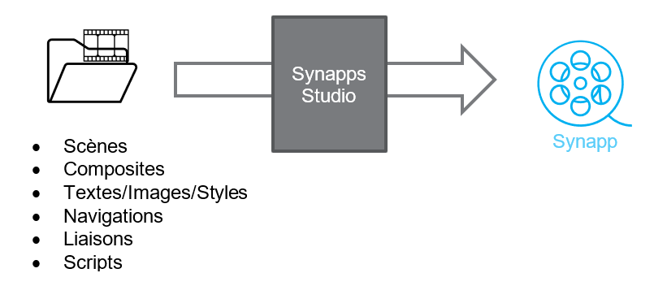
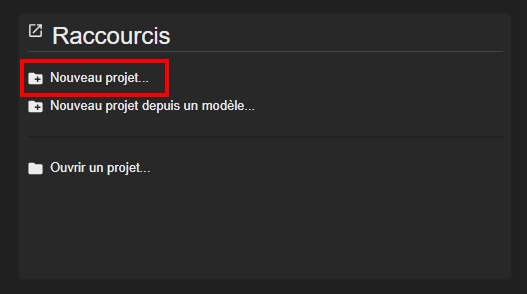

[◀ Installation](./install.md){: .btn } [Exécution ▶](./synapp-run.md){: .btn }

-------------



# Création d'un projet Studio

## Lancement de Synapps Studio

Vous allez ouvrir pour la première fois **Synapps Studio** en double cliquant son icône installé sur votre poste (dans le *menu démarrer* ou sur votre bureau).

La fenêtre de Synapps Studio s'est affichée :

<!-- ## Accès restreint

> Pendant toute la phase d'**accès retreint**, une clé d'agrément est requise pour activer Synapps Studio.

> Par la suite, cette limitation sera levée. -->

## Création d'un projet *"Bonjour le monde!"*

Nous allons créer un premier projet de démonstration, de sa construction jusqu'à son installation dans un REDY-PC.

Mais abordons deux éléments importants :

### Concept : La Synapp et le Projet

Nous surnommons **synapp** une application construite avec Studio.

Studio permet de construire un projet qui compile l'ensemble des ressources pour produire et distribuer une application.
Chaque synapp est le fruit d'un projet Studio.

Il faut l'envisager Studio comme un outil de montage vidéo :

Un projet réunit les différents rushs vidéo, musiques et autres ressources qui sont utilisés pour suivre un scenario et enfin produire un film.

Chaque projet est matérialisé dans un *dossier du système*. Il contient les fichiers de paramétrages des interfaces, la documentation, les fichiers de programmations, les images et les textes qui permettent de construire la synapp.

C'est ce que nous allons créer de suite.

### Création du projet

Pour créer votre premier projet, cliquez sur "Nouveau projet..." :

La fenêtre de création de projet s'est affichée :

Sélectionnez le modèle de projet "Tablette et bureau" :

Choisissez un emplacement dans votre système de fichier qui va contenir votre projet en cliquant sur le bouton suivant :

<!-- > ⚠️ **ATTENTION** 
> N'utiliser pas de lecteur réseau pour accueillir votre projet. En effet, Studio ne fonctionne pas correctement pour l'instant avec ce type de lecteur. -->

Rendez-vous dans le répertoire dans lequel celui du projet sera créé.

De retour dans la fenêtre de création, donnez un nom à votre projet :

Ce sera aussi le nom du répertoire qui contiendra tous les éléments de votre projet.

Vous n'avez plus qu'à cliquer sur le bouton "Créer".

Félicitation ! Votre premier projet est créé !

### Accueil de Projet

Vous visualisez à présent le *Lisez-moi* du projet qui fait office de documentation de ce dernier. Par défaut, vous pourrez y lire des informations sur le modèle de projet employé et comment l'utiliser pour alimenter votre synapp.

> Le *Lisez-moi* est bien sûr modifiable. Le format d'écriture est un standard dans la rédaction de documentation : Le [`markdown`](https://fr.wikipedia.org/wiki/Markdown).

# Prochaine étape
Maintenant, vous allez réaliser la [première exécution](./synapp-run.md) de la synapp du projet.

-------------------

[◀ Installation](./install.md){: .btn } [Exécution ▶](./synapp-run.md){: .btn }
