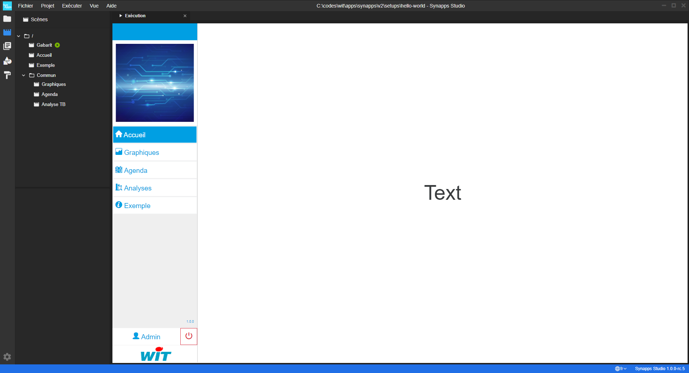

# Première exécution

Dans l'étape précédente, nous avons créé un projet avec le modèle "Tablette et Bureau". Cela a généré un projet avec un contenu pré-défini et adapté aux tailles des tablettes et bureau.
Le contenu est pret à être exécuté.

## Hôte

Lorsqu'une **synapp** s'exécute dans Studio, elle doit se connecter à une ULI. C'est ce que nous appelons l'**hôte** de la synapp qui permet de définir à quelle ULI elle se connecte.
Un nouveau projet pré-définit un hôte qui pointe vers `http://127.0.0.1`. Ainsi, le projet s'attend à la présence d'un **REDY-PC** et qu'il puisse se connecter avec l'utilisateur `admin`, mot de passe `.`. Tout ceci est paramétrable.

Lancez une instance de **REDY-PC** (au moins `13.2.0`).

> N'oubliez pas d'activer l'adds **Intravision**. C'est ce qui vous permettra plus tard de publier la synapp dans le paramétrage.

## Exécution

Passons maintenant à l'exécution de la synapp :
 - Rendez-vous dans le menu d'application et choisissez l'option "Exécution". Raccourci clavier **Ctrl+R**

L'onglet d'exécution s'est ouvert :

Vous pouvez tester la synapp en utilisant le menu.

> Un autre manière de visualiser la synapp est de l'ouvrir dans votre navigateur.
Dans ce cas choisissez l'option "Exécuter dans le navigateur...". Raccourci clavier **Ctrl+Shift+R**

# Prochaine étape :
Maintenant, vous allez [modifier la scène d'accueil](./modif-1) de projet Studio.
