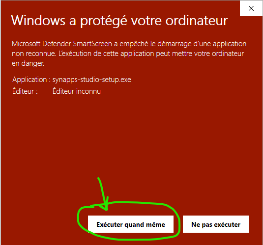

[◀ Getting Started Guide](./index){: .btn } [Create a project ▶](./first-project){: .btn }

--------------------

# Installation of Synapps Studio

First of all, you will need to install a version of Synapps Studio on your workstation.

Last version: [{{ site.data.constants.releaseVersion }}](https://github.com/witsa/synapps/releases/download/{{ site.data.constants.releaseVersion }}/synapps-studio-setup.zip)

- Download the zip file.
- Open the zip file and run the synapps-studio-setup.exe file
- Ignore the protection message:

- Then follow the instructions of the windows installer.

# Next step
Now you can open Studio and [create your first project](./first-project).

--------------------

[◀ Getting Started Guide](./index){: .btn } [Create a project ▶](./first-project){: .btn }
