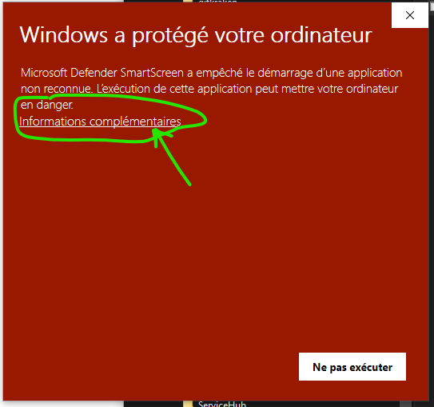
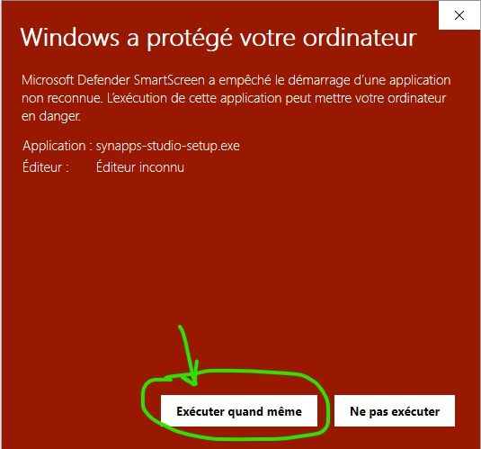

[◀ Guide de démarrage](./index.md){: .btn } [Création d'un projet ▶](./first-project.md){: .btn }

--------------------

# Installation de Synapps Studio

Avant tout, il va falloir installer une version de Synapps Studio sur votre poste.

Dernière version : [1.2.1](https://github.com/witsa/synapps/releases/download/1.2.1/synapps-studio-setup.zip)

- Téléchargez le fichier zip.
- Ouvrir le fichier zip et exécutez le fichier synapps-studio-setup.exe
- Ignorer le message de protection :

- Suivez ensuite les instructions de l'installeur windows.

# Prochaine étape
Maintenant, vous pouvez ouvrir Studio et [créer votre premier projet](./first-project.md).

--------------------

[◀ Guide de démarrage](./index.md){: .btn } [Création d'un projet ▶](./first-project.md){: .btn }
