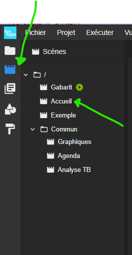
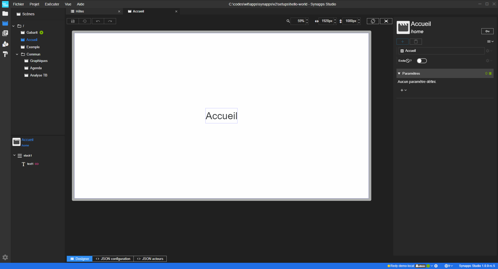



> En cours de rédaction...

# Première modification : la scène d'accueil

Nous allons modifier le projet de manière à afficher un message de bienvenue en accueil.

Mais d'abord, quelques concepts :

## La scène

Une synapp est composée d’unités d'interface graphique que nous appelons **scène**.

L'application est constituée d’une ou plusieurs scènes que l’utilisateur affiche en navigant de l’une vers l’autre.

## Ouverture du designer de scène

Nous allons sélectionner une des scènes du projet. Affichons l'arborescence des scènes du projet :

La scène avec le  est la celle de démarrage. Mais ce n'est pas cette scène que nous allons modifier ici.

Sélectionnez la scène **Accueil** pour afficher son **designer**.

