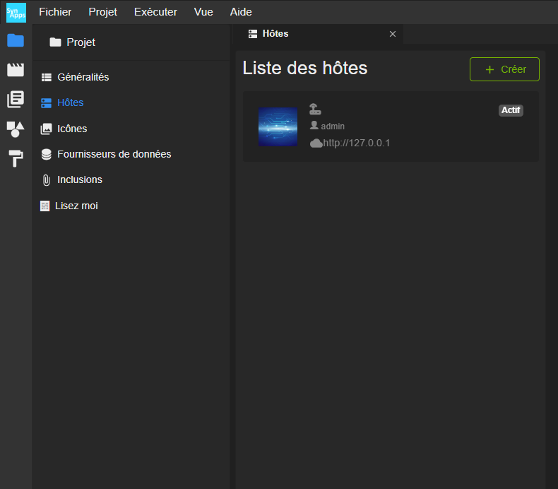
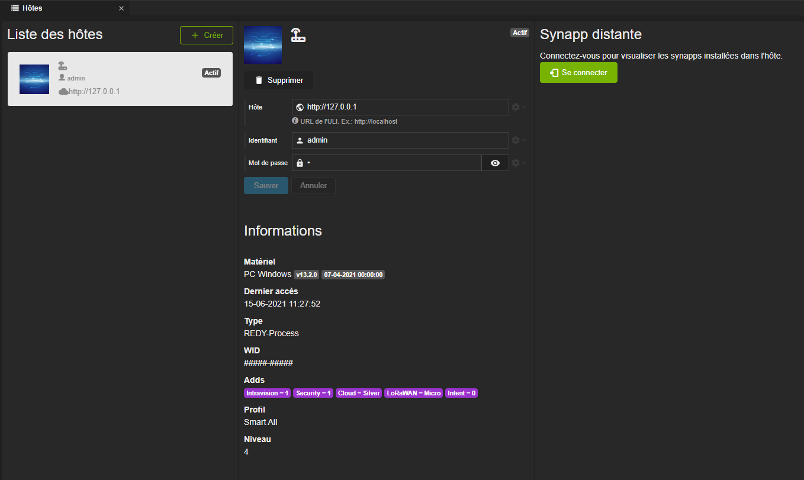
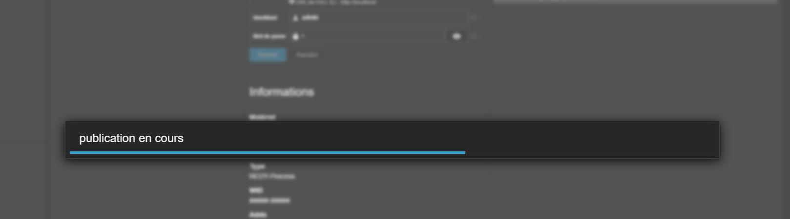
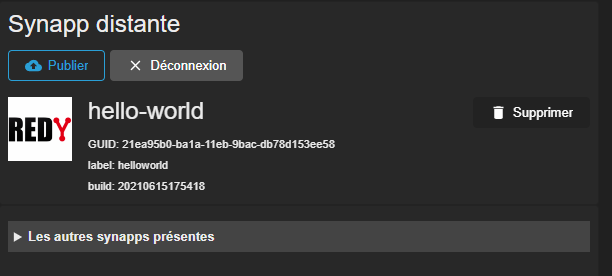



# Première publication dans un REDY

Il ne reste plus qu'à voir comment publier la synapp de votre projet.

Rendez-vous dans la rubrique *projet*  et la *gestion des hôtes*.

Sélectionnez le seul hôte défini ou bien celui sur lequel vous désirez publier si vous en avez définis plusieurs.

## Connexion à l'hôte

Il va falloir se connecter à l'hôte sélectionné. Pour celà, cliquez sur bouton vert *Se connecter*.

Une fois connectée, l'interface présente maintenant le bouton dédié à la publication.

> **Remarque :** Si vous définissez un utilisateur qui n'est pas au moins *installateur* ou si l'*adds Intravision* n'est pas activée, vous ne pourrez pas publier la synapp dans l'hôte.

## Publication

Appuyez sur le bouton *Publier* et la progression du déploiement s'affichera :

Si tout se passe bien, l'interface montrera la synapp correspondante au projet publiée dans l'hôte.

> **Remarque :** Chaque projet permet de définir une synapp, avec un identifiant unique. Ainsi, Studio est capable de reconnaître la synapp publiée commme correspondante à celle du projet en cours.

# Prochaine étape :
Maintenant, vous allez [afficher des données du REDY dans la scène](./display-redy-data.md).
